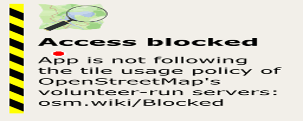

# ♻️ E-Waste Workshop

[](https://e-wasteworkshop.co.uk)
[](https://www.youtube.com/channel/UCe31iZazQVN678Yqn62u3GA)
[](https://github.com/Nairecth/eww)
[](https://www.ebay.co.uk/usr/e-waste_workshop)
[](LICENSE)

> **E-Waste Workshop** to startup technologiczny z misją recyklingu i refabrykacji elektroniki oraz sprzętu gospodarstwa domowego. Łączymy automatyzację, AI, druk 3D i HomeLab, aby projektować procesy odzysku i rewitalizacji.

> [!tip] 🚀 Zacznij tu
> - 📜 Roadmapa: `business/roadmap.md`
> - 🗑️ Polityka Zero Waste: `ZERO-WASTE-POLICY.md`
> - 🧭 Story: `business/story.md`
> - 🏗️ Infra: `docs/infra/infra.md`
> - 🛠️ `make help` – lista narzędzi

## 🎯 O projekcie

- 🔧 Recykling i refabrykacja elektroniki (urządzenia, komponenty, PCB, złącza, plastik → granulat/odlewy/druk 3D).
- 🤖 Automatyzacja procesów (AI, workflow) + własny system inwentaryzacji (Odoo + AI).
- 📦 Sprzedaż odrestaurowanych produktów (eBay/online) i edukacja (YouTube).
- 🗑️ Zero Waste – wszystko traktujemy jako surowiec (`ZERO-WASTE-POLICY.md`).

## 👥 Kim jesteśmy

- **Jakub (Great Implementer)** – R&D, eksperymenty na złomie, urządzenia i komponenty.
- **Karina** – stabilne produkty/serwis mobilny (start: iPhone 11), sprzedaż na eBay.
- Więcej w `business/story.md` i roadmapie `business/roadmap.md`.

## 📌 Spis treści
- 📍 [Lokalizacja](#-lokalizacja) — gdzie pracujemy
- 🔧 [Model i kanały](#-model-i-kanały) — kto co robi i jak sprzedajemy
- ⭐ [Dlaczego warto](#-dlaczego-warto) — czym się wyróżniamy
- 🛍️ [Co oferujemy](#-co-oferujemy-skrót) — produkty/usługi
- 📂 [Struktura repozytorium](#-struktura-repozytorium) — mapa katalogów
- 🧰 [Narzędzia i stack](#-narzędzia-i-stack) — czym pracujemy
- 🧾 [Versionowanie](#-versionowanie) — tagi, VERSION, frontmatter
- 📖 [Dokumentacja](#-dokumentacja) — kluczowe pliki
- 🤝 [Kontrybuowanie](#-kontrybuowanie) — jak pomagać
- 📧 [Kontakt](#-kontakt) — jak się z nami skontaktować
- 🌟 [Status projektu](#-status-projektu) — etap prac

## 📍 Lokalizacja

- 77C Church Lane, N9 9PZ (London) – outbuilding za domem Gary’ego.
- Szczegóły miejsca: `docs/infra/areas/workshop/location.md`; łączność (Gary Net): `docs/infra/hardware/network/garynet.md`.

## 🧭 Model i kanały

- **Jakub (R&D)** – pozyskiwanie złomu, refabrykacja, odzysk surowców, druk 3D.
- **Karina (produkt/sprzedaż)** – FCGH, serwis/refabrykacja mobilna, eBay.
- **Media**: YouTube (serie napraw/mobilne), strona www (oferta, kontakt).
- **Cel finansowy**: ≥ £1500/mies. na pokrycie czynszu. Pełna roadmapa: `business/roadmap.md`.

> [!note] ⭐ Dlaczego warto
> - Zero Waste jako zasada działania (każdy element to surowiec).
> - Automatyzacja i własne narzędzia (inwentaryzacja Odoo + AI).
> - Transparentna dokumentacja: story, roadmapa, polityki, infra.
> - Kanały sprzedaży i edukacji równolegle (eBay + YouTube).
> - Publiczny kod i proces: Makefile, polityki, versioning oparte na tagach Git.

> [!summary] 🔆 Highlights
> - **Zero Waste Policy** → `ZERO-WASTE-POLICY.md`
> - **Story & Roadmap** → `business/story.md`, `business/roadmap.md`
> - **Infra & Miejsce** → `docs/infra/areas/workshop/location.md`, `docs/infra/hardware/network/garynet.md`, `docs/infra/hardware/hardware.md`
> - **Proces** → `make check-versions` (tag + VERSION + frontmatter), `Makefile` (help)

> [!note] 🚀 Szybkie linki
> - 📜 Roadmap: `business/roadmap.md`
> - 🗑️ Zero Waste: `ZERO-WASTE-POLICY.md`
> - 🧭 Story: `business/story.md`
> - 🏗️ Infra: `docs/infra/infra.md`
> - 📚 Dokumentacja główna: `docs/README.md`

> [!summary] 🛍️ Co oferujemy (skrót)
> - Refabrykacja urządzeń i komponentów (Karina – FCGH, mobilne).
> - Eksperymenty/R&D na złomie (Jakub) + odzysk surowców, druk 3D.
> - Edukacja i content (YouTube: naprawy/mobilne, dokumentacja).

## 📂 Struktura repozytorium

```
eww/
├── business/          # Procesy biznesowe, governance, metodyki
├── usr/              # Katalogi użytkowników (jakubc, karinam, gary)
├── core/             # Konfiguracje systemowe, workflow, inbox
├── dev/              # Narzędzia deweloperskie, skrypty, projekty
├── lib/              # Biblioteki Bash
├── bin/              # Binaria wykonywalne
├── docs/             # Dokumentacja projektu
├── archive/          # Archiwum historyczne
├── AGENTS.md         # Kontekst dla AI Coding Agents
├── CHANGELOG.md      # Historia zmian
├── CONTRIBUTING.md   # Jak kontrybuować
├── LICENSE           # Licencja MIT
└── Makefile           # Automatyzacja zadań
```

> [!abstract] 🔍 Kluczowe ścieżki
> - 📁 Biznes: `business/`
> - ⚙️ Core/runtime: `core/`
> - 🧪 Dev tools/tests: `dev/`
> - 📚 Dokumentacja infra: `docs/infra/`
> - 🧠 AI/kontext: `AGENTS.md`

## 🧰 Narzędzia i stack

- Kubuntu 24.04 LTS
- VS Code, Obsidian
- Codex, GitHub Copilot
- Odoo ERP (inwentaryzacja – plan/rozwój)
- Make, systemd, GitHub Actions
- GitHub (repo, tagi `vX.Y.Z` obowiązkowe; `VERSION` + frontmatter muszą być zgodne; `make check-versions`)

## 🧾 Versionowanie

> [!warning] 🚨 WYMAGANE dla wszystkich użytkowników
> Przed pierwszym committem **MUSISZ** skonfigurować wersjonowanie:
> ```bash
> npm install -g semver     # Zainstaluj semver CLI
> make install-hooks        # Skonfiguruj Git hooks
> ```
> **Instrukcja:** [`docs/setup/onboarding.md`](docs/setup/onboarding.md)

> [!tip] 🔖 Versioning (Semver + Automatyzacja + Enforcement)
> - Projekt używa **Semantic Versioning** z automatyzacją (`semver` CLI + skrypty + Git tags).
> - **Aktualna wersja:** `0.0.6` (tag `v0.0.6`)
> - Sprawdź wersję: `make version`
> - Podbij wersję: `make bump-version BUMP=patch` (sync VERSION + frontmattery + tag)
> - Walidacja: `make check-versions`
> - **Pre-commit hook:** auto-bump `version` i `modified` w plikach `.md`
> - **Pre-push hook:** waliduje spójność wersji przed push
> - **CI/CD:** GitHub Actions sprawdza wersjonowanie na każdym PR
> - **📚 Kompletna dokumentacja:** [docs/versioning/enforcement-complete.md](docs/versioning/enforcement-complete.md)
> - **🚀 Szybki start:** [docs/versioning/quickstart.md](docs/versioning/quickstart.md)
> - **📋 Onboarding:** [docs/setup/onboarding.md](docs/setup/onboarding.md)

## 📖 Dokumentacja

- 📚 **[docs/README.md](docs/README.md)** - Główna dokumentacja
- 🤖 **[AGENTS.md](AGENTS.md)** - Kontekst dla AI Coding Agents
- 🛠️ **[CONTRIBUTING.md](CONTRIBUTING.md)** - Jak kontrybuować
- 🗑️ **[ZERO-WASTE-POLICY.md](ZERO-WASTE-POLICY.md)** - Zasada „wszystko jest surowcem”
- 🧭 **[business/story.md](business/story.md)** - Backstory i oś czasu zespołu
- 🗺️ **[business/roadmap.md](business/roadmap.md)** - Roadmapa biznesowa i KPI
- 📍 **[docs/infra/areas/workshop/location.md](docs/infra/areas/workshop/location.md)** - Lokalizacja warsztatu
- 🌐 **[docs/infra/hardware/network/garynet.md](docs/infra/hardware/network/garynet.md)** - Łączność (Gary Net)
- 🖥️ **[docs/infra/hardware/hardware.md](docs/infra/hardware/hardware.md)** - Sprzęt i stanowiska
- 🔄 **[core/workflow/](core/workflow/)** - Workflow i procesy
- 🧩 **[business/](business/)** - Governance, metodyki, procesy biznesowe

> [!todo] 🗺️ Roadmap (skrót)
> - [ ] Migracja struktur wg `docs/governance/RESTRUCTURE-MAP.md` (dev→development, usr→users)
> - [ ] Inwentaryzacja Odoo + AI (przyjęcie → test → refabrykacja → magazyn → sprzedaż)
> - [ ] Seria YouTube (mobilne/pato-naprawy) + produkt FCGH
> - [ ] Runbook systemd i ujednolicone README narzędzi
> - [ ] Cel finansowy: ≥ £1500/mies. utrzymany stabilnie

## 🤝 Kontrybuowanie

Wkład mile widziany! Zobacz [CONTRIBUTING.md](CONTRIBUTING.md) dla szczegółów.

1. Fork projektu
2. Utwórz branch (`git checkout -b feat/amazing-feature`)
3. Commit zmian (`git commit -m 'feat: dodaj amazing feature'`)
4. Push do brancha (`git push origin feat/amazing-feature`)
5. Otwórz Pull Request

## 📜 Licencja

Projekt jest dostępny na licencji **MIT**. Zobacz [LICENSE](LICENSE) dla szczegółów.

## 📧 Kontakt

- 🏠 **Website**: https://e-wasteworkshop.co.uk
- 📹 **YouTube**: https://www.youtube.com/channel/UCe31iZazQVN678Yqn62u3GA
- 🛒 **eBay**: https://www.ebay.co.uk/usr/e-waste_workshop
- 🛠️ **GitHub**: https://github.com/Nairecth/eww
- ✉️ **Email**: astriblast@gmail.com

### 🗺️ Lokalizacja (77C Church Lane, N9 9PZ)

- Outbuilding za domem Gary’ego (Warsztat/Office). Google Maps: [77C Church Lane, N9 9PZ](https://maps.google.com/?q=77C+Church+Lane+N9+9PZ)
  Statyczna mapa z pinezką (OSM kafel + marker):
  

> [!info] 🌟 Status projektu
> - ✅ Aktywny development
> - 📦 Wersja: `0.0.0.5` (Pre-MVP)
> - 🎯 Cel: MVP Q1 2025
> - 🔄 Ostatni commit: patrz `CHANGELOG.md`

## 🙏 Podziękowania

- Społeczność open-source za narzędzia i inspiration
- GitHub za platformę i infrastrukturę
- Wszystkim kontrybutrom i supporterom projektu

---

**♻️ Razem redukujemy e-waste i tworzymy wartość z odpadów elektronicznych! 🌍**

## 🔗 Backlinks

- [[EWW-MAP]]
- [[INDEX]]
- [[README]]
