---
tags:
  - todo
  - daily
  - jakubc
  - tasks
  - dataview
created: 2025-11-22T18:53:00Z
modified: 2025-11-22T21:08:00Z
author: jakubc
title: "TODO Daily - 2025-11-22"
date: 2025-11-22
type: daily-todo
cssclasses:
  - todo-dashboard
  - daily
banner: "![[banner-todo.jpg]]"
owner: jakubc
---

# 📅 TODO Daily - 2025-11-22

> [!info] Piątek, 22 listopada 2025
> **Tydzień:** 47 | **Dzień roku:** 326 | **Implementator:** jakubc
> **Status dnia:** 🟡 W trakcie | **Wykonane:** 12/21 (57%)

---

## 🚨 ZADANIA PRZETERMINOWANE (Deadline przekroczony)

```dataview
TABLE WITHOUT ID
  file.link as "Zadanie",
  priority as "P",
  deadline as "Deadline ⚠️",
  status as "Status"
FROM "usr/jakubc/TODO"
WHERE deadline < date(today)
  AND status != "done"
  AND status != "cancelled"
SORT deadline ASC
LIMIT 10
```

> [!danger] Uwaga!
> Powyższe zadania mają **przekroczony deadline**. Zrób je natychmiast lub zaktualizuj deadline!

---

## 🎯 ZADANIA DZISIAJ - Priorytety 1-10

> [!tip] Skala priorytetów
> **P10** = KRYTYCZNE (natychmiast) | **P1** = Niskie (gdy będzie czas)

### 🔥 P10 - KRYTYCZNE (Drop everything!)

```dataview
TASK
FROM "usr/jakubc/TODO/TODO-daily/TODO-2025-11-22"
WHERE priority = 10
WHERE !completed
```

**Ręczne (backup):**
- [ ] 🔥 *Brak zadań P10 - dobrze!*

---

### 🔴 P9 - BARDZO PILNE (Dzisiaj rano)

```dataview
TASK
FROM "usr/jakubc/TODO/TODO-daily/TODO-2025-11-22"
WHERE priority = 9
WHERE !completed
```

**Ręczne:**
- [ ] 🌐 [[garynet/task|GaryNet]] - skonfigurować połączenie (20m) `priority: 9`
- [ ] 👤 [[freederick/freederick|Freederick]] - zadanie do ustalenia `priority: 9`

---

### 🟠 P8 - PILNE (Przed lunchem)

```dataview
TASK
FROM "usr/jakubc/TODO/TODO-daily/TODO-2025-11-22"
WHERE priority = 8
WHERE !completed
```

**Ręczne:**
- [ ] 📺 [[tv-check/task|TV check]] - Samsung UE50CU8500KXUU `priority: 8`
- [ ] 📱 [[ipad/task|iPad]] - przygotować/konfigurować `priority: 8`

---

### 🟡 P7 - WYSOKIE (Dzisiaj popołudnie)

```dataview
TASK
FROM "usr/jakubc/TODO/TODO-daily/TODO-2025-11-22"
WHERE priority = 7
WHERE !completed
```

**Ręczne:**
- [ ] 🌸 [[flowers/task|Flowers]] - inwentaryzacja (7+6) `priority: 7`
- [ ] 🪑 [[desk/task|Desk]] - office protocol (sobota!) `priority: 7`

---

### 🔵 P6 - ŚREDNIE-WYSOKIE (Dzisiaj wieczór)

```dataview
TASK
FROM "usr/jakubc/TODO/TODO-daily/TODO-2025-11-22"
WHERE priority = 6
WHERE !completed
```

**Ręczne:**
- [ ] 📱 [[c4d-liquidation/task|C4D liquidation]] `priority: 6`
- [ ] 🗑️ [[rubbish/task|Rubbish]] `priority: 6`

---

### 🟢 P5 - ŚREDNIE (Jeśli starczy czasu)

```dataview
TASK
FROM "usr/jakubc/TODO/TODO-daily/TODO-2025-11-22"
WHERE priority = 5
WHERE !completed
```

**Ręczne:**
- [ ] ☎️ [[phones/task|Phones]] - stacjonarne `priority: 5`

---

### 🟣 P4 - ŚREDNIE-NISKIE (Opcjonalne dzisiaj)

```dataview
TASK
FROM "usr/jakubc/TODO/TODO-daily/TODO-2025-11-22"
WHERE priority = 4
WHERE !completed
```

**Ręczne:**
- [ ] Zinwentaryzować akcesoria GERC `priority: 4`
- [ ] Zinwentaryzować akcesoria asus_z77 `priority: 4`

---

### ⚪ P3 - NISKIE (Można przełożyć)

```dataview
TASK
FROM "usr/jakubc/TODO/TODO-daily/TODO-2025-11-22"
WHERE priority = 3
WHERE !completed
```

**Ręczne:**
- [ ] Wypełnić specs TV (IP, MAC) `priority: 3`
- [ ] Wypełnić dane kwiatów (7) `priority: 3`

---

### ⬜ P2 - BARDZO NISKIE (Nice to have)

```dataview
TASK
FROM "usr/jakubc/TODO/TODO-daily/TODO-2025-11-22"
WHERE priority = 2
WHERE !completed
```

**Ręczne:**
- [ ] Backup konfiguracji routera `priority: 2`

---

### 🔻 P1 - NAJNIŻSZE (Gdy naprawdę nudy)

```dataview
TASK
FROM "usr/jakubc/TODO/TODO-daily/TODO-2025-11-22"
WHERE priority = 1
WHERE !completed
```

**Ręczne:**
- [ ] Zaktualizować firmware ASUS DSL-N16 `priority: 1`

---

## ✅ WYKONANE DZISIAJ

```dataview
TABLE WITHOUT ID
  file.link as "Zadanie",
  priority as "P",
  dateformat(completed, "HH:mm") as "✓ Godz"
FROM "usr/jakubc/TODO/TODO-daily/TODO-2025-11-22"
WHERE completed = date(2025-11-22)
SORT completed DESC
```

**Ręczne (backup):**
- [x] Zdiagnozowano internet asus_z77 (192.168.0.10) ✅ 18:30
- [x] Utworzono docs ASUS DSL-N16 ✅ 19:00
- [x] Struktura accessories (GERC, asus_z77) ✅ 19:15
- [x] Przywrócono Obsidian graph ✅ 19:30
- [x] Utworzono pełną strukturę flowers/ (7 kwiatów + 6 doniczek + tools + seeds)
- [x] Utworzono szablon pot_file.md dla doniczek
- [x] Utworzono plik TV Samsung UE50CU8500KXUU.md z pełnymi specs
- [x] 🌸 Zadanie flowers przekazane do Kariny → `/usr/karinam/desktop/TODO/flowers/`
- [x] 🌸 Utworzono pełną strukturę flowers dla Kariny (7 kwiatów z katalogami photos/)
- [x] Szablon pot_file.md ✅ 20:15
- [x] TV Samsung UE50CU8500KXUU.md ✅ 20:30
- [x] Flowers → karinam ✅ 20:35
- [x] garynet.md documentation ✅ 20:45
- [x] office.md protocol (sobota) ✅ 20:50
- [x] Zmiana nazw: tablet→ipad, etc. ✅ 20:55
- [x] freederick/freederick.md ✅ 21:00

---

## 📊 STATYSTYKI DNIA

> [!success] Progress
> ```progress
> value: 57
> ```

### Zadania według priorytetu

| Priorytet | Do zrobienia | Wykonane | Razem |
|-----------|--------------|----------|-------|
| P10 | 0 | 0 | 0 |
| P9 | 2 | 0 | 2 |
| P8 | 2 | 0 | 2 |
| P7 | 2 | 0 | 2 |
| P6 | 2 | 0 | 2 |
| P5 | 1 | 0 | 1 |
| P4 | 2 | 0 | 2 |
| P3 | 2 | 0 | 2 |
| P2 | 1 | 0 | 1 |
| P1 | 1 | 0 | 1 |
| **SUM** | **15** | **12** | **27** |

### Timeline

```mermaid
gantt
    title TODO Timeline - 2025-11-22
    dateFormat HH:mm
    section P9-P10
    GaryNet           :crit, 09:00, 2h
    Freederick        :crit, 11:00, 1h
    section P8
    TV check          :active, 12:00, 1h
    iPad setup        :active, 13:00, 1h
    section P7
    Flowers           : 14:00, 2h
    Desk + office     : 16:00, 1h
    section P6
    C4D liquidation   : 17:00, 1h
    Rubbish           : 18:00, 30min
    section P5-P1
    Phones            : 18:30, 30min
    Pozostałe         : 19:00, 2h
```



---

## 🎯 FOKUS NA DZISIAJ

> [!quote] Cel dnia
> 1. **GaryNet** - najważniejsze (internet!)
> 2. **Freederick** - ustalić zadanie
> 3. **TV + iPad** - dla Kariny
> 4. **Flowers** - inwentaryzacja
> 5. **Desk** - office protocol (sobota!)

### Metoda Pomodoro (25 min fokus)

- [ ] 🍅 Pomodoro 1: GaryNet config
- [ ] 🍅 Pomodoro 2: GaryNet test
- [ ] 🍅 Pomodoro 3: Freederick
- [ ] 🍅 Pomodoro 4: TV check
- [ ] 🍅 Pomodoro 5: iPad
- [ ] 🍅 Pomodoro 6: Flowers (część 1)
- [ ] 🍅 Pomodoro 7: Flowers (część 2)
- [ ] 🍅 Pomodoro 8: Desk + office

**Szacowany czas:** 8 x 25min = 3h 20min (+ przerwy = 4h)

---

## 🔗 QUICK LINKS

```dataview
LIST
FROM "usr/jakubc/TODO/TODO-daily/TODO-2025-11-22"
WHERE file.name != "TODO-2025-11-22"
SORT file.name ASC
```

**Ręczne:**
- [[c4d-liquidation/task|C4D Liquidation]]
- [[desk/task|Desk]]
- [[flowers/task|Flowers]]
- [[freederick/freederick|Freederick]]
- [[garynet/task|GaryNet]]
- [[ipad/task|iPad]]
- [[phones/task|Phones]]
- [[rubbish/task|Rubbish]]
- [[tv-check/task|TV Check]]

---

## 📚 KONTEKST

### Infrastruktura
- **Gateway:** [[../../../../docs/infra/network/devices/asus-dsl-n16/asus-dsl-n16|192.168.0.10]]
- **GaryNet:** [[../../../../docs/infra/network/garynet|Połączenie 20m]]
- **Lenovo Y700:** [[../../../../docs/infra/hardware/laptops/lenovo_y700/lenovo_y700|Laptop]]

### Protokoły
- **Office:** [[../../../../core/house/rules/office|Sobota 24:00]]

### Research (Karinam)
- **TV:** [[../../../karinam/research/UE50CU8500KXUU|Samsung 50"]]
- **Flowers:** [[../../flowers/README|System kwiatów]]

---

## 💡 NOTATKI

> [!info] Dzisiaj
> - Problem z internetem może być ISP lub WAN config
> - Router: http://192.168.0.10 (admin/admin)
> - GaryNet: gniazdko → 20m → router Gary

> [!warning] Pamiętaj
> - Office protocol: **sobota** przed 24:00!
> - Flowers: 7 kwiatów + 6 doniczek do zinwentaryzowania

---

## 🕐 TIMELINE DNIA

| Godz | Zadanie | Status |
|------|---------|--------|
| 09:00 | ☕ Start dnia | ✅ |
| 09:30 | GaryNet config (P9) | ⏳ |
| 11:00 | Freederick (P9) | ⏳ |
| 12:00 | 🍽️ Lunch | - |
| 12:30 | TV check (P8) | ⏳ |
| 13:30 | iPad setup (P8) | ⏳ |
| 14:30 | Flowers inv (P7) | ⏳ |
| 16:30 | Desk + office (P7) | ⏳ |
| 17:30 | C4D (P6) | ⏳ |
| 18:30 | Rubbish + phones | ⏳ |
| 19:30 | Pozostałe (P1-P4) | ⏳ |
| 21:00 | 📊 Podsumowanie | ⏳ |

---

## 📊 PODSUMOWANIE DNIA

*Do uzupełnienia wieczorem (~21:00)*

### Co poszło dobrze? ✅


### Co można poprawić? 🔧


### Co nauczyłem się dzisiaj? 📚


### Jutro priorytet:


---

## 🔄 NAWIGACJA

**⬅️ Wczoraj:** [[../TODO-2025-11-21/TODO-2025-11-21|TODO-2025-11-21]]
**➡️ Jutro:** [[../TODO-2025-11-23/TODO-2025-11-23|TODO-2025-11-23]]
**📅 Tydzień:** [[../TODO-week-47|Week 47]]
**📆 Miesiąc:** [[../TODO-2025-11|November 2025]]

---

> [!quote] Motywacja
> *"The secret of getting ahead is getting started."* - Mark Twain

**Status:** 🟡 W trakcie | **Wykonane:** 12/27 (44%) | **Do zrobienia:** 15
