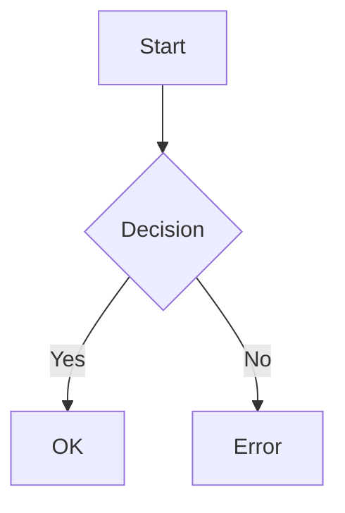

# Test Neovim - Markdown

## Funkcje do przetestowania

### 1. Markdown Preview
- [ ] `:MarkdownPreview` - podgląd w przeglądarce
- [ ] Syntax highlighting dla code blocks
- [ ] TOC generation
- [ ] Link completion

### 2. YAML Frontmatter
```yaml
title: Test Document
version: 1.0.0
  - test
  - markdown
```

### 3. Code Blocks Bash
```bash
#!/usr/bin/env bash
set -euo pipefail

# TODO: Test komentarza
test_function() {
    local arg="$1"
    echo "Testing: $arg"
}
```

### 4. Tabele

| Feature | Status | LSP |
|---------|--------|-----|
| Markdown | ✅ | ✅ |
| YAML | ✅ | ✅ |
| Bash | ✅ | ✅ |

### 5. Mermaid Diagrams



### 6. Math (KaTeX)

Inline: $x = \frac{-b \pm \sqrt{b^2-4ac}}{2a}$

Block:
$$
E = mc^2
$$

## Checklist testów

- [ ] Syntax highlighting działa
- [ ] LSP pokazuje błędy
- [ ] Autocomplete dla linków
- [ ] Format on save
- [ ] Live preview
- [ ] Spell check (PL + EN)

## 🔗 Backlinks

- [[dev/tests/tests]]
- [[dev/dev]]
- [[dev/Development]]
