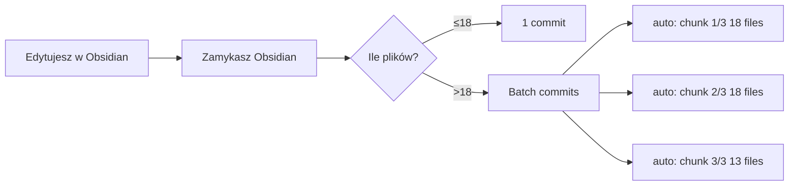

---
tags:
  - #automation
  - #eww
  - #git
  - #knowledge
  - #linux
  - #obsidian
  - #secondbrain
created: 2025-11-21T14:27:50Z
modified: 2025-11-21T14:27:50Z
author: jakubc
title: "🔄 Obsidian Git - Konfiguracja"


---

# 🔄 Obsidian Git - Konfiguracja

## 🎯 Cel

- **Commit tylko przy zamykaniu** Obsidiana
- **Max 18 plików per commit** (dla graph rendering)
- **Automatyczne dzielenie** na batche

## ⚙️ Konfiguracja

### 1. Obsidian Git Plugin

```json
{
  "autoSaveInterval": 0,           // ❌ Wyłączony auto-save
  "commitOnClose": true,            // ✅ Commit przy zamknięciu
  "autoCommitMessage": "docs: update {{numFiles}} files",
  "autoPullOnBoot": false           // ❌ Nie pull przy starcie
}
```

**Lokacja**: `.obsidian/plugins/obsidian-git/data.json`

### 2. Git Pre-Commit Hook

**Lokacja**: `.githooks/pre-commit`

**Funkcja**:
- Sprawdza liczbę staged plików
- Jeśli **> 18**: dzieli na batche po ~18
- Tworzy automatyczne commity: `auto: chunk 1/3 (18 plików)`

**Aktywacja**:
```bash
git config core.hooksPath .githooks
chmod +x .githooks/pre-commit
```

## 📊 Flow Pracy



## 📝 Przykład

**Edytujesz 47 plików** → Zamykasz Obsidian:

```
✓ auto: chunk 1/3 (18 plików)
✓ auto: chunk 2/3 (18 plików)  
✓ auto: chunk 3/3 (11 plików)
```

## 🚨 Troubleshooting

### Problem: Git nie dzieli commitów

**Sprawdź**:
```bash
git config core.hooksPath  # Powinno: .githooks
ls -la .githooks/pre-commit  # Powinno mieć +x
```

**Fix**:
```bash
git config core.hooksPath .githooks
chmod +x .githooks/pre-commit
```

### Problem: Auto-save co 5 minut

**Fix**:
W Obsidian:
1. Settings → Community Plugins → Obsidian Git
2. `Auto backup interval` → **0** (wyłącz)
3. `Vault backup on close` → **ON**

## 🔗 Related

- [[.githooks/pre-commit]] - Hook script
- [[GRAPH-PERFORMANCE-FIX]] - Dlaczego 18 plików?


**Autor**: jakubc  
**Data**: 2025-11-21  
**Status**: ✅ AKTYWNE
