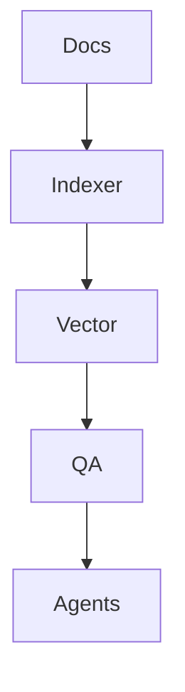

created: 2025-11-21T14:12:29Z
modified: 2025-11-24T22:34:18Z
author: jakubc
---
tags:
  - #automation
  - #development
  - #eww
  - #knowledge
  - #linux
  - #productivity
  - #secondbrain
title: Architecture
description: Dokumentacja projektu EWW
filepath: dev/Idea/Lab AI/Architecture.md
color: yellow
owner: jakubc
updated: 2025-11-21
version: 1.0.0
language: pl
status: active
  - documentation
  - markdown
  - development
  - code
related:
  - 
sources:
  - dev/Idea/Lab AI/Architecture.md
backlinks: []

created: 2025-11-21T14:12:29Z
modified: 2025-11-24T22:34:18Z
author: jakubc
---

