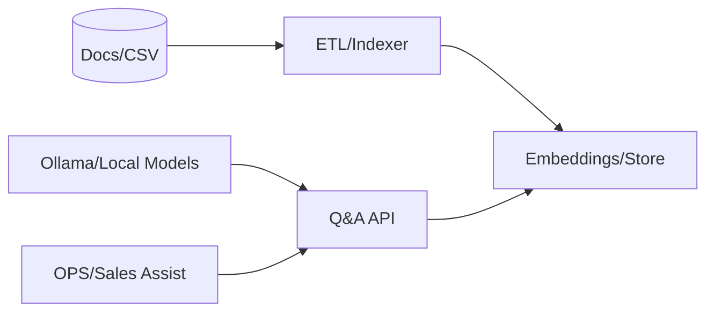

created: 2025-11-21T14:12:29Z
modified: 2025-11-24T22:34:18Z
author: jakubc
---
tags:
  - #automation
  - #development
  - #eww
  - #knowledge
  - #linux
  - #productivity
  - #secondbrain
title: Project Dashboard
description: 🔬 Lab AI — Project Dashboard  ^LabAI_Project
filepath: dev/Idea/Lab AI/Project_Dashboard.md
color: yellow
owner: jakubc
updated: 2025-11-21
version: 1.0.0
language: pl
status: active
  - documentation
  - markdown
  - development
  - code
related:
  - 
sources:
  - dev/Idea/Lab AI/Project_Dashboard.md
backlinks: []

created: 2025-11-21T14:12:29Z
modified: 2025-11-24T22:34:18Z
author: jakubc
---

# 🔬 Lab AI — Project Dashboard  ^LabAI_Project

## 🎯 Cele
- Lokalne inference (7–13B) + RAG nad SOP/FAQ.
- Watcher CSV → walidacja → feedback do OPS.

## 🧩 Architektura

## 🛣️ Milestones
- **Next 7d**: Node GPU, kontenery modeli, bazowy index. 🔶 #todo  
- **30d**: POC RAG nad SOP + endpoint HTTP. 🔶 #todo  
- **60d**: Watcher CSV + walidacja i raport. 🔶 #todo

## KPI
| Metr | Cel |
|---|---|
| Latencja | ≤ 2 s |
| Pokrycie indeksu SOP | ≥ 95% |
| Skuteczność walidacji CSV | ≥ 95% |

**Embedd:** `![[🔬 Lab AI — Project Dashboard#^LabAI_Project]]`