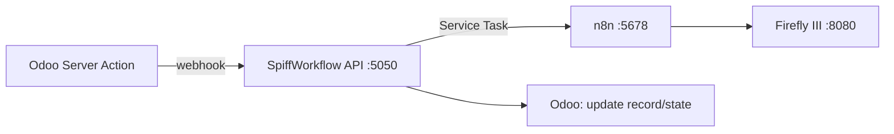

created: 2025-11-21T14:12:29Z
modified: 2025-11-24T22:34:18Z
author: jakubc
---
tags:
  - #automation
  - #development
  - #eww
  - #knowledge
  - #linux
  - #productivity
  - #secondbrain
title: Tech Dashboard
description: 🧭 BPMN (Tool)
filepath: dev/Idea/Tech_Dashboard.md
color: yellow
owner: jakubc
updated: 2025-11-21
version: 1.0.0
language: pl
status: active
  - documentation
  - markdown
  - development
  - code
related:
  - 
sources:
  - dev/Idea/Tech_Dashboard.md
backlinks: []

created: 2025-11-21T14:12:29Z
modified: 2025-11-24T22:34:18Z
author: jakubc
---

# 🧭 BPMN (Tool)

> **Założenie:** wszystko działa **lokalnie/offline**. Ten panel spina modelowanie, uruchamianie procesów i integracje z Odoo/n8n/Firefly — bez chmury.

**Szybkie wejścia**  
- 📂 Workflows (źródło prawdy): `Biznes/Systemy/Odoo/Workflows/BPMN/`  
- 🧪 Mermaid szkice: `Biznes/Systemy/Odoo/Workflows/Mermaid/`  
- 📚 Runbook szablon: `Biznes/Development/Runbooks/Runbook_Template`

created: 2025-11-21T14:12:29Z
modified: 2025-11-24T22:34:18Z
author: jakubc
---

## 🗺️ Warstwy stosu (lokalnie)
| Warstwa | Narzędzie | Rola | Gdzie | Port/Ścieżka | Status | Notatka |
|---|---|---|---|---|---:|---|
| ✏️ **Modelowanie** | **Camunda Modeler (desktop)** | edycja *.bpmn* | laptop/desktop | — | 🟢 | eksport PNG do Obsidiana |
| 👁️ **Viewer** | **bpmn-js (local)** | podgląd BPMN w przeglądarce | `file://` / lokalny serwer | 8088 (np. http‑server) | 🔶 #todo | prosty viewer read‑only |
| 🐍 **Runtime A (Python)** | **SpiffWorkflow** | wykonywanie BPMN | VM/CT (PROD/LAB) | :5050 (REST) | 🔶 #todo | lekki mikroserwis |
| ☕ **Runtime B (Java)** | **Flowable** | wykonywanie BPMN/DMN | VM/CT (LAB→PROD) | :8081 | 🔶 #todo | alternatywa enterprise |
| ☕ **Runtime C (Java)** | **jBPM/KIE** | wykonywanie BPMN/DMN | VM/CT (LAB) | :8082 | 🔶 #todo | opcja nr 2 |
| 📦 **Repo** | **Git (Synapser/CouchDB sync)** | wersjonowanie *.bpmn* | VM 100 | `/workflows.git` | 🟢 | konwencja nazewnictwa |
| 🔗 **Integracje** | **n8n (local)** | webhooki/ETL | VM 110 | :5678 | 🔶 #todo | flows prod |
| 🧮 **Finanse** | **Firefly III (local)** | cash‑flow | VM 120 | :8080 | 🔶 #todo | /transactions API |
| 🧰 **ERP** | **Odoo (local)** | SO/DO/Invoice | VM 130 | :8069 | 🟡 | automations/webhooki |

> [!tip] Utrzymujemy **jedno źródło prawdy**: pliki *.bpmn* w `Workflows/BPMN/`. Viewer/PNG służą tylko do podglądu.

created: 2025-11-21T14:12:29Z
modified: 2025-11-24T22:34:18Z
author: jakubc
---

## ✏️ Modelowanie (reguły)
- **Format**: BPMN 2.0, Camunda Modeler.  
- **Nazewnictwo plików**: `YYYY-MM_<Dzial>_<Proces>_vM.m.bpmn` (np. `2025-04_OPS_Main_v1.0.bpmn`).  
- **Eksport**: do `Workflows/BPMN/png/` jako `.png` dla podglądu w Obsidianie.  
- **Semantyka**: bramki *Exclusive* dla decyzji (Naprawa/Scrap/RMA), *User Task* dla czynności ręcznych, *Service Task* dla webhooków/n8n.

**Checklist komitu (BPMN)**
- [ ] Nazwy tasków i pól czytelne (PL), bez skrótów domenowych. #todo  
- [ ] Przepływy wyjątków opisane (label na krawędziach). #todo  
- [ ] Wersja w metadanych modelu uaktualniona. #todo

created: 2025-11-21T14:12:29Z
modified: 2025-11-24T22:34:18Z
author: jakubc
---

## 🐍 Runtime A — SpiffWorkflow (Python)
**Cel:** lekki **mikroserwis BPMN** do kroków automatycznych + wywołań webhooków.

**Architektura (lokalnie)**

**Minimalne endpointy**  
- `POST /process/start` body: `{ model: "OPS_Main", data: {...} }`  
- `POST /task/<id>/complete` dla tasków użytkownika (zatwierdzenia)  
- `GET /process/<id>/state` status

**Do wdrożenia**
- [ ] Kontener + systemd unit (VM 110/nowa) #todo  
- [ ] Schemat zmiennych BPMN ↔ Odoo/n8n (JSONSchema) #todo  
- [ ] Logi do pliku + rotacja #todo

created: 2025-11-21T14:12:29Z
modified: 2025-11-24T22:34:18Z
author: jakubc
---

## ☕ Runtime B — Flowable (alternatywa)
- [ ] Kontener (Docker/Podman) na VM 110/oddzielnej #todo  
- [ ] Import modeli BPMN/DMN, definicje procesów #todo  
- [ ] Użytkownicy/role, REST API włączone #todo

## ☕ Runtime C — jBPM (opcjonalnie)
- [ ] Serwer KIE (WildFly/Quarkus) lokalnie #todo  
- [ ] Projekty KIE, integracja REST #todo

> [!hint] Zacznij od **SpiffWorkflow** – szybsza integracja z Python/n8n; Flowable/jBPM zostaw jako „cięższe” opcje LAB.

created: 2025-11-21T14:12:29Z
modified: 2025-11-24T22:34:18Z
author: jakubc
---

## 🔗 Integracje lokalne
**Odoo → BPMN**: Server Action → `POST /process/start` (payload z SO/DO/Invoice).  
**BPMN → n8n**: Service Task HTTP → flow ETL (payouts/fees/label/parts).  
**n8n → Firefly**: `POST /api/v1/transactions` (tag `order-XXXX`).  
**BPMN → Odoo**: zapis notatek/stanów (QC, decyzje).

**Do zrobienia**
- [ ] Webhook `invoice_paid` → BPMN start `CashFlow` #todo  
- [ ] Flow `eBay payouts → Firefly` (alert odchyleń) #todo  
- [ ] Mapowanie pól #FCGH (parts/labor/label/fee) #todo

created: 2025-11-21T14:12:29Z
modified: 2025-11-24T22:34:18Z
author: jakubc
---

## 🧪 Testy i symulacja
- [ ] Test tokenów (Camunda Modeler) — przejście wszystkich bramek #todo  
- [ ] Dane testowe: 3 zamówienia (Naprawa/Scrap/RMA) #todo  
- [ ] Checkpointy: walidacja stanu w Odoo + wpisy w Firefly #todo

created: 2025-11-21T14:12:29Z
modified: 2025-11-24T22:34:18Z
author: jakubc
---

## 📈 KPI procesu (lokalnie)
| KPI | Cel | Źródło |
|---|---|---|
| Pokrycie BPMN (liczba procesów w *.bpmn*) | 100% krytycznych | repo Git |
| Czas start→finish procesu „Sprzedaż” | ≤ 24h | log Spiff / Odoo |
| Odchylenie payout vs invoice | ≤ £2 | n8n + Firefly |
| Udział wyjątków (Scrap/RMA) | ≤ X% | BPMN eventy |

created: 2025-11-21T14:12:29Z
modified: 2025-11-24T22:34:18Z
author: jakubc
---

## 🧰 Utrzymanie i repozytorium
- **Git flow**: `feature/<proces>` → PR → review → `main` → tag `vM.m`.  
- **Eksport PNG** po merdżu (hook/czynność ręczna).  
- **Runbooki**: `Biznes/Development/Runbooks/` (per usługa).

**To‑Do (utrzymanie)**
- [ ] Hook `pre-commit`: walidacja BPMN XML (xsd) #todo  
- [ ] Skrypt eksportu PNG (camunda‑cli) #todo

created: 2025-11-21T14:12:29Z
modified: 2025-11-24T22:34:18Z
author: jakubc
---

## ✅ Next 7 days (lokalnie)
- [ ] Zacommitować `OPS_Main.bpmn` + `FCGH_CashFlow.bpmn` (v1.0) #todo  
- [ ] Postawić **SpiffWorkflow** na VM (systemd + logi) #todo  
- [ ] Odoo: Server Action `invoice_paid → POST /process/start` #todo  
- [ ] n8n: dwa flow (`invoice_paid→Firefly`, `payouts→Firefly`) #todo  
- [ ] Uptime Kuma: health dla Spiff, n8n, Firefly #todo

created: 2025-11-21T14:12:29Z
modified: 2025-11-24T22:34:18Z
author: jakubc
---

### 📌 Embedy
- Panel: `![[BPMN – Local Stack Dashboard#^BPMN_Main]]`

created: 2025-11-21T14:12:29Z
modified: 2025-11-24T22:34:18Z
author: jakubc
---

## 🔗 Backlinki

*Pliki linkujące do tego dokumentu:*

- [[business/Finanse/Business_Dashboard|Business_Dashboard]]
- [[usr/karinam/Biznes/Finanse/Business_Dashboard|Business_Dashboard]]

created: 2025-11-21T14:12:29Z
modified: 2025-11-24T22:34:18Z
author: jakubc
---

**Backlinków:** 2  
**Linków wychodzących:** 0  
**Zaktualizowano:** 1763715867.5616052  
