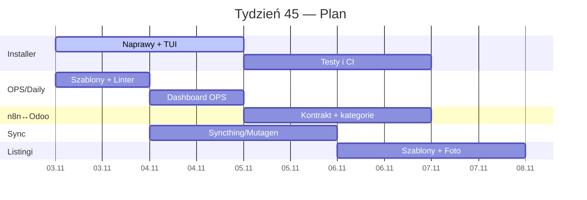

---
tags:
  - #automation
  - #development
  - #docs
  - #eww
  - #knowledge
  - #linux
  - #secondbrain
created: 2025-11-21T10:00:00Z
modified: 2025-11-21T10:00:00Z
author: jakubc
title: "## 🔗 Nawigacja"


---


> [!summary]+ 🧭 Przegląd tygodnia
> **Cele:** domknięcie instalatora EWW, uporządkowanie Playbooks, uruchomienie „Daily OPS” w Obsidianie, przygotowanie sync eBay ↔ n8n ↔ Odoo.
> **Kluczowe ryzyka:** błąd EOF w installerze, niestartujący Syncthing (user-service), rozjazd metadanych `created/updated` w notatkach.
> **Priorytety:** ✅ Installer, ✅ OPS/Daily, ✅ n8n↔Odoo kontrakt API, 🔶 Syncthing/Mutagen, 🔶 Listings, 🔶 Diagnostyka X99.


## 🔗 Nawigacja
- [📦 1) EWW‑Installer + Styl KDE](#-1-eww-installer--styl-kde)
- [📜 2) Playbooks • Tools • Stack](#-2-playbooks--tools--stack)
- [🗒️ 3) Obsidian OPS + Daily](#-3-obsidian-ops--daily)
- [🥑 4) Projekt „Avocado”](#-4-projekt-avocado)
- [🛒 5) eBay ↔ n8n ↔ Odoo](#-5-ebay--n8n--odoo)
- [🧠 6) Secondbrain: Syncthing/Mutagen](#-6-secondbrain-syncthingmutagen)
- [📶 7) Listingi: Bosch PHG 500‑2, TP‑Link C50](#-7-listingi-bosch-phg-500-2-tp-link-c50)
- [🧩 8) Diagnostyka HW/OS](#-8-diagnostyka-hwos)
- [📊 KPI i metryki](#-kpi-i-metryki)
- [📂 Ostatnie 5 plików Daily](#-ostatnie-5-plików-daily)
- [🗒️ Decyzje i notatki](#-decyzje-i-notatki)


## 📦 1) EWW‑Installer + Styl KDE
**Cel tygodnia:** Stabilny instalator 1‑plikowy z TUI i pełnym logowaniem.

**Stan:**
- Zebrane parametry motywu: `breeze-dark`, `Kvantum`, Accent `0,230,118`.
- Błąd: `nieoczekiwany EOF` ~linia 260 (quoting/heredoc) + przerwany krok sudo.

**Plan:**
- [ ] Dodać `set -Eeuo pipefail` i `trap 'rc=$?; echo "FAIL:$rc"; exit $rc' ERR`.
- [ ] Naprawić quoting i zamknięcia heredoc (`<<'BASH' ... BASH`).
- [ ] Logger: `exec > >(tee -a "$LOG") 2>&1` do `~/.cache/eww-installer/last.log`.
- [ ] `shellcheck + shfmt` w CI lokalnym; `bats` dla smoke‑testów.
- [ ] TUI: `gum` albo `whiptail`; PASS/FAIL przy każdym kroku.

**Artefakty:**
- [ ] `playbooks/installer/eww_style_playbook.sh` (wersja naprawiona)
- [ ] `tests/installer_smoke.bats`

> [!tip] Szybki test
> `bash -n eww_style_playbook.sh && shellcheck eww_style_playbook.sh && shfmt -d eww_style_playbook.sh`


## 📜 2) Playbooks • Tools • Stack
**Cel tygodnia:** Konwencja playbooków + narzędzia i checklisty.

**Stack docelowy:** `bash`, `aria2c`, `curl`, `jq|yq`, `rsync`, `systemd --user`, `shellcheck`, `shfmt`, `bats`.

**Struktura repo:**
```
playbooks/
  00_common/
  10_desktop_theme/
  20_obsidian_ops/
  30_n8n_odoo/
  90_diag/
scripts/
ci/
```

**Plan:**
- [ ] Konwencja „kroków” z jednoznacznym PASS/FAIL.
- [ ] Wspólny `lib/log.sh`, `lib/ask.sh` (gum), `lib/pkg.sh`.
- [ ] README z tabelą playbooków i wejściami/wyjściami.


## 🗒️ 3) Obsidian OPS + Daily
**Cel tygodnia:** Jeden przycisk „New Daily”, metadane z pliku, panel ostatnich plików.

**Plan:**
- [ ] Templater: front‑matter z `file.mtime`, `file.size`, `ext`.
- [ ] Dataview: lista ostatnich 5 z `00_CORE/Daily`.
- [ ] Linter: standaryzacja YAML i kolejności pól.
- [ ] Karta „OPS Daily” z checklistą SOP.

**Blokery:** rozjazd `created/updated` z zegarem systemu.

**Artefakty:**
- [ ] `templates/daily.md`
- [ ] `dashboards/OPS_Daily.md`

> [!info] Wskazówka
> Ustaw `created` na `dateformat(file.ctime, "yyyy-MM-dd HH:mm")` w headerze przez Templater.


## 🥑 4) Projekt „Avocado”
**Cel tygodnia:** Gotowy dashboard + dziennik `Daily/` z foto‑logiem.

**Plan:**
- [ ] Struktura folderów `Avocado/README.md`, `Avocado/Daily/2025-11-03.md` itd.
- [ ] Szablon dzienny z godzinami zadań i miejscem na foto.
- [ ] Checklisty pielęgnacji (temp, woda, światło).

**Artefakty:**
- [ ] `projects/Avocado/Avocado_Dashboard.md`


## 🛒 5) eBay ↔ n8n ↔ Odoo
**Cel tygodnia:** Kontrakt API + pobranie drzew kategorii i mapowanie do Odoo.

**Plan:**
- [ ] Specyfikacja przepływu: eBay API → n8n → Odoo (`product.category`, `product.template`).
- [ ] Adapter kategorii + harmonogram sync.
- [ ] Logowanie metryk i błędów w n8n.

**Parametry sieci:**
```
Odoo-app: 192.168.0.200
Odoo-db : 192.168.0.201
n8n/Synapser: 192.168.0.211
Gateway: 192.168.0.10
```

**Artefakty:**
- [ ] `n8n/workflows/ebay_to_odoo.json`
- [ ] `docs/api_contracts/ebay_odoo.md`


## 🧠 6) Secondbrain: Syncthing/Mutagen
**Cel tygodnia:** Stabilny sync i polityka chunkingu pod RAG.

**Plan:**
- [ ] `journalctl --user -u syncthing` + naprawa ścieżek/permissions.
- [ ] Włączyć autostart `systemctl --user enable --now syncthing`.
- [ ] Profile Mutagen do vaultów i repo.
- [ ] Polityka chunkingu: 3–8 KB na segment, nagłówki jako granice.

**Artefakty:**
- [ ] `mutagen.yml`
- [ ] `ops/sync_checklist.md`


## 📶 7) Listingi: Bosch PHG 500‑2, TP‑Link C50
**Cel tygodnia:** Ujednolicony szablon listingów i komplet zdjęć 1:1.

**Plan:**
- [ ] Sekcje: Highlights • Stan • Co w zestawie • Test • Porty • Parametry.
- [ ] SKU i tagi, link do testu działania.
- [ ] Zdjęcia: tło neutralne, 1:1, 2000×2000 px.

**Artefakty:**
- [ ] `listings/templates/sku_listing.md`
- [ ] `listings/bosch_phg500-2.md`
- [ ] `listings/tplink_c50.md`


## 🧩 8) Diagnostyka HW/OS
**Cel tygodnia:** Ustalić przyczynę OOM i zweryfikować Q‑code płyty.

**Plan:**
- [ ] Analiza `dmesg` i `journalctl -k` pod OOM‑killer.
- [ ] Manual płyty X99 → interpretacja Q‑code.
- [ ] Testy RAM, zasilania, termiki.

**Artefakty:**
- [ ] `diag/oom_report.md`
- [ ] `diag/x99_qcodes.md`


## 📊 KPI i metryki
- [ ] **Tasks planned:** {{kpi.tasks_planned}}
- [ ] **Tasks done:** {{kpi.tasks_done}}
- [ ] **Blockers:** {{kpi.blockers}}
- [ ] **Incidents:** {{kpi.incidents}}

> [!quote] Cytat tygodnia
> "What gets measured gets managed."


## 📂 Ostatnie 5 plików Daily
```dataview
LIST FROM "00_CORE/Daily"
SORT file.mtime desc
LIMIT 5
```


## 🗓️ Oś tygodnia



## 🗒️ Decyzje i notatki
- [ ] Standaryzacja logowania w playbookach przez `lib/log.sh`.
- [ ] `aria2c` jako domyślny downloader.
- [ ] Metadane notatek z `file.ctime/mtime`, nie z zegara systemu.

> [!todo] Backlog do rozpisania
> - Syncthing service: szczegóły błędu i ścieżki.
> - X99: Q‑code i lista testów.
> - eBay: mapowanie kategorii → Odoo.


> [!success] Jak używać tego dashboardu
> 1. Uzupełnij checklisty w każdej sekcji.
> 2. Dodaj linki do artefaktów i commitów.
> 3. Zaktualizuj KPI i status na koniec tygodnia.
