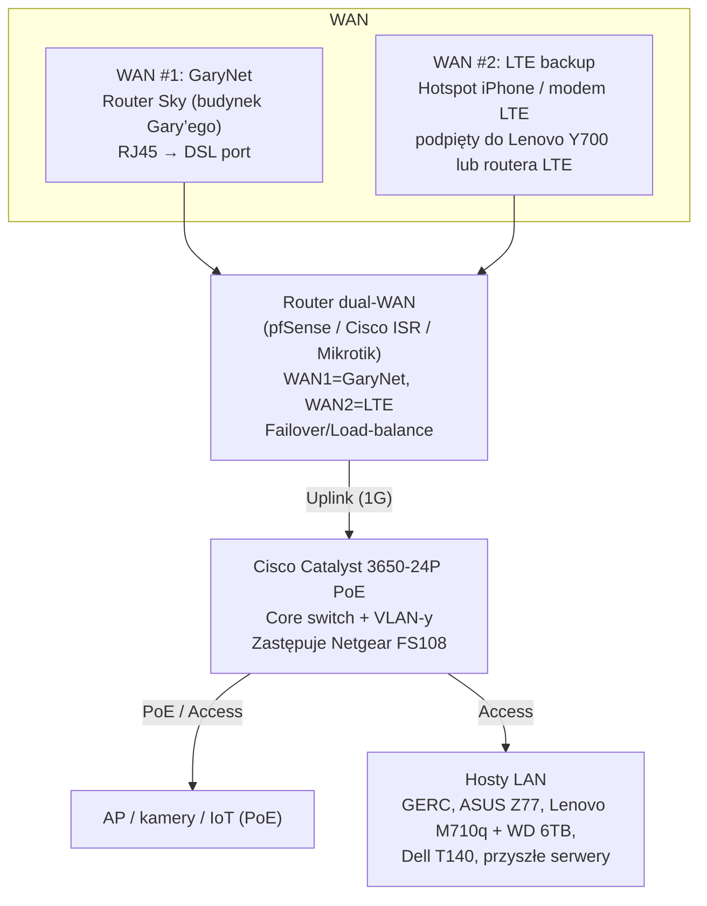

---
tags:
  - #infrastructure
  - #network
  - #deployment
  - #garynet
  - #roadmap
created: 2025-11-23T19:35:04Z
modified: 2025-11-23T19:35:04Z
author: jakubc
title: "Plan wdrożenia — Cisco Catalyst + dual-WAN"
status: draft
owner: jakubc
---

# Plan wdrożenia — Cisco Catalyst + dual-WAN

Dokument opisuje modernizację sieci: wprowadzenie przełącznika Cisco Catalyst 3650-24P PoE, uporządkowanie segmentu GaryNet oraz automatyczny failover WAN (GaryNet ↔ LTE/tethering). Ma służyć jako runbook projektowy zanim zaczniemy kupować sprzęt.

## 🎯 Cele
- Zapewnić stabilne zasilanie PoE dla przyszłych AP/kamer/telefonów IP.
- Skonsolidować LAN 192.168.0.0/24 na pojedynczym core switchu (Catalyst) zamiast Netgear FS108.
- Wprowadzić podwójny WAN: 
  1. **Primary** — GaryNet (router Sky w budynku Gary’ego) gdy DSL działa.  
  2. **Backup** — Tethering LTE (telefon → Lenovo Y700) lub dedykowany modem LTE.
- Zautomatyzować przełączenie WAN (failover) bez ręcznego przepinania kabli.

## 🧩 Architektura docelowa

### Role elementów
- **Router dual-WAN** — jedyne urządzenie mówiące z GaryNet i LTE; monitoruje łącza (`ping 8.8.8.8`) i przełącza ruch. Może to być:
  - Cisco ISR (np. 4331),
  - pfSense/opnSense na mini-PC z dwoma NIC,
  - Mikrotik (hap ax3 / RB4011) z configiem failover.
- **Catalyst 3650-24P** — centralny przełącznik z PoE, stackingiem i możliwością VLAN. Netgear FS108 zostaje jako rezerwowy/edge.
- **Lenovo Y700** — w pierwszej fazie nadal źródło LTE (ICS). Docelowo zastąpione przez modem LTE lub router 5G.
- **GaryNet** — opisany w [[garynet]]. Po wpięciu do WAN1 reaguje natychmiast (nie wymaga ręcznego logowania).

## 🛠️ Etapy wdrożenia

1. **Audit & labeling**
   - Spisać wszystkie kable RJ45, oznaczyć gniazdo GaryNet i porty hostów.  
   - Zweryfikować pobór mocy urządzeń PoE (kamery, AP) → czy 3650-24P wystarczy z zapasem.
2. **Przygotowanie dual-WAN**
   - Wybrać hardware routera + zaprojektować politykę failover (tracking, health-check).  
   - Zbudować patch panel lub mały switch WAN, który pozwoli szybko podpiąć Lenovo Y700 / modem LTE do portu WAN2.
3. **Montaż Cisco Catalyst**
   - Rack/uchwyty, zasilanie (UPS).  
   - Skonfigurować VLAN 1 (LAN), VLAN 20 (IoT/PoE), ewentualnie mgmt VLAN.
   - Przepiąć hosty z Netgear FS108 do Catalystem (po jednym).  
   - Wstępny config PoE i portów (opis na switchu).
4. **Migracja WAN**
   - Podłączyć WAN1 do gniazdka GaryNet (DSL port).  
   - WAN2 do Lenovo Y700 / modemu LTE.  
   - Ustawić politykę „preferred WAN1”, „failover WAN2”, pseudo load-balance (np. 90/10).  
   - Testy: odpięcie GaryNet → ruch przechodzi na LTE; przywrócenie → powrót do GaryNet.
5. **Dokumentacja & monitoring**
   - Uaktualnić [[docs/infra/hardware/network/status/wan-fallback-2025-11-23]] diagramem docelowej architektury.  
   - Dodać zadania w `wan-fallback-2025-11-23` i `core/workflow/infrastructure.md`.  
   - Włączyć monitoring (syslog, SNMP) na routerze/Catalyście.

## 🏗️ Lokalizacja fizyczna (rack U42 + biurko DEV)

| Lokalizacja | Rola | Sprzęt | Uwagi montażowe |
| --- | --- | --- | --- |
| **Biurko (środowisko DEV)** | Lab/DEV/testy | Małe huby USB, Lenovo Y700, Netgear FS108 (tymczasowo), router ASUS DSL-N16 | Zostaje jako środowisko eksperymentalne i szybki bypass. Nie montować tam Catalystem – zostaje w szafie PROD. |
| **Szafa serwerowa U42 — front, górna połka (U38–U42)** | Core PROD | Cisco Catalyst 3650-24P PoE (1U) | Umieść możliwie wysoko, frontem do drzwi szafy (łatwy dostęp do patch paneli, krótkie kable do organizera). Zabezpiecz przepływ powietrza (góra = cieplej, ale najłatwiej prowadzić kable w dół). |
| **Szafa serwerowa U42 — front, tuż pod Catalystem (np. U36–U38)** | Router dual-WAN | pfSense/Mikrotik/ISR | Blisko switcha dla krótkich patchy (Gi1/0/1). Front montaż pozwala na wygodne przepięcia WAN (GaryNet, LTE). |
| **Szafa serwerowa U42 — tył** | Zasilanie/patch panel | UPS, listwy PDU, panel RJ45 (GaryNet + hosty) | Prowadź kable strukturalne z góry szafy, aby switch miał patchcordy tylko z przodu. |

> [!tip] Pozycjonowanie „przód/tył”
> - Catalyst i router montuj frontem do drzwi (łatwy dostęp do portów i konsoli).  
> - Kable zasilania/ethernet prowadź wzdłuż boków szafy.  
> - Jeśli potrzebujesz szybkiego podpięcia DEV (np. laptopa), zostaw jeden port frontowy Catalystem oznaczony jako „DEV/diag”.

## ✅ Checklisty

### Dual-WAN router
- [ ] Liczba portów WAN ≥ 2.
- [ ] Obsługa monitoringu linków/policy routing.
- [ ] Możliwość zapisania configu w repo (np. backup configa `.cfg`).
- [ ] Tryb manual bypass (fizyczny przełącznik / patch cord) opisany w runbooku.

### Catalyst 3650-24P
- [ ] Pełny `show inventory` + numer seryjny w [[docs/infra/hardware/network/catalyst_3650]] (do utworzenia).  
- [ ] Profile portów: `Gi1/0/1` uplink do routera, `Gi1/0/2-24` access/PoE.  
- [ ] Zasilanie i chłodzenie (głośność!) — plan lokalizacji.  
- [ ] Backup konfiguracji (`copy running-config tftp://...`).

## 🔗 Powiązane dokumenty
- [[docs/infra/hardware/network/status/wan-fallback-2025-11-23]] — bieżący runbook tetheringu.  
- [[network]] — źródło prawdy o sieci.  
- [[garynet]] — opis połączenia między budynkami.  
- [[docs/infra/hardware/laptops/lenovo_y700/lenovo_y700]] — rola Y700 jako bridge LTE.

## 📝 TODO (draft)
- [ ] Wybrać konkretny model routera dual-WAN (budżet vs funkcje).  
- [ ] Potwierdzić dostępność Catalyst 3650-24P PoE (rynek wtórny?) i koszt modułów zasilania.  
- [ ] Przygotować plan migracji krok-po-kroku (np. okno serwisowe nocą).  
- [ ] Zaprojektować monitoring (Prometheus/Zabbix, e-mail alert).  
- [ ] Po wdrożeniu zaktualizować wszystkie diagramy (wan-fallback-2025-11-23, network README, core workflow).

## 🔗 Backlinks

- [[network]]
- [[docs/docs]]
- [[INDEX]]
