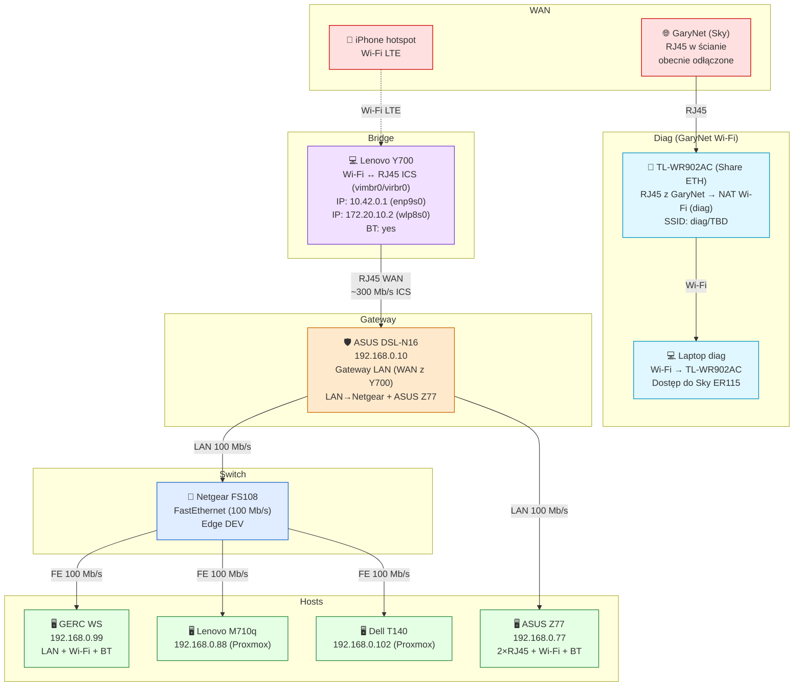

---
tags:
  - #network
  - #diagram
  - #topology
created: 2025-12-01T21:25:00Z
modified: 2025-12-01T21:35:00Z
modified: 2025-12-01T22:10:00Z
author: jakubc
title: "Network Topology — EWW"
status: draft
owner: jakubc
---

# Network Topology — EWW

Stan **aktualny (bez Catalysta)**: hotspot iPhone → Wi-Fi Lenovo Y700 → ICS RJ45 → ASUS DSL-N16 → Netgear FS108 → hosty. IP podane tam, gdzie znane. Kolory: WAN czerwony, bridge fiolet, gateway pomarańcz, switch niebieski, hosty zielone.

## 📋 Lista urządzeń (skrót)
- **📱 iPhone hotspot** — źródło internetu (Wi-Fi).
- **💻 Lenovo Y700** — most Wi-Fi → RJ45 (ICS, vimbr0/virbr0) dla WAN; IP: 10.42.0.1 (enp9s0), 172.20.10.2 (wlp8s0); BT: tak.
- **🛡️ ASUS DSL-N16** — gateway 192.168.0.10, NAT/Firewall dla 192.168.0.0/24.
- **🔀 Netgear FS108** — edge switch FastEthernet (DEV/hosty).
- **🖥️ Hosty** — GERC (192.168.0.99, LAN + Wi-Fi + BT), ASUS Z77 (192.168.0.77, 2×RJ45 + Wi-Fi + BT), Lenovo M710q (192.168.0.88/Proxmox), Dell T140 (192.168.0.102/Proxmox).
- **🌐 GaryNet** — RJ45 w ścianie (Sky, podpięte tylko do TL-WR902AC diag; brak połączenia z ASUS DSL-N16).
- **📡 TL-WR902AC (diag)** — w trybie Share ETH z RJ45 GaryNet, wystawia Wi-Fi (diag SSID) do diagnostyki routera Sky ER115.

## 🧭 Bloki (tekst)
- **WAN:** iPhone hotspot (Wi-Fi); GaryNet RJ45 tylko do diag AP (nie do ASUS DSL-N16).
- **Bridge:** Lenovo Y700 (ICS) — 10.42.0.1 (enp9s0), 172.20.10.2 (wlp8s0), BT.
- **Gateway:** ASUS DSL-N16 — 192.168.0.10; LAN do Netgear i bezpośrednio do ASUS Z77.
- **Switch:** Netgear FS108 — FastEthernet 100 Mb/s do hostów.
- **Hosty:** GERC 192.168.0.99 (LAN/Wi-Fi/BT), ASUS Z77 192.168.0.77 (2×RJ45/Wi-Fi/BT), Lenovo M710q 192.168.0.88 (Proxmox), Dell T140 192.168.0.102 (Proxmox).
- **Diag:** TL-WR902AC (Share ETH) + Wi-Fi diag → laptop z dostępem do Sky ER115 (GaryNet).

## 🗒️ Do uzupełnienia
- IP dla ewentualnych IoT/PoE.
- IP dla GaryNet (router Sky) po ponownym podłączeniu.
- Plan docelowy (dual-WAN + Catalyst) pozostaje w `network-deployment*.md`.

## 🔗 Backlinki

- [[network]]
- [[tp-link_tl-wr902ac]]
- [[cisco-3650-catalyst-poe-24/cisco-3650-catalyst-poe-24]]
- [[netgear_fs108/netgear_fs108]]
- [[devices/asus-dsl-n16/asus-dsl-n16]]
