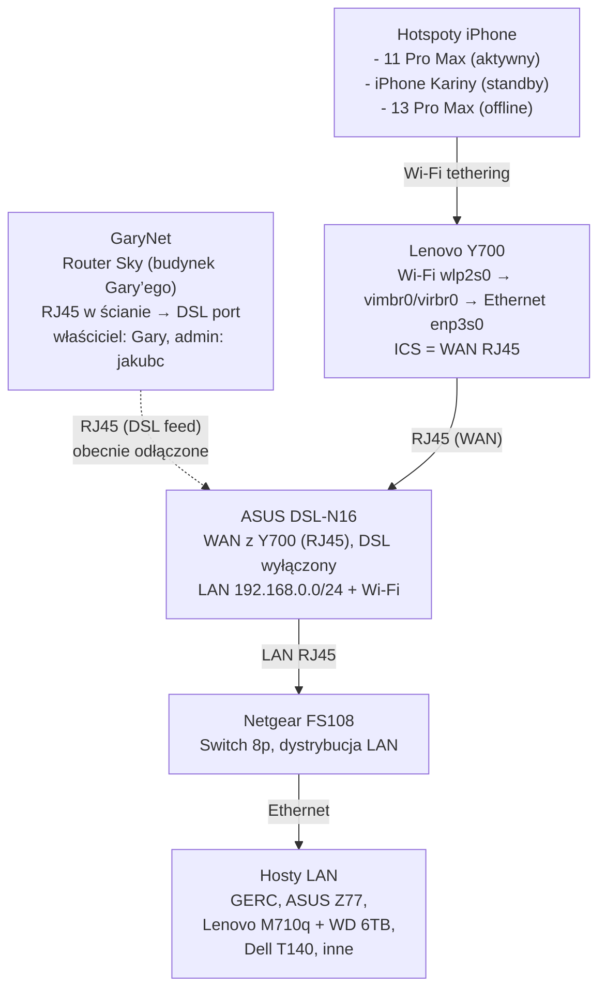

---
tags:
  - #automation
  - #docs
  - #eww
  - #infrastructure
  - #knowledge
  - #linux
  - #secondbrain
created: 2025-11-21T17:00:00Z
modified: 2025-11-22T17:15:00Z
author: jakubc
title: "🌐 Network — źródło prawdy"

owner: jakubc
---

# 🌐 Network — źródło prawdy

## Zakres
- Plan adresacji IPv4/IPv6 i rezerwacje DHCP
- Topologia (diagramy, opis fizycznych i logicznych połączeń)
- VLAN-y, VPN-y oraz zasady routingu
- Porty usługowe i listy kontroli dostępu
- Plan modernizacji (patrz [[docs/infra/network/network-deployment]])

## 📊 Urządzenia sieciowe

### Router główny (192.168.0.10)
> [!info] ASUS DSL-N16
> - **Model:** ASUS DSL-N16 (ADSL/VDSL modem-router)
> - **IP:** 192.168.0.10
> - **MAC:** 88:d7:f6:63:40:b8
> - **Interfejs webowy:** http://192.168.0.10
> - **SSH:** Port 22 zamknięty
> - **Login:** admin / admin
> - **Status:** 2025-11-22 - problem z routingiem WAN (brak dostępu do internetu)
> - **Dokumentacja:** [[devices/asus-dsl-n16/asus-dsl-n16]]
> - **Physical link:** Router Gary’ego jest połączony kablem RJ45, który wchodzi do naszej ściany i zasila port WAN w warsztacie (Gary > RJ45 > ściana > ASUS DSL-N16). Przy wszelkich modyfikacjach należy upewnić się, że ten przewód jest wpięty i opisany.

> - **Rola:** Router/gateway LAN (obsługuje NAT dla całego segmentu 192.168.0.0/24)
> - **WAN:** Tymczasowo otrzymuje uplink Ethernet z Lenovo Y700 (RJ45), podczas gdy moduł DSL jest wypięty.
> - **GaryNet:** Port DSL może zostać ponownie spięty z gniazdkiem GaryNet (router Sky Gary’ego, właściciel: Gary, admin: jakubc). Patrz [[docs/infra/network/garynet]].

### lenovo_y700 (mobilny uplink)
- **Funkcja:** Tymczasowy source internetu (hotspot)
- **Źródło WAN:** Wi-Fi hotspot z iPhone (karinam lub jakubc)
- **Tryb:** Laptop łączy się przez Wi-Fi do telefonu i udostępnia internet do LAN (Ethernet → router ASUS DSL-N16)
- **Uwagi:** Przed włączeniem tuneli (Cloudflare WARP/Tailscale) należy upewnić się, że tethering Wi-Fi działa stabilnie (zależność: bateria telefonu).
- **Backstory:** Gary (landlord) nie opłacał rachunków za DSL przez ~6 miesięcy, więc Y700 stał się głównym źródłem internetu; skutkiem jest degradacja baterii iPhone 13 Pro Max (spuchnięty, martwy) oraz przeciążenie iPhone 11 Pro Max i telefonu Kariny.
- **Ryzyko:** Telefony muszą leżeć za oknem, trudno się dodzwonić (hotspot pochłania energię). Gdy Gary przywróci stałe łącze, należy zredukować wykorzystanie tetheringu i rezerwować telefony do komunikacji.
- **Bridge:** ICS realizowany przez most programowy (`vimbr0`/`virbr0`) imitujący port WAN na RJ45 dla routera ASUS.
- **Runbook:** [[docs/infra/status_sieci|Status sieci — hotspot iPhone → Lenovo Y700 → ASUS DSL-N16]]

#### Schemat awaryjnego WAN (2025-11-23)

### GaryNet (zewnętrzny segment)
- **Lokalizacja:** osobny budynek Gary’ego, łącze Sky → nasza ściana.  
- **Sprzęt:** router Sky (Gary), gniazdko RJ45 → nasz port DSL.  
- **Własność/administracja:** urządzenie należy do Gary’ego, natomiast adminem operacyjnym jest `jakubc` (hasła/logi).  
- **Status:** fizycznie dostępne, ale przewód DSL jest wypięty, ponieważ WAN działa obecnie z tetheringu Y700.  
- **Dokumentacja:** [[docs/infra/network/garynet]] zawiera szczegóły i checklisty przed ponownym podłączeniem.

### asus_z77 (192.168.0.77)
- **IP:** 192.168.0.77/24
- **MAC:** 8a:7f:75:bf:88:f0 (permaddr: c8:60:00:a2:e2:c0)
- **Interfejs:** enp13s0
- **Gateway:** 192.168.0.10
- **Użytkownik:** karinam
- **OS:** Ubuntu 25.04 (kernel 6.14.0-36-generic)
- **WiFi:** wlp11s0 (DOWN, MAC: fc:b3:bc:35:67:bd)
- **Ethernet 2:** eno1 (NO-CARRIER)
- **SSH:** `ssh karinam@192.168.0.77` / hasło `ciastko33` (tylko sieć lokalna)

### Netgear FS108 (switch dev)
- **Typ:** 8-portowy FastEthernet (niezarządzalny)
- **Rola:** Łączy hosty DEV (GERC, ASUS Z77, Lenovo M710q, router ASUS DSL-N16)
- **Topologia:** Router Gary → ASUS DSL-N16 (WAN) → Netgear FS108 → hosty
- **Dokumentacja:** [[docs/infra/hardware/netgear_fs108/netgear_fs108|netgear_fs108]]
- **Hosty:** Aktualna lista podłączonych urządzeń (Lenovo M710q + WD Elements 6TB, GERC, ASUS Z77, Dell T140) znajduje się w [[docs/infra/status_sieci#Hosty-aktywne-w-Netgear-FS108|status_sieci]].

## 🔍 Znane problemy

### 2025-11-22: Brak dostępu do internetu na asus_z77
- **Symptom:** Firefox nie ładuje stron na asus_z77 (192.168.0.77)
- **Stan sieci lokalnej:** 
  - ✅ `gerc (192.168.0.99) → asus_z77` — ping OK (`ping -c4 192.168.0.77`)
  - ✅ `asus_z77 → gerc` — ping OK (`ping -c4 192.168.0.99`)
- **Diagnoza:** 
  - ✅ Ping do gateway (192.168.0.10) działa
  - ❌ Ping do 8.8.8.8 - 100% packet loss (tylko na asus_z77)
  - 🌍 `gerc → internet` działa (`ping 8.8.8.8`, `curl https://example.com`) — router WAN jest dostępny
  - Wniosek: problem ogranicza się do hosta asus_z77 (konfiguracja sieci/iptables), nie routera
- **Kierunek naprawy:** Debug na asus_z77 (firewall/NAT/DNS) + porównanie z konfiguracją gerc
- **Status 2025-11-22 19:00:** Router ASUS DSL-N16 został zresetowany (soft reset + restart WAN), nie przyniosło to zmiany — z77 nadal bez internetu mimo że ruch LAN jest widoczny. Podejrzenie przesuwa się na lokalny agent Cloudflare Zero Trust (WARP) na asus_z77, który mógł wejść w konflikt z routingiem lub regułami iptables. GERC także ma Zero Trust, ale zachowuje łączność, więc trzeba porównać polityki.
- **Diagnoza SSH (2025-11-22 19:20):**
  - `nmcli d status` / `ip route` / `ip neigh` — konfiguracja statyczna poprawna, gateway osiągalny.
  - `ping -c4 -w5 8.8.8.8` — 100% packet loss; `ping` do 192.168.0.10 i 192.168.0.99 OK.
  - `warp-cli status` → `Status update: Connecting (happy eyeballs to 162.159.192.1:443)`, `warp-cli settings` wskazuje `Always On: true` + lokalny override endpoint.
  - `sudo systemctl status warp-svc` pokazuje setki procesów `warp-dex traceroute 162.159.192.1`, co oznacza zapętlenie się klienta Zero Trust i brak ustanowionego tunelu.
- **Działanie naprawcze (2025-11-22 18:00):**
  - `warp-cli disconnect` + `echo 'ciastko33' | sudo -S systemctl stop warp-svc` → zatrzymanie agenta Cloudflare Zero Trust.
  - Po zatrzymaniu usługi `ping -c4 -w5 8.8.8.8` przechodzi (0% strat), a `curl -I http://example.com` / `curl -I https://example.com` zwracają HTTP 200 — potwierdza że to klient WARP blokował zarówno HTTP, jak i HTTPS.
  - Do czasu przeprojektowania polityki Zero Trust pozostawić warp-svc w stanie `inactive (dead)` lub skonfigurować split tunnel tak jak na GERC.
- **Status 2025-11-22 18:05:** Internet na asus_z77 działa stabilnie z wyłączonym WARP-em; monitorować, aby usługa nie startowała automatycznie zanim nie powstanie poprawna polityka CFZT.
- **Status 2025-11-22 18:30:** Lenovo Y700 pełni rolę awaryjnego źródła internetu (hotspot iPhone → Wi-Fi → Y700 → router ASUS DSL-N16). W razie utraty łącza DSL należy upewnić się, że tethering jest aktywny i kabel Ethernet z Y700 trafia do portu WAN routera.
- **Status 2025-11-22 18:45:** Gary deklaruje, że wznowi opłacanie rachunków. Po potwierdzeniu należy przywrócić normalny DSL i zakończyć degradujący scenariusz z telefonami.

#### Procedura debug dla asus_z77
1. Zweryfikuj warstwę 2/3 na hoście:
   - `nmcli d status`, `ip addr show enp13s0` oraz `ip route` potwierdzają statyczny adres `192.168.0.77/24`, bramę `192.168.0.10` i aktywny interfejs enp13s0.
   - `ip neigh` / `arp -a` upewnia się, że router odpowiada w sieci lokalnej (MAC `88:d7:f6:63:40:b8`).
2. Potwierdź objawy: `ping -c4 192.168.0.10` (OK) oraz `ping -c4 8.8.8.8` + `traceroute 8.8.8.8` (zatrzymanie na bramie) i `systemd-resolve --status` (DNS lokalny 127.0.0.53), co wskazuje na problem ograniczony do hosta (pakiety nie wychodzą poza bramę).
3. Uruchom przeglądarkę (Firefox/Chromium) i wejdź na `http://192.168.0.10`. Zaloguj się danymi **admin / admin** (zapisać w logbooku po zmianie) i sprawdź status WAN/NAT/firewall.
4. W UI routera (ASUS DSL-N16) przejdź do Advanced Settings → DSL Line i logów WAN, zweryfikuj synchronizację DSL, dane PPPoE/DHCP i ewentualne błędy ISP. Po wprowadzeniu korekty ponownie wykonaj testy z pkt. 2.
5. Jeśli router i WAN są OK (potwierdza GERC), skontroluj samego hosta:
   - `sudo ufw status verbose`, `sudo nft list ruleset` lub `sudo iptables -S` pod kątem reguł DROP dla ruchu wychodzącego.
   - `nmcli connection show enp13s0` vs profil GERC (DNS, MTU, metric).
   - `journalctl -u NetworkManager --since "today"` oraz `dmesg -T | grep -i enp13s0` w poszukiwaniu błędów sterownika.
   - Test awaryjny: tymczasowo ustaw `nmcli con mod <profil> ipv4.dns "1.1.1.1 8.8.8.8"` i `sudo systemctl restart NetworkManager`.

#### Zero Trust / Cloudflare — możliwy konflikt
1. Sprawdź status klienta na obu hostach:
   - `warp-cli status`, `warp-cli settings`, `sudo systemctl status warp-svc`.
   - Czy asus_z77 ma wymuszone `warp-cli enable-always-on`, podczas gdy gerc działa w trybie `on`.
2. Tymczasowo wyłącz usługę na asus_z77:
   - `sudo warp-cli disable-always-on`, `warp-cli disconnect`, `sudo systemctl stop warp-svc`.
   - Sprawdź czy `ip route` odzyskuje standardową trasę przez 192.168.0.10 i czy ping do 8.8.8.8 działa.
3. Porównaj polityki Zero Trust:
   - Panel Cloudflare → Logs/Access → sprawdź czy urządzenie `asus_z77` nie ma wymogu tunelu per-app, który blokuje ruch gdy router został zresetowany (brak re-autoryzacji).
   - Jeśli trzeba, usuń urządzenie z portalu i ponowna rejestracja `warp-cli register`.
4. Upewnij się, że jednoczesna praca Cloudflare Zero Trust i Tailscale (na GERC) nie wprowadza dodatkowych tras ze zbyt wysokim priorytetem; w razie potrzeby ustaw metryki `nmcli con mod enp13s0 ipv4.route-metric 100`.

## Co uzupełnić
- [ ] Aktualne VLAN ID + opis segmentów
- [ ] Tabela urządzeń z przypisanymi adresami IP/MAC
- [ ] Polityki firewall/VPN i procedury zmian

Możesz dodawać osobne pliki z diagramami (`diagram.md`, `.puml`, `.drawio`).
- **Status 2025-11-22 18:45:** Gary deklaruje, że wznowi opłacanie rachunków. Po potwierdzeniu należy przywrócić normalny DSL i zakończyć degradujący scenariusz z telefonami.

## 📦 Status środowisk i urządzeń

### Środowisko developerskie
| Urządzenie | Status | Notatki |
| --- | --- | --- |
| `GERC` | dev | Workstation developerski (192.168.0.99) |
| `ASUS DSL-N16` | dev | Router w trybie awaryjnym, zależny od Y700/hotspot |
| `Netgear FS108` | dev | Switch 8-portowy, łączy hosty dev |
| `Lenovo M710q` | planowane/dev | Mikroserwer w przygotowaniu |
| Urządzenia mobilne (Y700 + iPhone’y) | dev | zapewniają internet (hotspot) |

### Środowisko produkcyjne
| Urządzenie | Status | Notatki |
| --- | --- | --- |
| `ASUS Z77` | wdrożone | Stacja robocza Kariny (LAN) |
| `Dell T140` | wdrożone | Serwer tower (storage/kontenery) |
| `Dell Inspiron 3881` | rozpoczęte | Lekka stacja robocza, w trakcie audytu |

### Media list
| Urządzenie | Status | Notatki |
| --- | --- | --- |
| Telewizory (3×) | 2/3 wdrożone | Pozostały 1 TV do skonfigurowania |
| Amplituner | wdrożony | Integracja z SONY TV (GERC) |
| Soundbar | planowane/to-do | Wymaga konfiguracji/automatyzacji |
| Kuchnia – media touch screen | planowane/to-do | Panel dotykowy jeszcze przed wdrożeniem |
