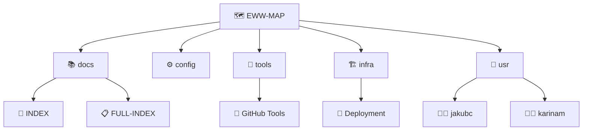

created: 2025-11-21T09:00:00Z
modified: 2025-11-24T22:34:18Z
author: jakubc
---
tags:
  - #automation
  - #development
  - #docs
  - #eww
  - #knowledge
  - #linux
  - #secondbrain
title: "🗺️ EWW Repository Map"

owner: jakubc
created: 2025-11-21T09:00:00Z
modified: 2025-11-24T22:34:18Z
author: jakubc
---

# 🗺️ EWW Repository Map

> **Główna mapa nawigacyjna projektu E-Waste Workshop**
> Wszystkie kluczowe elementy repozytorium połączone w spójną strukturę grafu

## 📊 Struktura Projektu

### 🔷 Rdzeń Projektu (niebieski - `#core`)
- [[README|📘 README]] - Główna dokumentacja projektu
- [[CHANGELOG|📝 CHANGELOG]] - Historia zmian
- [[Makefile|⚙️ Makefile]] - Automatyzacja zadań
- [[init-eww.sh|🚀 Init Script]] - Inicjalizacja środowiska

### 📁 Główne Katalogi

#### 📚 [[docs/docs|Dokumentacja]] (`#docs` - magenta)
Centralna dokumentacja projektu:
- [[infra/infra.md|📑 Infra README]] - Główny indeks dokumentacji
- [[docs/FULL-INDEX|📋 FULL-INDEX]] - Kompletny indeks plików
- [[docs/ROOT-STRUCTURE|🏗️ ROOT-STRUCTURE]] - Struktura głównego katalogu
- [[docs/GITHUB-TOOLS|🐙 GITHUB-TOOLS]] - Narzędzia GitHub
- [[docs/OBSIDIAN-SETUP|💎 OBSIDIAN-SETUP]] - Konfiguracja Obsidian
- [[docs/narzedzia-deweloperskie|🛠️ Narzędzia Dev]]

#### ⚙️ [[config/config|Konfiguracja]] (`#config` - pomarańczowy)
Pliki konfiguracyjne i ustawienia:
- [[.gitignore|Git Ignore]]
- [[.editorconfig|Editor Config]]
- [[config/config|Config Notes]]

#### 🔧 [[tools/tools|Narzędzia]] (`#tools` - cyan)
Narzędzia i skrypty pomocnicze:
- [[tools/tools|Tools Index]]
- Skrypty pomocnicze
- Generatory

#### 🏗️ [[infra/infra|Infrastruktura]] (`#infra` - żółty)
Infrastruktura i deployment:
- [[infra/infra|Infra Index]]
- Konfiguracje CI/CD
- Docker, systemd

#### 👤 [[usr/usr|Użytkownicy]] 
Profile i notatki użytkowników:
- [[usr/jakubc/jakubc|👨‍💻 Jakub C]] (`#jakubc` - zielony)
- [[usr/karinam/karinam|👩‍💻 Karina M]] (`#karinam` `#candy` - różowy)

#### 💾 [[var/var|Zmienne Dane]]
Dane zmienne, cache, logi:
- [[var/var|Var Index]]

#### 🚧 [[dev/dev|Development]]
Pliki deweloperskie:
- [[dev/dev|Dev Index]]

## 🎨 Kod Kolorów Grafu

| Kolor | Tag | Znaczenie |
|-------|-----|-----------|
| 🔵 Niebieski | `#core` | Rdzeń projektu |
| 🟣 Magenta | `#docs` | Dokumentacja |
| 🟡 Żółty | `#infra` | Infrastruktura |
| 🔷 Cyan | `#tools` | Narzędzia |
| 🟠 Pomarańczowy | `#config` | Konfiguracja |
| 🟢 Zielony | `#jakubc` | Jakub (właściciel) |
| 🩷 Różowy | `#karinam` `#candy` | Karina |

## 🔗 Kluczowe Połączenia

## 📌 Szybki Dostęp

### 🎯 Najczęściej Używane
- [[README]] - Start tutaj
- [[infra/infra.md|Infra README]] - Dokumentacja
- [[docs/GITHUB-TOOLS]] - GitHub CLI/Copilot
- [[Makefile]] - Komendy make

### 👥 Profile Użytkowników
- [[usr/jakubc/jakubc|Jakub C Profile]]
- [[usr/karinam/karinam|Karina M Profile]]

### 📝 Planowanie
- [[docs/MVP]] - Minimum Viable Product
- [[docs/nextsteps]] - Kolejne kroki

## 🔍 Nawigacja

- **Po tagach**: Użyj panelu tagów po prawej →
- **Po graphie**: Otwórz widok Graph View (Ctrl+G)
- **Po backlinks**: Sprawdź linki zwrotne w panelu po prawej →

## 📊 Statystyki

- **Foldery główne**: 8
- **Pliki markdown**: ~100+
- **Użytkownicy**: 2 (jakubc, karinam)
- **Główne tagi**: 7

## 🎯 Używanie Mapy

1. **Nawigacja wizualna**: Otwórz Graph View w Obsidian
2. **Filtry**: Użyj tagów do filtrowania (#core, #docs, etc)
3. **Kolory**: Każdy obszar ma swój kolor na graphie
4. **Backlinki**: Każdy plik pokazuje powiązania

**Ostatnia aktualizacja**: 2025-11-21  
**Autor**: [[usr/jakubc/jakubc|Jakub C]]  
**Status**: ✅ Aktywna

#eww #core #map #index #navigation
