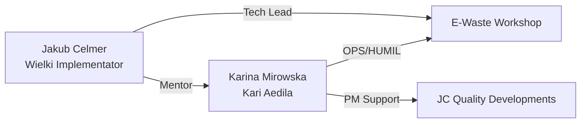

created: 2025-11-21T22:00:00Z
modified: 2025-11-24T22:34:18Z
author: jakubc
---
tags:
  - #automation
  - #development
  - #eww
  - #knowledge
  - #linux
  - #productivity
  - #secondbrain
title: "👥 Katalog użytkowników"


owner: jakubc
created: 2025-11-21T22:00:00Z
modified: 2025-11-24T22:34:18Z
author: jakubc
---

# 👥 Katalog użytkowników

Katalog `/usr` zawiera konfiguracje dostępu do katalogów domowych użytkowników na różnych maszynach fizycznych.

**KONCEPCJA**: Katalog `usr/<username>/` w repozytorium to **remote folder** podłączony przez SSH do fizycznego `/home/<username>/` na zdalnej maszynie użytkownika.

> 📖 **[Zobacz przewodnik SSH Remote](SSH-REMOTE-GUIDE.md)** — jak skonfigurować Remote SSH w VS Code
> ⚙️ **[ssh-config.example](ssh-config.example)** — przykładowa konfiguracja SSH

## 📋 Architektura

```
[VS Code na dev-laptop]           [VS Code na ops-workstation]
        |
        | SSH Remote
        |
        v
/home/karinam/ ← usr/karinam/     /home/jakubc/ ← usr/jakubc/
(ops-workstation)                  (dev-laptop)
```

## 🖥️ Mapowanie SSH

| User w EWW | Remote Host | Remote Path | Lokalny dostęp przez |
|------------|-------------|-------------|---------------------|
| `jakubc/` | localhost | `/home/jakubc/` | Lokalnie (dev-laptop) |
| `karinam/` | `karinam@ops-workstation` | `/home/karinam/` | SSH Remote z dev-laptop |

## 👤 Użytkownicy

### Jakub Celmer (jakubc)
- **Alias**: Wielki Implementator
- **Rola**: Tech Lead, Architekt, Mentor
- **Vault**: [usr/jakubc/](./jakubc/)
- **Obszary**: Star Wars, M18 Tools, Health, Infrastructure
- **Profile**: [jakubc/README.md](./jakubc/README.md)

### Karina Mirowska (karinam)
- **Aliasy**: Kari Aedila, Kari Tori
- **Rola**: OPS/HUMIL, Strażniczka Rynku, TECHNIK w szkoleniu
- **Vault**: [usr/karinam/](./karinam/)
- **Obszary**: E-Waste OPS, Logistics, Business, Development
- **Profile**: [karinam/README.md](./karinam/README.md)
- **Social**: @ewaste_kari (TikTok), @karina_e-waste (Instagram)

## 🔗 Relacje



## 📊 Statystyki

| User | Vault Size | Pliki .md | Główne obszary |
|------|-----------|-----------|----------------|
| jakubc | ~500 MB | ~100 | Star Wars, M18, Health |
| karinam | ~3.0 GB | ~1200 | OPS, Business, Projects, Archives |

## 🎯 KPI zespołu

### Jakub (jakubc)
- Jakość kodu i architektury
- SLA odpowiedzi technicznych
- Efektywność mentoringowa

### Karina (karinam)
- TTList ≤ 24h
- Order-to-Ship D+1 ≥ 95%
- Stock accuracy ≥ 99%
- Evidence coverage = 100%

## 📝 Konwencje

1. Każdy użytkownik ma swój vault w `/usr/{username}/`
2. Każdy vault zawiera `README.md` z profilem
3. Struktura vault'u jest elastyczna i dostosowana do użytkownika
4. Backupy i archiwa przechowywane w vault'ach osobistych
5. Współdzielone projekty w `/projects/`

## 🔐 Prywatność

⚠️ **UWAGA: Dane osobiste użytkowników NIE powinny być commitowane do repo!**

### Ignorowane przez Git

Następujące katalogi są w `.gitignore`:
- `usr/*/inbox/` - prywatne inbox'y
- `usr/*/workspace/` - osobiste workspace'y
- `usr/*/.obsidian/` - konfiguracje Obsidian

### Zasady commitowania

Do repo powinny trafiać tylko:
- ✅ Struktury katalogów (puste foldery)
- ✅ README.md i dokumentacja publiczna
- ✅ Szablony i przykładowe pliki (bez danych osobowych)
- ❌ **NIE** commitować: prywatnych notatek, zdjęć, wrażliwych danych

### Współdzielona wiedza

- Vault'y osobiste są prywatne dla każdego użytkownika
- Współdzielona wiedza w `/docs/`, `/projects/`, `/business/`
- Wrażliwe dane **tylko** w vault'ach osobistych (ignorowanych przez Git)
