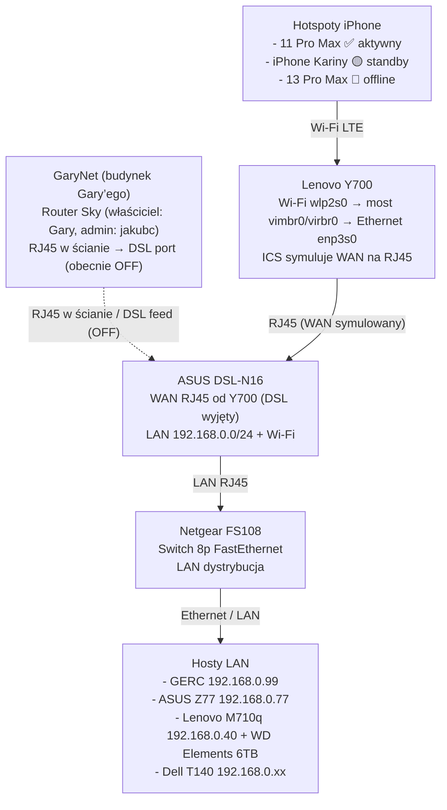

---
tags:
  - #infrastructure
  - #hardware
  - #network
  - #ops
created: 2025-11-23T19:07:26Z
modified: 2025-11-23T19:09:53Z
author: jakubc
title: "Status sieci — hotspot iPhone → Lenovo Y700 → ASUS DSL-N16"
owner: jakubc
---

# Status sieci — hotspot iPhone → Lenovo Y700 → ASUS DSL-N16

> [!summary] Stan WAN (2025-11-23 19:09 UTC)
> - 🔴 **DSL:** nadal brak usług od Gary’ego (port DSL w ASUS DSL-N16 wyjęty).
> - 🟡 **Tryb awaryjny:** LTE z hotspotu iPhone → Wi-Fi → Lenovo Y700 → Ethernet (RJ45) → ASUS DSL-N16 → Netgear FS108 → LAN 192.168.0.0/24.
> - 🧠 **Bridge:** Lenovo Y700 używa wirtualnego mostu (`vimbr0/virbr0`) aby zasymulować port WAN na RJ45 dla routera ASUS.
> - 🧱 **GaryNet:** Gniazdko RJ45 w ścianie (nasz budynek) prowadzi do routera Sky w budynku Gary’ego; właścicielem jest Gary, ale adminem operacyjnym jesteś Ty. Połączenie jest przygotowane jako osobny segment (DSL) i obecnie jest wyjęte.
> - ⚠️ **Ryzyko:** degradacja baterii telefonów, ręczne przełączanie, brak zapasowego uplinku kablowego.
> - 📌 **Źródła prawdy:** [[docs/infra/network/README]], [[docs/infra/hardware/laptops/lenovo_y700/lenovo_y700]], [[docs/infra/hardware/mobile/phones/README]].

## Aktualny łańcuch połączenia

### Segment GaryNet (nowy budynek)

- **Fizyczna trasa:** gniazdko RJ45 w naszej ścianie ↔ kabel ~20 m ↔ router Sky w budynku Gary’ego.  
- **Własność:** router i linia należą do Gary’ego; administrowanie konfiguracją (np. hasła, logi) jest po naszej stronie (`jakubc`).  
- **Status:** port DSL w ASUS DSL-N16 jest obecnie odłączony, ale przewód GaryNet pozostaje opisany i gotowy do re-użycia.  
- **Dokumentacja:** [[docs/infra/network/garynet]] opisuje parametry i checklisty tego połączenia międzybudynkowego.

1. **iPhone (hotspot LTE)**  
   - W `Ustawienia → Osobisty hotspot` włącz udostępnianie i podepnij stałe zasilanie (ładowarka USB-C/Lightning).  
   - iPhone 11 Pro Max pełni rolę podstawowego źródła; iPhone Kariny to zapas; iPhone 13 Pro Max jest nieużywalny (spuchnięta bateria).  
   - Zapisuj czas pracy, aby rotować telefony co 4–6 godzin i ograniczać przegrzewanie.
2. **Lenovo Y700 (klient Wi-Fi + udostępnianie)**  
   - Łączy się z hotspotem przez Wi-Fi (wlp2s0); adresy dostaje z DHCP telefonu (zwykle 172.20.10.0/28).  
   - NetworkManager: Wi-Fi `IPv4 method: Automatic (DHCP)`, a interfejs przewodowy `enp3s0`/`enp2s0` ustawiony na udostępnianie (`shared to other computers`) poprzez most `vimbr0`/`virbr0` imitujący WAN.  
   - Przed włączeniem udostępniania wyłącz `warp-svc`, WARP oraz inne tunele — inaczej reguły NAT/iptables odetną ruch, co już widzieliśmy na `asus_z77`.
3. **ASUS DSL-N16 (router/brama)**  
   - Port WAN routera jest spięty kablem Ethernet z Lenovo Y700; w panelu ustaw `WAN Connection Type: Automatic IP`.  
   - Modem DSL pozostaje wypięty (brak sygnału z mieszkania Gary’ego) — nie przepinaj przewodów, dopóki DSL oficjalnie nie wróci.  
   - Router wystawia sieć LAN 192.168.0.0/24, rozdaje DNS 1.1.1.1 / 8.8.8.8 oraz zapewnia Wi-Fi dla urządzeń lądowych (laptopów/mobile).
4. **Netgear FS108 + hosty LAN**  
   - Port LAN routera → Netgear FS108 → GERC (192.168.0.99), ASUS Z77 (192.168.0.77), Dell T140, Lenovo M710q itd.  
   - Ruch lokalny działa normalnie; tylko wyjście na WAN zależy od tandemu iPhone + Y700.

## Tabela statusów

| Segment | Urządzenie | Status | Notatki operacyjne |
| --- | --- | --- | --- |
| Źródło WAN | iPhone 11 Pro Max | ✅ aktywny | Hotspot działa, ale wymaga rotacji i chłodzenia; telefon trzymaj przy oknie dla lepszego LTE. |
| Rezerwa WAN | iPhone Kariny | 🟡 oczekuje | Uruchom, gdy 11 Pro Max się przegrzewa albo trzeba go podładować; kontroluj pakiet danych. |
| Źródło (martwe) | iPhone 13 Pro Max | 🔴 offline | Bateria spuchnięta, urządzenie odłączone; zaplanować serwis/utylizację. |
| Most (bridge) | Lenovo Y700 | ✅ aktywny | Tryb Wi-Fi klient + Ethernet sharing; `warp-cli` wyłączony, `nmcli d status` powinien pokazywać `wlp2s0 connected`. |
| Brama | ASUS DSL-N16 | 🟡 awaryjny | WAN przez Ethernet (Y700), DSL wyłączony; loginy admin/admin; monitoruj temperaturę i logi WAN. |
| Dystrybucja LAN | Netgear FS108 + hosty | ✅ aktywna | LAN oraz Tailscale/SSH działają; ograniczeniem jest tylko uplink WAN. |

## Hosty aktywne w Netgear FS108

| Host | Połączenie | Notatki |
| --- | --- | --- |
| `lenovo_m710q` + `WD Elements 6TB` | RJ45 → switch | Mikroserwer always-on; dysk USB WD Elements 6TB służy jako magazyn/backup. |
| `GERC` | RJ45 → switch | Workstation główny (192.168.0.99). |
| `ASUS Z77` | RJ45 → switch | Stacja Kariny (192.168.0.77). |
| `Dell T140` | RJ45 → switch | Serwer tower (storage/kontenery). |

## Procedura uruchamiania i zatrzymania tetheringu

1. **Uruchomienie**
   1. Naładowany telefon → włącz hotspot i zanotuj godzinę startu.  
   2. Na Lenovo Y700: `nmcli d wifi connect "<SSID hotspotu>" password "<haslo>"`, potem `nmcli -g IP4.ADDRESS d show wlp2s0`.  
   3. Sprawdź, czy `nmcli c show "<Wired connection (shared)>" | grep ipv4.method` zwraca `shared`.  
   4. Podepnij Ethernet z Y700 do portu WAN w ASUS DSL-N16; w panelu routera (`Network Map → Internet status`) upewnij się, że widnieje `Connected`.  
   5. Na GERC uruchom `ping -c4 1.1.1.1` oraz `curl -I https://example.com` w celu potwierdzenia ruchu wychodzącego.
2. **Zmiana / zatrzymanie**
   1. Najpierw wypnij kabel WAN z routera, a dopiero potem zatrzymaj udostępnianie na Y700, aby nie zostawały błędne wpisy ARP.  
   2. Na Y700 wykonaj `nmcli con down "<Wired shared>"` oraz `nmcli con down "<Hotspot Wi-Fi>"`.  
   3. Wyłącz hotspot na telefonie, pozwól mu ostygnąć i zanotuj łączny czas pracy.  
   4. Na routerze przywróć DSL dopiero, gdy potwierdzisz sygnał w zakładce `Status → DSL`.

## Monitorowanie i alerty

- 🔋 **Bateria telefonów:** po każdej zmianie wpisz stan naładowania (SoC) w [[docs/infra/hardware/mobile/phones/README]]. Tethering LTE >4 h mocno zużywa ogniwa.  
- 🌡️ **Temperatura Y700:** udostępnianie + ładowanie grzeją obudowę; używaj podstawki chłodzącej i nie zasłaniaj wlotów.  
- 🌐 **Logi routera:** w `Administration → System Log → WAN` powinny pojawiać się odnowienia DHCP z Y700; brak logów oznacza WAN down.  
- 🧪 **Testy LAN:** raz na zmianę `ping 192.168.0.10`, `ping 192.168.0.77`, `ping 192.168.0.99` oraz `traceroute 8.8.8.8` z Y700 i z GERC, by wykrywać pętle.  
- 📅 **Powrót DSL:** po potwierdzeniu płatności od Gary’ego przygotuj rollback (przepięcie przewodu DSL do WAN, wyłączenie ICS na Y700, aktualizacja tej notatki).

## Zadania / działania

- [ ] Spisać dokładne profile NetworkManager (nazwy połączeń, metryki) w `docs/infra/hardware/laptops/lenovo_y700/ops/`.  
- [ ] Zautomatyzować rejestrowanie czasu pracy hotspotu (np. wpis raz dziennie w `ops/`).  
- [ ] Skonfigurować powiadomienia mail/Syslog w ASUS DSL-N16 o utracie WAN.  
- [ ] Po powrocie DSL zostawić tethering jedynie jako procedurę awaryjną i zaktualizować tę notatkę.

## Powiązane notatki

- [[docs/infra/network/README]]
- [[docs/infra/hardware/laptops/lenovo_y700/lenovo_y700]]
- [[docs/infra/hardware/mobile/phones/README]]
