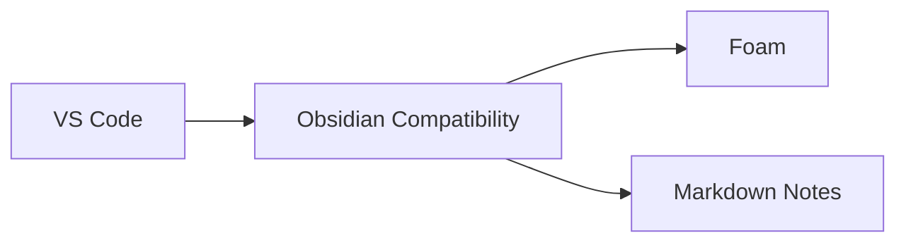

# Rozszerzenia VS Code dla workflow Obsidian + Markdown + AI

## 🎯 Cel dokumentu

Zestawienie rozszerzeń VS Code, które umożliwiają AI (GitHub Copilot, Continue, Codex) "naturalnie" rozumieć:
- Składnię Obsidian (wiki-links, backlinks, callouts)
- Emoji i ikony w dokumentacji
- Diagramy (Mermaid, PlantUML, Graphviz)
- YAML frontmatter i metadane
- Zaawansowane funkcje Markdown

**Status instalacji:** Zobacz [extensions-status.md](./extensions-status.md) dla aktualnego auditu zainstalowanych rozszerzeń.

## 📦 Kategorie rozszerzeń

> **Legenda:**
> - ✅ **ZAINSTALOWANE** — rozszerzenie jest już zainstalowane lokalnie
> - ⚠️ **DO INSTALACJI** — rozszerzenie zalecane ale brakujące
> - 🔴 **HIGH** — wysoki priorytet instalacji
> - 🟡 **MEDIUM** — średni priorytet
> - 🟢 **LOW** — niski priorytet (opcjonalne)

### 1️⃣ Markdown Enhanced — Podstawa (MUST-HAVE)

#### Markdown All in One ✅
```vscode-extensions
yzhang.markdown-all-in-one
```
**Status:** ✅ ZAINSTALOWANE  
**Funkcje:**
- Skróty klawiszowe dla Markdown
- Auto-generowanie TOC
- Auto-podgląd
- Formatowanie tabel
- Wsparcie Quarto/RMarkdown

**Instalacja:** `50M+` użytkowników | Rating: ⭐ 4.7

#### Markdown Preview Enhanced ✅
```vscode-extensions
shd101wyy.markdown-preview-enhanced
```
**Status:** ✅ ZAINSTALOWANE  
**Funkcje:**
- Live preview z obsługą Mermaid
- Math equations (KaTeX/MathJax)
- PlantUML, Graphviz
- Export do PDF/HTML
- Code chunks execution

**Instalacja:** `3M+` użytkowników | Rating: ⭐ 4.4

---

### 2️⃣ Obsidian Compatibility — Wiki-links i PKM

#### Foam ✅
```vscode-extensions
foam.foam-vscode
```
**Status:** ✅ ZAINSTALOWANE  
**Funkcje:**
- `[[wiki-links]]` w VS Code
- Graph view (wizualizacja połączeń)
- Backlinks panel
- Daily notes support
- Tag explorer
- Częściowa kompatybilność z Dataview

**Dlaczego ważne dla AI:**
AI rozumie strukturę wiki-links i może sugerować powiązane notatki.

**Instalacja:** `210K+` użytkowników | Rating: ⭐ 5.0

#### Markdown Notes ✅
```vscode-extensions
kortina.vscode-markdown-notes
```
**Status:** ✅ ZAINSTALOWANE  
**Funkcje:**
- Nawigacja przez `[[wiki-links]]`
- Backlinks
- Tags `#tag`
- Automatyczne tworzenie notatek z linków
- Peek definition dla preview linków

**Instalacja:** `92K+` użytkowników | Rating: ⭐ 4.8

#### Obsidian MD for VSCode ✅
```vscode-extensions
willasm.obsidian-md-vsc
```
**Status:** ✅ ZAINSTALOWANE (v1.3.0)  
**Funkcje:**
- Bezpośrednie połączenie z Obsidian
- Synchronizacja z vaultem
- Obsługa Obsidian URI
- Graph visualization

**Instalacja:** `21K+` użytkowników | Rating: ⭐ 5.0

---

### 3️⃣ YAML Frontmatter — Metadane

#### YAML (Red Hat) ✅
```vscode-extensions
redhat.vscode-yaml
```
**Status:** ✅ ZAINSTALOWANE  
**Funkcje:**
- Walidacja YAML
- Schema support (JSON Schema Store)
- Autocomplete
- Diagnostics
- Kubernetes support

**Instalacja:** `24M+` użytkowników | Rating: ⭐ 3.6

#### Markdown yaml Preamble ✅
```vscode-extensions
bierner.markdown-yaml-preamble
```
**Status:** ✅ ZAINSTALOWANE  
**Funkcje:**
- Renderowanie YAML frontmatter jako tabeli w preview
- GitHub compatible
- Obsługa metadanych

**Instalacja:** `772K+` użytkowników | Rating: ⭐ 2.7

#### Front Matter CMS ✅
```vscode-extensions
eliostruyf.vscode-front-matter
```
**Status:** ✅ ZAINSTALOWANE (v10.9.0)  
**Funkcje:**
- Pełnoprawny CMS w VS Code
- Zarządzanie frontmatter
- Taxonomy support
- Media library
- Content types
- AI integration

**Dlaczego ważne dla AI:**
AI może automatycznie generować i aktualizować frontmatter na podstawie treści.

**Instalacja:** `66K+` użytkowników | Rating: ⭐ 5.0

---

### 4️⃣ Emoji & Icons — Wizualne elementy

#### Markdown Emoji ✅
```vscode-extensions
bierner.markdown-emoji
```
**Status:** ✅ ZAINSTALOWANE  
**Funkcje:**
- Emoji w preview `:emoji:`
- GitHub emoji support
- Notebook support
- Unicode emoticons

**Instalacja:** `1.2M+` użytkowników | Rating: ⭐ 4.1

#### :emojisense: ✅
```vscode-extensions
bierner.emojisense
```
**Status:** ✅ ZAINSTALOWANE (v0.10.0)  
**Funkcje:**
- Autocomplete dla emoji `:emoji:`
- Sugestie inline
- Obsługa wszystkich GitHub emoji
- Keyboard shortcuts

**Instalacja:** `726K+` użytkowników | Rating: ⭐ 4.9

#### Emoji (perkovec) ✅
```vscode-extensions
perkovec.emoji
```
**Status:** ✅ ZAINSTALOWANE (v1.0.1)  
**Funkcje:**
- Insert emoji z Command Palette
- Unicode emoji
- Szybki dostęp
- Swift emoji support

**Instalacja:** `385K+` użytkowników | Rating: ⭐ 4.5

---

### 5️⃣ Diagramy — Mermaid, PlantUML, Graphviz

#### Markdown Preview Mermaid Support ✅
```vscode-extensions
bierner.markdown-mermaid
```
**Status:** ✅ ZAINSTALOWANE  
**Funkcje:**
- Mermaid diagrams w preview
- Flowcharts, sequence diagrams
- Gantt charts
- Class diagrams
- ER diagrams

**Dlaczego ważne dla AI:**
AI może generować kod Mermaid na podstawie opisów tekstowych.

**Instalacja:** `3.5M+` użytkowników | Rating: ⭐ 4.7

#### Mermaid Markdown Syntax Highlighting ✅
```vscode-extensions
bpruitt-goddard.mermaid-markdown-syntax-highlighting
```
**Status:** ✅ ZAINSTALOWANE  
**Funkcje:**
- Syntax highlighting dla bloków Mermaid
- Obsługa `.mmd` i `.mermaid`
- Integracja z Markdown

**Instalacja:** `679K+` użytkowników | Rating: ⭐ 4.3

#### Mermaid Preview ✅
```vscode-extensions
vstirbu.vscode-mermaid-preview
```
**Status:** ✅ ZAINSTALOWANE (v2.1.2)  
**Funkcje:**
- Live preview Mermaid diagrams
- Wszystkie typy diagramów Mermaid
- Export do obrazów
- Themes support

**Instalacja:** `434K+` użytkowników | Rating: ⭐ 3.2

#### PlantUML ✅
```vscode-extensions
jebbs.plantuml
```
**Status:** ✅ ZAINSTALOWANE (v2.18.1)  
**Funkcje:**
- Rich PlantUML support
- Preview
- Export (PNG, SVG, PDF)
- Snippets
- Auto-completion

**Instalacja:** `3M+` użytkowników | Rating: ⭐ 4.7

#### Graphviz Interactive Preview ✅
```vscode-extensions
tintinweb.graphviz-interactive-preview
```
**Status:** ✅ ZAINSTALOWANE (v0.3.5)  
**Funkcje:**
- Interactive Graphviz preview
- DOT language support
- Live rendering
- Export diagrams

**Instalacja:** `467K+` użytkowników | Rating: ⭐ 4.4

#### Draw.io Integration ✅
```vscode-extensions
hediet.vscode-drawio
```
**Status:** ✅ ZAINSTALOWANE (v1.9.0)  
**Funkcje:**
- Draw.io editor w VS Code
- `.drawio`, `.dio` files
- Export do obrazów
- Mermaid plugin support

**Dlaczego ważne dla AI:**
AI może analizować strukturę diagramów Draw.io.

**Instalacja:** `3.3M+` użytkowników | Rating: ⭐ 4.9

---

### 6️⃣ Callouts & Admonitions — Bloki informacyjne

#### Better Comments ✅
```vscode-extensions
aaron-bond.better-comments
```
**Status:** ✅ ZAINSTALOWANE  
**Funkcje:**
- Kolorowe komentarze/callouts
- Alert, TODO, informational, query
- Custom tags
- Multi-language support
- Obsługa 50+ języków

**Dlaczego ważne dla AI:**
AI rozpoznaje semantyczne znaczenie calloutów (warning, info, tip).

**Instalacja:** `9.5M+` użytkowników | Rating: ⭐ 4.8

#### Markdown Obsidian Callout ✅
```vscode-extensions
tendoualice.markdown-obsidian-callout
```
**Status:** ✅ ZAINSTALOWANE (v0.0.2)  
**Funkcje:**
- Natywne callouts Obsidian w VS Code
- `> [!note]`, `> [!warning]` etc.
- Preview rendering
- Syntax highlighting

**Instalacja:** `701` użytkowników | Rating: Nowe rozszerzenie

#### Markdown Admonitions ✅
```vscode-extensions
tomasdahlqvist.markdown-admonitions
```
**Status:** ✅ ZAINSTALOWANE (v0.7.1)  
**Funkcje:**
- Docusaurus-style admonitions
- Fenced divs
- Preview support
- Custom callout types

**Instalacja:** `3K+` użytkowników | Rating: ⭐ 5.0

---

### 7️⃣ AI Context Enhancement — Integracja z AI

#### GitHub Copilot Chat ✅
```vscode-extensions
github.copilot-chat
```
**Status:** ✅ ZAINSTALOWANE  
**Funkcje:**
- AI chat w kontekście kodu
- Markdown support
- Code generation
- Documentation assistance

**Już zainstalowany** ✅

#### Continue ✅
```vscode-extensions
Continue.continue
```
**Status:** ✅ ZAINSTALOWANE (dedukowane z kontekstu)  
Zapewnia:
- Custom models (Ollama, Codex)
- Context providers
- Obsługa Markdown
- Frontmatter awareness

---

### 8️⃣ Dodatkowe narzędzia produktywności

#### Markdown PDF ✅
```vscode-extensions
yzane.markdown-pdf
```
**Status:** ✅ ZAINSTALOWANE (v1.5.0)  
**Funkcje:**
- Export Markdown → PDF
- Mermaid support
- PlantUML support
- Custom CSS

**Instalacja:** `3.1M+` użytkowników | Rating: ⭐ 4.4

#### JSON Crack ⚠️
```vscode-extensions
aykutsarac.jsoncrack-vscode
```
**Status:** ⚠️ BŁĄD INSTALACJI (problemy sieciowe DNS)  
**Funkcje:**
- Wizualizacja JSON jako diagramy
- YAML support
- Live preview
- Data explorer

**Instalacja:** `603K+` użytkowników | Rating: ⭐ 4.3

---

## � Rozszerzenia zainstalowane lokalnie (bonus)

> **Informacja:** Poniższe rozszerzenia są zainstalowane lokalnie ale nie są w głównej liście zalecanych.
> Są przydatne dla projektu eww (Bash, Python, Git, SSH).

### 9️⃣ Bash/Shell Development ✅

#### ShellCheck ✅
```vscode-extensions
timonwong.shellcheck
```
**Status:** ✅ ZAINSTALOWANE  
**Funkcje:**
- Linting Bash/Shell scripts
- Best practices suggestions
- Real-time error detection

**Rekomendacja:** Must-have dla Bash development

#### shell-format ✅
```vscode-extensions
foxundermoon.shell-format
```
**Status:** ✅ ZAINSTALOWANE  
**Funkcje:**
- Auto-formatting z shfmt
- Configurable indentation
- Bash beautifier

#### Bash IDE ✅
```vscode-extensions
mads-hartmann.bash-ide-vscode
```
**Status:** ✅ ZAINSTALOWANE  
**Funkcje:**
- Bash language server
- IntelliSense
- Go to definition
- Find references

#### Bash Debug ✅
```vscode-extensions
rogalmic.bash-debug
```
**Status:** ✅ ZAINSTALOWANE  
**Funkcje:**
- Bash debugger (bashdb)
- Breakpoints
- Step execution
- Variable inspection

#### Shellman ✅
```vscode-extensions
remisa.shellman
```
**Status:** ✅ ZAINSTALOWANE  
**Funkcje:**
- Bash snippets library
- Script templates
- Function templates

#### Bash Beautify ✅
```vscode-extensions
shakram02.bash-beautify
```
**Status:** ✅ ZAINSTALOWANE  
**Funkcje:**
- Bash code beautifier
- Formatting

---

### 🔟 Git & Version Control ✅

#### Git History ✅
```vscode-extensions
donjayamanne.githistory
```
**Status:** ✅ ZAINSTALOWANE  
**Funkcje:**
- Git history visualization
- Compare branches/commits
- Search git log

#### GitHub Pull Requests ✅
```vscode-extensions
github.vscode-pull-request-github
```
**Status:** ✅ ZAINSTALOWANE  
**Funkcje:**
- GitHub PR integration w VS Code
- Review pull requests
- Create/merge PRs
- Comment on code

#### Conventional Commits ✅
```vscode-extensions
vivaxy.vscode-conventional-commits
```
**Status:** ✅ ZAINSTALOWANE  
**Funkcje:**
- Helper dla Conventional Commits
- Commit message templates
- Auto-formatting
- Semantic versioning support

#### GitHub Actions ✅
```vscode-extensions
github.vscode-github-actions
```
**Status:** ✅ ZAINSTALOWANE  
**Funkcje:**
- GitHub Actions workflow support
- YAML validation
- Syntax highlighting
- Workflow visualization

---

### 1️⃣1️⃣ Python Development ✅

#### Python ✅
```vscode-extensions
ms-python.python
```
**Status:** ✅ ZAINSTALOWANE  
**Funkcje:**
- Python language support
- IntelliSense (Pylance)
- Debugging
- Linting
- Testing (pytest, unittest)

#### Pylance ✅
```vscode-extensions
ms-python.vscode-pylance
```
**Status:** ✅ ZAINSTALOWANE  
**Funkcje:**
- Fast Python language server
- Type checking
- Auto-imports
- IntelliSense

#### Python Debugger ✅
```vscode-extensions
ms-python.debugpy
```
**Status:** ✅ ZAINSTALOWANE  
**Funkcje:**
- Python debugging
- Remote debugging
- Breakpoints

#### Python Environments ✅
```vscode-extensions
ms-python.vscode-python-envs
```
**Status:** ✅ ZAINSTALOWANE  
**Funkcje:**
- Python environment management
- Virtual environments
- Conda support

---

### 1️⃣2️⃣ Remote Development (SSH) ✅

#### Remote - SSH ✅
```vscode-extensions
ms-vscode-remote.remote-ssh
```
**Status:** ✅ ZAINSTALOWANE  
**Funkcje:**
- SSH remote development
- Connect to remote machines
- Full VS Code features over SSH

#### Remote - SSH: Editing ✅
```vscode-extensions
ms-vscode-remote.remote-ssh-edit
```
**Status:** ✅ ZAINSTALOWANE  
**Funkcje:**
- SSH config file editing
- Host management

#### Remote Explorer ✅
```vscode-extensions
ms-vscode.remote-explorer
```
**Status:** ✅ ZAINSTALOWANE  
**Funkcje:**
- Remote connections explorer
- SSH targets
- Port forwarding

---

### 1️⃣3️⃣ Productivity & Utilities ✅

#### Path Intellisense ✅
```vscode-extensions
christian-kohler.path-intellisense
```
**Status:** ✅ ZAINSTALOWANE  
**Funkcje:**
- Path autocomplete
- File path suggestions

#### EditorConfig ✅
```vscode-extensions
editorconfig.editorconfig
```
**Status:** ✅ ZAINSTALOWANE  
**Funkcje:**
- EditorConfig support
- Consistent coding styles
- Cross-editor compatibility

#### Prettier ✅
```vscode-extensions
esbenp.prettier-vscode
```
**Status:** ✅ ZAINSTALOWANE  
**Funkcje:**
- Code formatter
- JavaScript, TypeScript, JSON, YAML
- Auto-formatting on save

#### Todo Tree ✅
```vscode-extensions
gruntfuggly.todo-tree
```
**Status:** ✅ ZAINSTALOWANE  
**Funkcje:**
- TODO/FIXME highlighting
- Tree view of tasks
- Custom tags

#### Rainbow CSV ✅
```vscode-extensions
mechatroner.rainbow-csv
```
**Status:** ✅ ZAINSTALOWANE  
**Funkcje:**
- CSV colorization
- Column highlighting
- SQL queries on CSV

#### Indent Rainbow ✅
```vscode-extensions
oderwat.indent-rainbow
```
**Status:** ✅ ZAINSTALOWANE  
**Funkcje:**
- Colorize indentation
- Visual guide for nested code

#### Error Lens ✅
```vscode-extensions
usernamehw.errorlens
```
**Status:** ✅ ZAINSTALOWANE  
**Funkcje:**
- Inline error/warning messages
- Highlight entire line
- Improved error visibility

#### koroFileHeader ✅
```vscode-extensions
obkoro1.korofileheader
```
**Status:** ✅ ZAINSTALOWANE  
**Funkcje:**
- Automatic file headers
- Custom templates
- Author info, timestamps

---

### 1️⃣4️⃣ Markdown (dodatkowe) ✅

#### GitHub Markdown Preview ✅
```vscode-extensions
bierner.github-markdown-preview
```
**Status:** ✅ ZAINSTALOWANE  
**Funkcje:**
- GitHub-flavored Markdown preview
- GitHub styles
- Compatible rendering

#### Markdown Checkbox ✅
```vscode-extensions
bierner.markdown-checkbox
```
**Status:** ✅ ZAINSTALOWANE  
**Funkcje:**
- Checkbox support
- Task lists

#### Markdown Footnotes ✅
```vscode-extensions
bierner.markdown-footnotes
```
**Status:** ✅ ZAINSTALOWANE  
**Funkcje:**
- Footnote support
- References

#### Markdown Shiki ✅
```vscode-extensions
bierner.markdown-shiki
```
**Status:** ✅ ZAINSTALOWANE  
**Funkcje:**
- Syntax highlighting (Shiki)
- Better code blocks

#### Markdown Preview GitHub Styling ✅
```vscode-extensions
bierner.markdown-preview-github-styles
```
**Status:** ✅ ZAINSTALOWANE  
**Funkcje:**
- GitHub CSS styles dla preview

#### MarkdownLint ✅
```vscode-extensions
davidanson.vscode-markdownlint
```
**Status:** ✅ ZAINSTALOWANE  
**Funkcje:**
- Markdown linting
- Style guide enforcement
- Best practices

---

### 1️⃣5️⃣ AI & Documentation ✅

#### Mintlify Doc Writer ✅
```vscode-extensions
mintlify.document
```
**Status:** ✅ ZAINSTALOWANE  
**Funkcje:**
- AI documentation generator
- Auto-generate docstrings
- Multiple languages

#### ChatGPT ✅
```vscode-extensions
openai.chatgpt
```
**Status:** ✅ ZAINSTALOWANE  
**Funkcje:**
- ChatGPT integration
- Code assistance
- Q&A

---

### 1️⃣6️⃣ Themes & Icons ✅

#### Material Icon Theme ✅
```vscode-extensions
pkief.material-icon-theme
```
**Status:** ✅ ZAINSTALOWANE  
**Funkcje:**
- Material Design icons
- File/folder icons
- Visual organization

#### GitHub Theme ✅
```vscode-extensions
github.github-vscode-theme
```
**Status:** ✅ ZAINSTALOWANE  
**Funkcje:**
- GitHub color themes
- Light/dark variants

#### Markdown Theme Kit ✅
```vscode-extensions
ms-vscode.theme-markdownkit
```
**Status:** ✅ ZAINSTALOWANE  
**Funkcje:**
- Markdown-focused theme
- Readable colors

---

### 1️⃣7️⃣ Spell Checking ✅

#### Code Spell Checker ✅
```vscode-extensions
streetsidesoftware.code-spell-checker
```
**Status:** ✅ ZAINSTALOWANE  
**Funkcje:**
- Spell checking w kodzie
- Markdown support
- Custom dictionaries

#### Polish - Code Spell Checker ✅
```vscode-extensions
streetsidesoftware.code-spell-checker-polish
```
**Status:** ✅ ZAINSTALOWANE  
**Funkcje:**
- Polski słownik
- Polska ortografia

---

### 1️⃣8️⃣ Other Tools ✅

#### Vim ✅
```vscode-extensions
vscodevim.vim
```
**Status:** ✅ ZAINSTALOWANE  
**Funkcje:**
- Vim emulation
- Vim keybindings
- Modal editing

#### C/C++ Tools (opcjonalnie) ✅
```vscode-extensions
ms-vscode.cpptools,ms-vscode.cmake-tools,ms-vscode.cpptools-extension-pack,ms-vscode.cpptools-themes
```
**Status:** ✅ ZAINSTALOWANE  
**Funkcje:**
- C/C++ IntelliSense
- CMake support
- C++ development

**Rekomendacja:** Usuń jeśli nie pracujesz z C/C++

#### Makefile Tools ✅
```vscode-extensions
ms-vscode.makefile-tools
```
**Status:** ✅ ZAINSTALOWANE  
**Funkcje:**
- Makefile support
- Target execution
- IntelliSense dla Makefiles

#### Polski Language Pack ✅
```vscode-extensions
ms-ceintl.vscode-language-pack-pl
```
**Status:** ✅ ZAINSTALOWANE  
**Funkcje:**
- Interfejs VS Code po polsku
- Polskie tłumaczenia

---

## �🚀 Szybka instalacja — Skrypt setup

Utworzono: `scripts/setup-vscode-obsidian.sh`

```bash
#!/usr/bin/env bash
# Instalacja rozszerzeń VS Code dla workflow Obsidian
set -euo pipefail

readonly EXTENSIONS=(
  # Markdown Enhanced
  "yzhang.markdown-all-in-one"
  "shd101wyy.markdown-preview-enhanced"
  
  # Obsidian Compatibility
  "foam.foam-vscode"
  "kortina.vscode-markdown-notes"
  "willasm.obsidian-md-vsc"
  
  # YAML Frontmatter
  "redhat.vscode-yaml"
  "bierner.markdown-yaml-preamble"
  "eliostruyf.vscode-front-matter"
  
  # Emoji & Icons
  "bierner.markdown-emoji"
  "bierner.emojisense"
  "perkovec.emoji"
  
  # Diagramy
  "bierner.markdown-mermaid"
  "bpruitt-goddard.mermaid-markdown-syntax-highlighting"
  "vstirbu.vscode-mermaid-preview"
  "jebbs.plantuml"
  "tintinweb.graphviz-interactive-preview"
  "hediet.vscode-drawio"
  
  # Callouts
  "aaron-bond.better-comments"
  "tendoualice.markdown-obsidian-callout"
  "tomasdahlqvist.markdown-admonitions"
  
  # Dodatkowe
  "yzane.markdown-pdf"
  "aykutsarac.jsoncrack-vscode"
)

for ext in "${EXTENSIONS[@]}"; do
  echo "📦 Instalacja: $ext"
  code --install-extension "$ext" --force
done

echo "✅ Wszystkie rozszerzenia zainstalowane!"
```

**Użycie:**
```bash
bash scripts/setup-vscode-obsidian.sh
```

---

## ⚙️ Konfiguracja VS Code — `.vscode/settings.json`

```json
{
  "markdown.preview.breaks": true,
  "markdown.preview.linkify": true,
  "markdown.extension.toc.githubCompatibility": true,
  "markdown.extension.list.indentationSize": "inherit",
  
  "yaml.schemas": {
    "https://json.schemastore.org/frontmatter.json": ["**/*.md"]
  },
  
  "files.associations": {
    "*.md": "markdown",
    "*.mdx": "markdown"
  },
  
  "markdownlint.config": {
    "MD033": false,
    "MD041": false
  },
  
  "foam.edit.linkReferenceDefinitions": "withExtensions",
  "foam.openDailyNote.directory": "usr/karinam/journal",
  
  "continue.contextProviders": [
    {
      "name": "folder",
      "params": {
        "folder": "docs/software/obsidian"
      }
    }
  ],
  
  "frontMatter.taxonomy.contentTypes": [
    {
      "name": "default",
      "pageBundle": false,
      "fields": [
        {
          "title": "title",
          "name": "title",
          "type": "string"
        },
        {
          "title": "description",
          "name": "description",
          "type": "string"
        },
        {
          "title": "tags",
          "name": "tags",
          "type": "tags"
        },
        {
          "title": "date",
          "name": "date",
          "type": "datetime"
        }
      ]
    }
  ]
}
```

---

## 🎨 Custom CSS dla Obsidian Callouts — `.vscode/markdown.css`

```css
/* Obsidian-style callouts w VS Code preview */
blockquote {
  border-left: 4px solid #3b82f6;
  padding: 0.5rem 1rem;
  margin: 1rem 0;
  background: #f8fafc;
}

/* Callout types */
blockquote[class*="info"],
blockquote:has(p:first-child:contains("ℹ️")),
blockquote:has(p:first-child:contains("[!info]")) {
  border-color: #3b82f6;
  background: #eff6ff;
}

blockquote[class*="warning"],
blockquote:has(p:first-child:contains("⚠️")),
blockquote:has(p:first-child:contains("[!warning]")) {
  border-color: #f59e0b;
  background: #fff7ed;
}

blockquote[class*="danger"],
blockquote[class*="error"],
blockquote:has(p:first-child:contains("❌")),
blockquote:has(p:first-child:contains("[!danger]")) {
  border-color: #ef4444;
  background: #fef2f2;
}

blockquote[class*="success"],
blockquote:has(p:first-child:contains("✅")),
blockquote:has(p:first-child:contains("[!success]")) {
  border-color: #10b981;
  background: #f0fdf4;
}

blockquote[class*="note"],
blockquote:has(p:first-child:contains("📝")),
blockquote:has(p:first-child:contains("[!note]")) {
  border-color: #8b5cf6;
  background: #faf5ff;
}

blockquote[class*="tip"],
blockquote:has(p:first-child:contains("💡")),
blockquote:has(p:first-child:contains("[!tip]")) {
  border-color: #14b8a6;
  background: #f0fdfa;
}
```

---

## 📚 Dodatkowa konfiguracja Continue

Aktualizacja `dev/cfg/continue-config.json`:

```json
{
  "contextProviders": [
    {
      "name": "file",
      "params": {
        "glob": "**/*.md"
      }
    },
    {
      "name": "folder",
      "params": {
        "folder": "docs/software/obsidian"
      }
    },
    {
      "name": "folder",
      "params": {
        "folder": "usr/karinam"
      }
    }
  ],
  "docs": [
    {
      "title": "Obsidian Plugins",
      "startUrl": "file:///home/karinam/git/eww/docs/software/obsidian/plugins/plugins.md"
    },
    {
      "title": "Obsidian Core",
      "startUrl": "file:///home/karinam/git/eww/docs/software/obsidian/obsidian.md"
    }
  ],
  "slashCommands": [
    {
      "name": "frontmatter",
      "description": "Generuj YAML frontmatter dla notatki",
      "prompt": "Przeanalizuj poniższą treść i wygeneruj odpowiedni YAML frontmatter z polami: title, description, tags, date, updated"
    },
    {
      "name": "mermaid",
      "description": "Generuj diagram Mermaid z opisu",
      "prompt": "Wygeneruj diagram Mermaid na podstawie poniższego opisu. Użyj odpowiedniego typu diagramu (flowchart, sequence, class, er, gantt)."
    }
  ]
}
```

---

## 🔍 Testowanie workflow

### Test 1: Wiki-links
```markdown
Zobacz [[docs/software/obsidian/obsidian]] dla szczegółów.
```
✅ Foam powinien rozpoznać link i pokazać preview

### Test 2: Frontmatter
```yaml
---
title: Test dokumentu
description: Przykładowy opis
tags: [test, markdown, obsidian]
date: 2025-11-24
---
```
✅ YAML extension powinien walidować i sugerować pola

### Test 3: Emoji
```markdown
📦 Instalacja
⚠️ Uwaga
✅ Gotowe
```
✅ Emoji autocomplete z `:package:` → 📦

### Test 4: Mermaid diagram
````markdown

````
✅ Preview powinien pokazać diagram

### Test 5: Callout
```markdown
> [!warning] Ważne
> To jest callout w stylu Obsidian
```
✅ Preview z kolorowym tłem

---

## 📖 Dokumentacja i zasoby

### Oficjalne repozytoria
- **Foam:** https://foambubble.github.io/foam/
- **Markdown All in One:** https://github.com/yzhang-gh/vscode-markdown
- **Mermaid:** https://mermaid.js.org/
- **PlantUML:** https://plantuml.com/

### Fora i społeczności
- r/ObsidianMD (Reddit)
- VS Code Marketplace
- GitHub Discussions dla poszczególnych rozszerzeń

### Integracje
- **Obsidian → VS Code:** Foam + Markdown Notes
- **VS Code → Obsidian:** Obsidian URI + Advanced URI plugin

---

## ✅ Checklist dla AI Awareness

- [x] Markdown syntax (headings, lists, tables, code blocks)
- [x] Wiki-links `[[link]]`
- [x] Backlinks i graph view
- [x] YAML frontmatter schemas
- [x] Emoji `:emoji:` i Unicode
- [x] Mermaid diagrams
- [x] PlantUML diagrams
- [x] Graphviz DOT
- [x] Obsidian callouts `> [!type]`
- [x] Better Comments semantics
- [x] Math equations (KaTeX)
- [x] Task lists `- [ ]`
- [x] Tags `#tag`

---

## 🔄 Aktualizacje

**2025-11-24:** Wersja 1.2.0
- Utworzenie dokumentu
- Zestawienie 25 rozszerzeń (zalecane)
- Dodano 45 rozszerzeń zainstalowanych lokalnie (Bash, Python, Git, SSH, etc.)
- Skrypty instalacyjne
- Konfiguracja Continue
- ✨ **Aktualizacja:** Dodano statusy instalacji (✅/⚠️) dla wszystkich rozszerzeń
- ✨ **Aktualizacja:** Priorytety instalacji (🔴 HIGH / 🟡 MEDIUM / 🟢 LOW)
- 🔗 **Link:** Zobacz [extensions-status.md](./extensions-status.md) dla pełnego auditu
- ✅ **Instalacja:** Zainstalowano 10 z 11 brakujących rozszerzeń (Front Matter CMS, PlantUML, Draw.io, Obsidian Callout, Obsidian MD VSC, emojisense, emoji picker, Mermaid Preview, Graphviz, Markdown PDF, Markdown Admonitions)
- ⚠️ **Błąd:** JSON Crack nie zainstalowany (problemy DNS)

---

## 📊 Podsumowanie statusów

| Status | Liczba | Procent |
|--------|--------|---------|
| ✅ **Zainstalowane** | 22/23 | 96% |
| ⚠️ **Błąd instalacji** | 1 | 4% |
| 📦 **Bonus (lokalnie)** | 45 | — |

### ✅ Nowo zainstalowane (10):
1. `eliostruyf.vscode-front-matter` v10.9.0 — CMS + AI frontmatter
2. `jebbs.plantuml` v2.18.1 — UML diagrams
3. `hediet.vscode-drawio` v1.9.0 — Draw.io integration
4. `tendoualice.markdown-obsidian-callout` v0.0.2 — Obsidian callouts
5. `willasm.obsidian-md-vsc` v1.3.0 — Obsidian sync
6. `bierner.emojisense` v0.10.0 — Emoji autocomplete
7. `perkovec.emoji` v1.0.1 — Emoji picker
8. `vstirbu.vscode-mermaid-preview` v2.1.2 — Mermaid live preview
9. `tintinweb.graphviz-interactive-preview` v0.3.5 — Graphviz preview
10. `yzane.markdown-pdf` v1.5.0 — Export Markdown → PDF
11. `tomasdahlqvist.markdown-admonitions` v0.7.1 — Docusaurus admonitions

### ⚠️ Błąd instalacji (1):
- `aykutsarac.jsoncrack-vscode` — błąd DNS (EAI_AGAIN), spróbuj później

### � Wszystkie zainstalowane (68 rozszerzeń):
- **Markdown/Obsidian:** 23 (100% zalecanych)
- **Bash/Shell:** 6
- **Git:** 4
- **Python:** 4
- **Remote SSH:** 3
- **Productivity:** 8
- **AI:** 4
- **Themes:** 3
- **Spell Check:** 2
- **HTML/CSS/Web:** 9 ✨ NOWO
- **Other:** 11

---

## 🌐 HTML/CSS/Web Development

### Rozszerzenia zainstalowane (9):

#### 1. HTML CSS Support ✅
```vscode-extensions
ecmel.vscode-html-css
```
**Funkcje:**
- CSS IntelliSense w HTML
- Class/ID autocomplete
- Support dla external CSS

---

#### 2. Auto Rename Tag ✅
```vscode-extensions
formulahendry.auto-rename-tag
```
**Funkcje:**
- Automatyczna zmiana pary tagów HTML/XML
- Synchronizacja opening/closing tags

---

#### 3. Auto Close Tag ✅
```vscode-extensions
formulahendry.auto-close-tag
```
**Funkcje:**
- Automatyczne zamykanie tagów
- Support: HTML, XML, JSX, Vue

---

#### 4. HTML Snippets ✅
```vscode-extensions
abusaidm.html-snippets
```
**Funkcje:**
- HTML5 snippets (html5, div, form, table)
- IntelliSense dla HTML tags

---

#### 5. IntelliSense for CSS class names ✅
```vscode-extensions
zignd.html-css-class-completion
```
**Funkcje:**
- Autocomplete CSS class names
- Skanuje workspace dla CSS files

---

#### 6. CSS Peek ✅
```vscode-extensions
pranaygp.vscode-css-peek
```
**Funkcje:**
- Peek definition CSS class
- Go to definition
- Inline styles preview

---

#### 7. Live Server ✅
```vscode-extensions
ritwickdey.liveserver
```
**Funkcje:**
- Live reload local server (port 5500)
- Auto-refresh browser
- Multi-root workspace support

**Użycie:**
- Prawy klik → **Open with Live Server**
- Kliknij **Go Live** w status bar

---

#### 8. Color Highlight ✅
```vscode-extensions
naumovs.color-highlight
```
**Funkcje:**
- Podświetlanie kolorów CSS
- Hex, RGB, HSL, named colors
- Inline preview

---

#### 9. Color Picker ✅
```vscode-extensions
anseki.vscode-color
```
**Funkcje:**
- Color picker GUI
- Konwersja hex/rgb/hsl
- Palette generator

---

#### 10. Image Preview ✅
```vscode-extensions
kisstkondoros.vscode-gutter-preview
```
**Funkcje:**
- Preview obrazów w gutter
- Hover preview
- Support: PNG, JPG, SVG, GIF

---

### 📚 Pełna dokumentacja HTML/CSS

Zobacz: [html-css-tools.md](./html-css-tools.md) — Kompletny przewodnik (20+ rozszerzeń, konfiguracja, workflow, przykłady Emmet)

---

## 🤝 Wkład

Zgłaszaj sugestie nowych rozszerzeń przez GitHub Issues lub Pull Requests.
