tags:
  - folder_note
  - readme
  - index
  - ops
  - operations
  - eww
  - zero-waste
created: 2025-11-28T19:45:00Z
modified: 2025-11-28T20:45:00Z
author: karinam
title: "Ops - Operations"
owner: karinam
---

# Ops - Operations
# Diagram operacyjny (workflow)
---
### Opisy modułów operacyjnych

**INTAKE** – Przyjęcia nowych przedmiotów i materiałów z rozbiórki. Rejestracja, nadanie ID, wstępna dokumentacja.

**RESEARCH** – Badania techniczne, dokumentacja, opracowanie SOP, ocena wartości rynkowej.

**DIAG** – Diagnostyka wg SOP, ocena stanu technicznego, decyzja o dalszym procesie.

**REPAIR** – Naprawy wewnętrzne i zewnętrzne, refabrykacja, testy jakości.

**AS-IS** – Sprzedaż sprzętu sprawnego bez naprawy, szybka ścieżka do SALES.

**ROZBIÓRKA** – Demontaż, testowanie, sortowanie na podzespoły, komponenty, surowce i odpady.

**PARTS** – Materiały z rozbiórki: podzespoły, komponenty, surowce, odpady – kierowane do INTAKE, UPCYCLE lub RECYCLE.

**RECYCLE** – Przetwarzanie odpadów na czysty surowiec (plastik, metale, szkło, PCB, baterie).

**SUROWCE** – Magazyn czystych surowców z recyklingu, gotowych do produkcji lub sprzedaży.

**PRODUKCJA** – Wytwarzanie nowych produktów z surowców wtórnych (filament, obudowy, przewody, adaptery).

**UPCYCLE** – Kreacja nowych produktów artystycznych i funkcjonalnych z materiałów rozbiórki.

**SALES** – Zarządzanie listingami, sprzedaż na eBay, Gumtree, Vinted, Etsy.

```mermaid
flowchart TD
  %% ============================================
  %% WĘZŁY - GŁÓWNY PRZEPŁYW
  %% ============================================
  START(["🎯 START<br/>Nowy przedmiot"])
  INTAKE["📥 INTAKE - Przyjęcia<br/>════════════════<br/>• Rejestracja przyjęcia<br/>• Nadanie ID inwentarzowego<br/>• Wstępna dokumentacja stanu<br/>• TAKŻE: podzespoły z rozbiórki"]
  RESEARCH["📚 RESEARCH - Badania<br/>════════════════<br/>• Zbieranie informacji o sprzęcie<br/>• Tworzenie dokumentacji technicznej<br/>• Opracowanie SOP (procedur)<br/>• Określenie wartości rynkowej"]
  DIAG{"🔍 DIAG - Diagnostyka<br/>═══════════════<br/>Szybka diagnostyka wg SOP<br/>Ocena stanu technicznego<br/>Sprawdzenie wszystkich funkcji"}
  %% ============================================
  %% WĘZŁY - ŚCIEŻKI DECYZYJNE
  %% ============================================
  REPAIR["🔧 REPAIR - Naprawy<br/>════════════════<br/>• Naprawy wewnętrzne (własne)<br/>• Naprawy zewnętrzne (klienci)<br/>• Refabrykacja urządzeń<br/>• Testy końcowe jakości"]
  ASIS["✅ AS-IS<br/>════════════════<br/>Sprzęt SPRAWNY<br/>Sprzedaż bez naprawy<br/>w aktualnym stanie"]
  ROZBIORKA["♻️ ROZBIÓRKA - Odzysk<br/>════════════════<br/>• Demontaż urządzenia<br/>• Testowanie komponentów<br/>• Sortowanie wg kategorii<br/>• Oznaczenie i katalogowanie"]
  PARTS["✨ MATERIAŁY Z ROZBIÓRKI<br/>══════════════════════<br/>🔹 PODZESPOŁY → INTAKE:<br/>  • Ekrany LCD/OLED<br/>  • Baterie i akumulatory (sprawne)<br/>  • Aparaty fotograficzne<br/>  • Płyty główne<br/>  • Głośniki, mikrofony<br/><br/>⚡ KOMPONENTY → INTAKE:<br/>  • IC (układy scalone)<br/>  • Kondensatory<br/>  • Rezystory<br/>  • Złącza i porty<br/>  • Cewki, transformatory<br/><br/>🏭 SUROWCE → INTAKE:<br/>  • Plastik (ABS, PC, PVC)<br/>  • Metale (Al, Cu, Fe)<br/>  • Szkło<br/>  • Kable i przewody<br/><br/>🗑️ ODPADY → RECYCLE:<br/>  • PCB uszkodzone<br/>  • Baterie zużyte<br/>  • Plastik mieszany<br/>  • Szkło uszkodzone"]
  %% ============================================
  %% WĘZŁY - PRZETWARZANIE
  %% ============================================
  RECYCLE["♻️ RECYCLE<br/>RECYKLING ODPADÓW<br/>═══════════════════<br/>• PCB → kruszenie, Au/Ag/Cu<br/>• Plastik → kruszenie, mycie<br/>• Metale → cięcie, segregacja<br/>• Szkło → kruszenie, frakcje<br/>• Baterie → demontaż, separacja<br/><br/>PRODUKT: CZYSTY SUROWIEC<br/>→ 1kg kruszonego plastiku<br/>→ 100g miedzi<br/>→ 10g złota"]
  SUROWCE["📦 SUROWCE WTÓRNE<br/>Z RECYKLINGU<br/>════════════════<br/>• Plastik kruszony (1kg worki)<br/>• Granulat plastiku<br/>• Metal segregowany (Cu/Al/Fe)<br/>• Złoto/srebro odzyskane<br/>• Proszek szklany (frakcje)"]
  PRODUKCJA["🏭 PRODUKCJA<br/>WYTWARZANIE PRODUKTÓW<br/>════════════════════<br/>• Ekstruzja filamentu 3D<br/>• Wtrysk plastiku<br/>• Odlewanie metali<br/>• Druk 3D (obudowy, części)<br/>• Lutowanie (elektronika)<br/><br/>PRODUKT: GOTOWE WYROBY<br/>→ Filament 1.75mm<br/>→ Obudowy 3D printed<br/>→ Przewody, kable"]
  UPCYCLE["🎨 UPCYCLE<br/>KREACJA PRODUKTÓW<br/>════════════════════<br/>• Design i prototypowanie<br/>• Montaż i składanie<br/>• Testowanie funkcjonalności<br/>• Wykończenie i pakowanie<br/><br/>PRODUKTY:<br/>🎨 Artystyczne (lampki, rzeźby)<br/>🛠️ Funkcjonale (power banki)<br/>🖥️ Tech (Raspberry Pi cases)<br/>🏡 Użytkowe (organizery)<br/><br/>→ GOTOWY PRODUKT → SALES"]
  %% ============================================
  %% WĘZŁY - SPRZEDAŻ
  %% ============================================
  SALES["💼 SALES - Sprzedaż<br/>════════════════<br/>• Przygotowanie opisów<br/>• Naniesienie na szablony<br/>• Zdjęcia produktowe<br/>• Zarządzanie listingami"]
  EBAY["💵 EBAY<br/>90% WOLUMENU<br/>════════════<br/>Główny kanał sprzedaży<br/>• Urządzenia<br/>• Podzespoły<br/>• Komponenty<br/>• Surowce"]
  GUMTREE["💰 GUMTREE<br/>Rynek lokalny"]
  VINTED["💳 VINTED<br/>Kanał alternatywny"]
  ETSY["🎨 ETSY<br/>Produkty UPCYCLE<br/>artystyczne, handmade"]
  %% ============================================
  %% POŁĄCZENIA - GŁÓWNY PRZEPŁYW
  %% ============================================
  START ==> INTAKE
  INTAKE ==>|"Krok 1"| RESEARCH
  RESEARCH ==>|"Krok 2"| DIAG
  %% ============================================
  %% POŁĄCZENIA - DECYZJE Z DIAG
  %% ============================================
  DIAG -->|"🔧 Wymaga naprawy<br/>(opłacalna)"| REPAIR
  DIAG -->|"✅ SPRAWNY<br/>Sprzedać bez naprawy"| ASIS
  DIAG -->|"❌ Nieopłacalna naprawa<br/>lub uszkodzone"| ROZBIORKA
  %% ============================================
  %% POŁĄCZENIA - ŚCIEŻKI DO SALES
  %% ============================================
  REPAIR ==>|"Po naprawie/<br/>refabrykacji"| SALES
  ASIS ==>|"Bez zmian"| SALES
  %% ============================================
  %% POŁĄCZENIA - ROZBIÓRKA
  %% ============================================
  ROZBIORKA ==>|"Wszystko sortowane"| PARTS
  PARTS ==>|"🔄 CYKL ZAMKNIĘTY<br/>═════════════<br/>Wartościowe materiały<br/>wraca do INTAKE"| INTAKE
  PARTS ==>|"🎨 MATERIAŁY<br/>DO KREACJI"| UPCYCLE
  PARTS ==>|"🗑️ Odpady<br/>do recyklingu"| RECYCLE
  PARTS -.->|"Po zakończeniu cyklu"| SALES
  %% ============================================
  %% POŁĄCZENIA - RECYCLE → SUROWCE → PRODUKCJA
  %% ============================================
  RECYCLE ==>|"Czysty surowiec<br/>gotowy do użycia"| SUROWCE
  SUROWCE ==>|"🏭 Do produkcji<br/>przemysłowej"| PRODUKCJA
  SUROWCE ==>|"🎨 Do kreacji<br/>artystycznej"| UPCYCLE
  SUROWCE -.->|"Sprzedaż surowców"| SALES
  %% ============================================
  %% POŁĄCZENIA - PRODUKCJA I UPCYCLE → SALES
  %% ============================================
  PRODUKCJA ==>|"Gotowe wyroby"| SALES
  UPCYCLE ==>|"Gotowy produkt"| SALES
  %% ============================================
  %% POŁĄCZENIA - KANAŁY SPRZEDAŻY
  %% ============================================
  SALES ==>|"Główny kanał"| EBAY
  SALES -->|"Lokalnie"| GUMTREE
  SALES -->|"Alternatywnie"| VINTED
  SALES -->|"Artystyczne"| ETSY
  %% ============================================
  %% STYLE - GŁÓWNY PRZEPŁYW
  %% ============================================
  style START fill:#FF5252,stroke:#D32F2F,stroke-width:4px,color:#fff
  style INTAKE fill:#2196F3,stroke:#1976D2,stroke-width:4px,color:#fff
  style RESEARCH fill:#FF9800,stroke:#F57C00,stroke-width:4px,color:#fff
  style DIAG fill:#9C27B0,stroke:#7B1FA2,stroke-width:4px,color:#fff
  %% ============================================
  %% STYLE - ŚCIEŻKI DECYZYJNE
  %% ============================================
  style REPAIR fill:#4CAF50,stroke:#388E3C,stroke-width:4px,color:#fff
  style ASIS fill:#E91E63,stroke:#C2185B,stroke-width:4px,color:#fff
  style ROZBIORKA fill:#FFEB3B,stroke:#FBC02D,stroke-width:4px,color:#000
  style PARTS fill:#FFF9C4,stroke:#F9A825,stroke-width:4px,color:#000
  %% ============================================
  %% STYLE - PRZETWARZANIE
  %% ============================================
  style RECYCLE fill:#795548,stroke:#5D4037,stroke-width:4px,color:#fff
  style SUROWCE fill:#8BC34A,stroke:#689F38,stroke-width:4px,color:#fff
  style PRODUKCJA fill:#FF5722,stroke:#E64A19,stroke-width:4px,color:#fff
  style UPCYCLE fill:#AB47BC,stroke:#8E24AA,stroke-width:4px,color:#fff
  %% ============================================
  %% STYLE - SPRZEDAŻ
  %% ============================================
  style SALES fill:#66BB6A,stroke:#43A047,stroke-width:4px,color:#fff
  style EBAY fill:#2E7D32,stroke:#1B5E20,stroke-width:5px,color:#fff
  style GUMTREE fill:#388E3C,stroke:#2E7D32,stroke-width:3px,color:#fff
  style VINTED fill:#43A047,stroke:#388E3C,stroke-width:3px,color:#fff
  style ETSY fill:#D81B60,stroke:#C2185B,stroke-width:3px,color:#fff
```

## Proces operacyjny pojedynczego sprzętu
