# 🔧 SoC 2025 - Diagram
## Wspólny schemat

```mermaid
flowchart LR
CPU[CPU]:::b --> OS[System/Framework]
GPU[GPU]:::b --> OS
NPU[NPU/TPU/APU]:::b --> OS
ISP[ISP]:::b --> Cam[Kamery]
MEDIA[Media Engine]:::b --> OS
MEM[LPDDR5X/5T]:::b --> CPU
STO[UFS 4.x / NVMe]:::b --> OS
MODEM[5G + Wi‑Fi 7]:::b --> Net[Sieć]
SEC[Secure Enclave/TEE]:::b --> OS
classDef b fill:#eef,stroke:#55a;
```

### Apple A19 Pro
- CPU 2P+4E, GPU 6‑rdz RT, Neural Engine 16‑rdz, NVMe.
- Media: ProRes, HEVC/H.264, AV1 decode.

### Snapdragon 8 Elite Gen 5
- CPU Oryon 8C, Adreno z RT, Hexagon NPU (INT4/FP16), UFS 4.0/4.1.

### Exynos 2500
- CPU 10C (X925 + A7xx/A5xx), Xclipse RDNA3, NPU GA.

### Tensor G5
- TSMC N3P, TPU do Gemini Nano, Titan M2.

### Dimensity 9400
- X925 + X4 + A720, Immortalis G925, APU INT8/FP16, LPDDR5X/5T.
