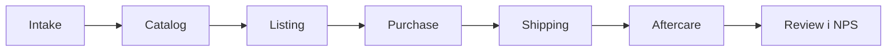
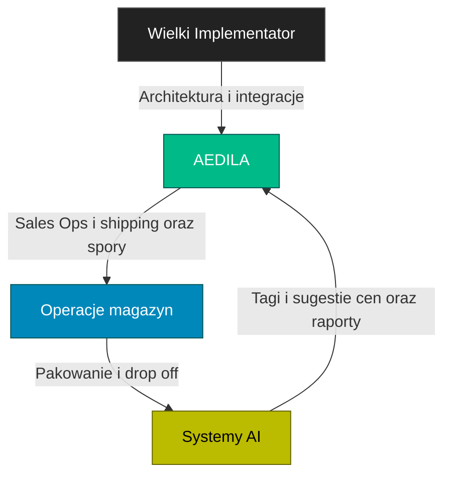
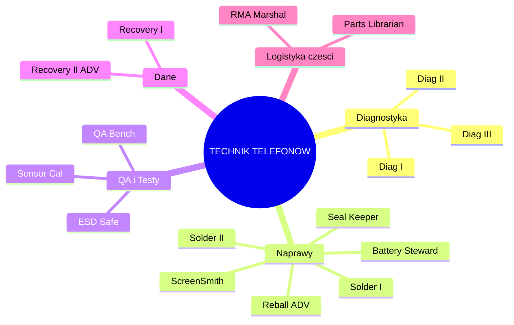
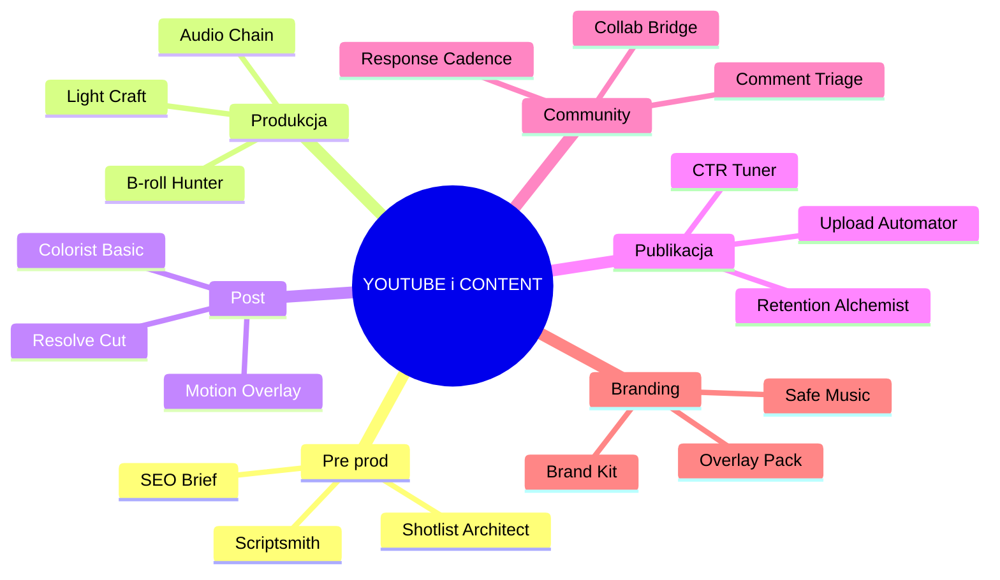

# 👩‍⚖️ AEDILA • Consul HUMIL • Strazniczka Rynku

> [!summary] Mandat i tozsamosc
> Evidence first. Bez `EVIDENCE.zip` nie ma rolloutu.  
> Callsign: `AEDILA/CONSUL`. Pseudonim: AEDILA. Alias zewnetrzny: Kari Aedila.  
> Ranga: OPS HUMIL • kandydat na TECHNIK. Mentor: Wielki Implementator.  
> Domeny: Odoo • eBay • Logistyka • FCGH • Sales • Content • Bastion • Secondbrain.

---

## 📊 KPI rdzeniowe
TTList ≤ 24 h • O2S D+1 ≥ 95% • Stock accuracy ≥ 99% • Evidence coverage 100% • Drift Δ=0 w T+7 • Return% ≤ prog.

## 🧠 Atrybuty
Intelekt 5 • Determinacja 5 • Prezencja 4 • Zrecznosc 3 • Wytrzymalosc 3 • Intuicja 4

---

# 🏷️ SALES • model operacyjny

> [!info] Cel
> Sprzedaz powtarzalna. Marza stabilna. Reputacja rosnaca. Dokumentacja pelna.

## 🔌 Kanaly
eBay UK • Local pickup • Direct B2C formularz • Testy: Vinted i Facebook Marketplace.  
Regula HUMIL: elementy z tagiem `promo` wymagaja przegladu i `EVIDENCE.zip`.

## 🧵 Lejek sprzedazy

Intake • badanie • ID • foto • cena minimalna.  
Catalog • karta Odoo • atrybuty • SKU FCGH.  
Listing • szablon • polityki • SEO • miniatura.  
Purchase • platnosc • faktura.  
Shipping • batch 10 • drop off 17:00.  
Aftercare • zwroty • spory • makra odpowiedzi.  
Review • NPS • eskalacje.

## 🗂️ Taksonomia katalogu
Kategorie: telefony • laptopy • akcesoria • czesci.  
Linie: FCGH • Liquidation. Stany: A • B • C • For parts.  
Atrybuty: model • wariant • pamiec • kolor • stan • komplet.

## 💸 Ceny i marze
Paski marzy: min • target • max.  
Zmiany cen > 10% • HUMIL gate • test na staging • symulacja popytu.  
Promocje: krotkie okna • zapis do `EVIDENCE.zip` • plan rollback.

## 🖼️ Media
Preset swiatlo • 6 zdjec • kat 45 • tlo jednolite.  
Nazwy plikow: SKU numer i kolejnosc.  
Video short • Fix with me • YouTube • link do eBay.

## 🚚 Polityki wysylek
Cut off 14:00 • drop off 17:00 • batch 10.  
Evri i Royal Mail • waga • dowod nadania • CSV etykiet.  
SLA: D+1 dla 95% zamowien.

## 🛡️ Spory i moderacje
Playbook Shield • analiza powodu • wariant tresci • apelacja • eskalacja.  
Mierniki: odzysk ofert • czas do przywrocenia • stosunek wygranych.

## 🧾 Zwroty
Okno zgodne z kanalem • checklista stanu • test funkcjonalny.  
Decyzja: refund • replacement • partial.  
Miernik: Return% • zrodlo zwrotu • korekta opisu.

## 👥 RACI sprzedazy

## 📈 Dashboard sprzedazy
Revenue • Margin% • ASP • Conversion • CTR • Return% • O2S • Moderation rate • TTList • Stock accuracy • NPS.  
Widok tygodniowy i miesieczny • notatki w Secondbrain.

## 🧰 Szablony
Listing eBay • preset media • makra support • release notes.  
Mapa `EVIDENCE.zip`: raw • testy • CSV • linki • logi.

---

# 🧪 Sciezka TECHNIK • mentoring
> Cel: samodzielny cykl Intake • Inventory • Listing • Shipping • Returns.

## Curriculum M1 do M7
| Modul | Zakres | Zadanie | DoD |
|---|---|---|---|
| M1 Intake | przyjecie i tagi oraz foto | 10 assetow pelnych | 0 brakow |
| M2 Inventory | karty i warianty oraz atrybuty | 10 SKU FCGH | audyt OK |
| M3 Listing | szablon i media oraz polityki | 10 listingow | TTList ≤ 24 h |
| M4 Shipping | Evri i RM oraz waga i etykiety | 20 wysylek | O2S ≥ 95% |
| M5 Counter Mod | spory i odzysk | 3 sprawy | co najmniej 2 odzyskane |
| M6 Data Hygiene | drift i nazwy oraz ceny | 50 SKU | Δ=0 w T+7 |
| M7 HUMIL | bramki i weto oraz dowody | 5 decyzji | pelne `EVIDENCE.zip` |

## Egzaminy E1 do E3
E1 Audyt SKU • 20 losowych • 0 krytycznych.  
E2 Misja D+1 • 10 zamowien w 48 h • O2S ≥ 95%.  
E3 HUMIL Gate • rollout cenowy > 10% na staging • poprawny werdykt • `EVIDENCE.zip`.

## Kryteria promocji
M1 do M7 oraz E1 do E3 • 50 listingow bez driftu • 2 odzyski • 3 miesiace O2S ≥ 95% • Return% ≤ prog.

## 📈 Tor 90 dni
[ ] M1 do M3 • [ ] M4 do M5 • [ ] M6 do M7 i E1 do E3  
[ ] 50 listingow bez driftu • [ ] 2 odzyski • [ ] O2S 95% przez 12 tygodni

---

# 🌳 Perki • rdzen OPS i HUMIL
| Galaz | Perk | Efekt | Warunek |
|---|---|---|---|
| OPS | QuickList I i II | skroty i auto media | 20 i 60 listingow oraz O2S ≥ 95% |
| HUMIL | Gatekeeper I i II | weto na staging i na produkcji | 3 i 10 trafionych bramek |
| HUMIL | Rollback Marshal | Recall Beacon | E3 zaliczony |
| Data | Drift Zero I i II | monitoring i auto korekty | 50 i 150 SKU z Δ=0 |
| Taxonomy | Sage | projekt tagow | 3 projekty przyjete |
| Disputes | Agent I i II | spory 200 i 500 GBP | 2 i 5 odzyskow |
| Logistics | D+1 Ranger | optymalizacja tras | 100 zamowien D+1 |
| Logistics | Batch Commander | partie 50 plus | 3 partie bez bledow |
| Comms | Crisis Brief I i II | brief 5 min oraz rollback | 3 i 5 poprawnych |
| Tooling | Macro Forge | makra operacyjne | 5 makr OK |
| Tooling | Evidence Automator | auto ZIP artefaktow | 3 automaty |

---

# 🌳 Perki • TECHNIK TELEFONOW

| Perk | Efekt | Warunek |
|---|---|---|
| Diag I II III | intake i testy • plyta • oscyloskop | 10 i 30 i 50 diagnoz |
| ScreenSmith | wymiana ekranow bez driftu | 20 sztuk oraz reklamacje < 2% |
| Battery Steward | wymiana i kalibracja | 30 sztuk oraz log kalibracji |
| Seal Keeper | odtworzenie uszczelnien i IP | 15 sztuk oraz test IP |
| Solder I i II | mikro lut i QFN i PMIC | 10 i 10 reworkow oraz 90% pass |
| Reball ADV | reball BGA | 5 sukcesow |
| ESD Safe | zgodnosc ESD | audyt OK |
| QA Bench | standaryzacja testow | 50 urzadzen oraz 0 brakow |
| Sensor Cal | kalibracje prox i cam | 15 OK |
| Recovery I i II | odzysk logiczny i ADV bez chip off | 10 i 5 sukcesow |
| Parts Librarian | system czesci i zgodnosci | 200 pozycji oraz Δ=0 |
| RMA Marshal | zwroty serwisowe | 10 spraw oraz czas ≤ 7 dni |

---

# 🌳 Perki • YOUTUBE i CONTENT

| Perk | Efekt | Warunek |
|---|---|---|
| Scriptsmith | skrypty 60 do 120 s | 10 skryptow OK |
| Shotlist Architect | lista ujec i props | 5 odcinkow |
| SEO Brief | metadane spojne | 10 publikacji |
| Light Craft | setup 3 punktowy w 10 min | 10 realizacji |
| Audio Chain | czysty dzwiek i LUFS | 10 nagran |
| B-roll Hunter | B-roll maskuje ciecia | 10 wideo |
| Resolve Cut | plynny montaz | 10 wideo |
| Colorist Basic | balans bieli i skin | 10 korekcji |
| Motion Overlay | overlay brand | 5 szablonow |
| CTR Tuner | A i B miniatury i tytuly | CTR ≥ 6% przez 5 filmow |
| Retention Alchemist | hook i pacing | AVD ≥ 35% przez 5 filmow |
| Upload Automator | preset upload | 10 publikacji |
| Response Cadence | okno 24 h | 10 filmow |
| Comment Triage | triage szablonami | 50 watkow |
| Collab Bridge | goscie i cross promo | 3 wspolprace |
| Brand Kit | fonty i kolory oraz logo | zestaw w repo |
| Overlay Pack | lower thirds i intro i outro | 1 pakiet |
| Safe Music | biblioteka licencji | 20 utworow |

---

# 🎛️ Playbook OPS
QuickList • preset foto • szablon • atrybuty • publikacja • `EVIDENCE.zip`.  
D+1 Ranger • batch 10 • cut off 14:00 • drop off 17:00 • CSV etykiet.  
Shield • analiza • wariant tresci • apelacja • eskalacja.  
Seal i Recall • PR i testy i KPI • Akcept lub Warunki lub Stop • plan Recall • weryfikacja po T+7.

---

# 🔐 OPSEC podwojnego agenta
Dwa kanaly i jedna prawda • tresc spojna i metadane rozdzielone.  
Tozsamosci: `AEDILA/CONSUL` i Broker • osobne sesje i klucze.  
Zakaz cross tokenow i wspolnych cookies.  
Rollback gotowy przed kazdym rolloutem.

---

# 🧨 Rejestr ryzyk
| Ryzyko | Objaw | Mitigacja | Trigger |
|---|---|---|---|
| Drift danych | ceny i atrybuty rozchodza sie | Drift Zero i audyt tygodniowy | Δ>0 dla 10 plus SKU |
| Spadek O2S | przeciazenie i chaos | batch 10 i cut off 14:00 i rezerwa | O2S < 90% tydzien |
| Moderacje | niejasny regulamin | Shield playbook i szablony | 2 plus oferty zdjete |
| Feedback shock | blokada dzialania | mikro retro 10 min i focus 90 | 2 briefy spoznione |
| OPSEC | wyciek aliasow | izolacja tozsamosci i rotacja kluczy | naruszenie sesji |

---

# ⏱️ Energetyka i rytualy
2 x 90 min glebokiej pracy dziennie • 4 x 25 min batch.  
Tygodniowo: 3 KPI review • 1 audyt SKU • 1 mikro retro.

---

# 🧩 Szablony misji
## Mission • Counter Moderation Run
Cel: odzyskac {N} ofert do {data}. Powod moderacji: {…}. Dowody: linki i zrzuty.  
Strategia: wariant tresci A i B oraz apelacja. KPI: procent odzyskow i czas.  
Rollback: re listing z korekta.

## Mission • Konwoj D+1
Cel: wysylki {N} do {godzina D}. Batch: {rozmiar}. Okno drop off: {…}.  
Ryzyka: opoznienia i braki materialow. KPI: O2S i bledy pakowania.  
Evidence: CSV etykiet i proof drop off.

## Mission • Price Guard
Cel: marza co najmniej {prog} procent. Zakres: kategorie {…}.  
Wejscia: koszt i popyt oraz konkurencja. Kroki: symulacje i prog i rollout.  
KPI: marza i sprzedaz oraz zwroty. Rollback: powrot cen z notka.

---

# 📜 Kontrakt DoR i DoD
**DoR** • problem 1 do 3 zdania • 1 KPI • granice • `EVIDENCE.raw` • test i rollback • etykiety • termin.  
**DoD** • `EVIDENCE.zip` • KPI • update SOP • releasenotes • werdykt HUMIL • aktualizacje Odoo i eBay • mikro retro.

---

# 🧰 Loadout
Real: Kubuntu • Odoo 18 CE • eBay • PhotoPrism • Nextcloud • drukarka etykiet • skaner • waga • lightbox • zestaw serwisowy.  
Diegetyczne: Market Sensor Array • Counter Moderation Shield • Supply Chain Holomap • Price War Simulator • HUMIL Seal • Recall Beacon.

---

# 🎭 Postac • profil i diegeza
## Pochodzenie
Dorastala miedzy handlem i procedura. Widzi oba jezyki. Nie ufa niczemu bez danych.  
Zwerbowana po serii skutecznych odzyskow zmoderowanych ofert.  
W Rebeli jest bramka HUMIL. Na zewnatrz jest Brokerem.

## Motywacje
Porzadek rynku. Przejrzystosc. Spojnosc danych.  
Ochrona reputacji warsztatu. Stabilna marza. Skuteczne dostawy.

## Mocne strony
Konsekwencja. Myslenie procesowe. Dyscyplina dokumentow.  
Nauka przez mentoring. Praca w presji czasu.

## Slabe strony
Reaktywnosc na ostry feedback. Ryzyko blokady dzialania.  
Skonnosc do chaosu zakupowego. Potrzeba jasnych rytualow.

## Rytualy
Dwie sesje glebokiej pracy po 90 min. Cztery batch po 25 min.  
Tydzien: przeglad KPI • audyt SKU • mikro retro.

## Kodeks
No evidence no rollout. Jedna prawda. Dzialanie na artefaktach.  
Prywatnosc klienta ponad tresc promo. Brak chip off bez zgody.

## Glos
Krotko. Rzeczowo. Na liczbach. Bez dekoracji.

## Relacje
Wielki Implementator • mentor i bramka technologii.  
HUMIL • instytucje zewnetrzne • kanaly sprzedazy • klienci.

## Haki fabularne
Counter Moderation Run • Konwoj D+1 • Price Guard • Operacja Recall.
