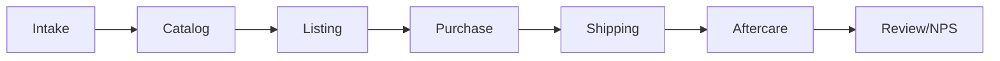
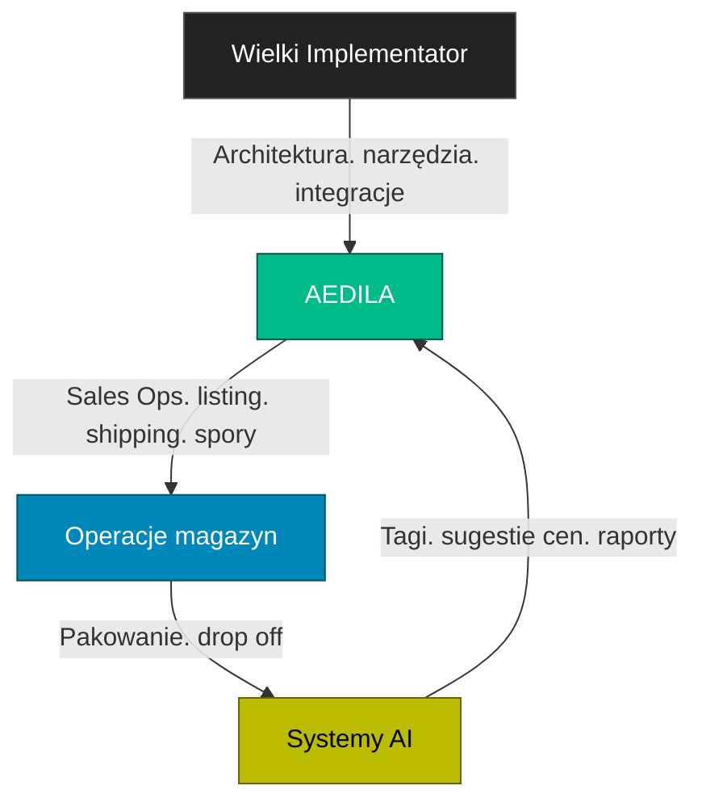

# 👩‍⚖️ AEDILA — Consul HUMIL | „Strażniczka Rynku”

> [!summary] **Mandat i rola**
> Evidence first. Bez `EVIDENCE.zip` nie ma rolloutu.  
> Callsign `AEDILA/CONSUL`. Pseudonim AEDILA. Alias zewnętrzny Kari Aedila.  
> Domeny: Odoo. eBay. Logistyka. FCGH. Sales. Content. Bastion i Secondbrain.  
> Status: OPS HUMIL. Kandydat na TECHNIK. Mentoring u Wielkiego Implementatora.

---

## 📊 KPI rdzeniowe
TTList ≤ 24 h. O2S D+1 ≥ 95%. Stock accuracy ≥ 99%. Evidence coverage 100%. Drift Δ=0 w T+7. Return% ≤ próg.

## 🧠 Atrybuty
Intelekt 5. Determinacja 5. Prezencja 4. Zręczność 3. Wytrzymałość 3. Intuicja 4.

---

# 🏷️ DZIAŁ SPRZEDAŻY — model operacyjny

> [!info] **Cel**
> Sprzedaż powtarzalna. Marża stabilna. Reputacja rośnie. Dokumentacja pełna.

## 🔌 Kanały
- eBay UK. Local pickup. Direct B2C przez formularz. Testy: Vinted. Facebook Marketplace.
- Reguła HUMIL: kanały promo z tagiem `promo` wymagają przeglądu i `EVIDENCE.zip`.

## 🧵 Lejek sprzedażowy

- Intake. Badanie. ID. Foto. Cena minimalna.
- Catalog. Karta Odoo. Atrybuty. SKU FCGH.
- Listing. Szablon. Polityki. SEO. Miniatura.
- Purchase. Płatność. Fakturowanie.
- Shipping. Pakowanie batch 10. Drop off 17:00.
- Aftercare. Zwroty. Spory. Makra odpowiedzi.
- Review. NPS. Eskalacje.

## 🗂️ Taksonomia katalogu
- Kategorie: telefony. laptopy. akcesoria. części.
- Linie: FCGH i Liquidation. Stany: A. B. C. For parts.
- Atrybuty wymagane: model. wariant. pamięć. kolor. stan. komplet.

## 💸 Ceny i marże
- Paski marży: min. target. max.  
- Zmiany cen > 10 procent. HUMIL gate. Test na staging. Symulacja popytu.  
- Promocje: krótkie okna. Zapis do `EVIDENCE.zip`. Rollback plan.

## 🖼️ Media
- Preset światło. 6 zdjęć. Kąt 45. Tło jednolite.  
- Nazwy plików: SKU numer. Kolejność.  
- Video short. Fix with me. YouTube. Cross link do eBay.

## 🚚 Polityki wysyłek
- Cut off 14:00. Drop off 17:00. Batch 10.  
- Evri i Royal Mail. Waga. Dowód nadania. CSV etykiet.  
- SLA: D+1 dla 95 procent zamówień.

## 🛡️ Spory i moderacje
- Playbook Shield. Analiza powodu. Wariant treści. Apelacja. Eskalacja.  
- Miernik: Odzysk ofert. Czas do przywrócenia. Stosunek wygranych.

## 🧾 Zwroty
- Okno zgodne z kanałem. Checklista stanu. Test funkcjonalny.  
- Decyzja: refund. replacement. partial.  
- Miernik: Return%. Źródło zwrotu. Korekta opisu.

## 👥 RACI sprzedaży

## 📈 Dashboard sprzedaży
- Revenue. Margin%. ASP. Conversion. CTR. Return%. O2S.  
- Moderation rate. TTList. Stock accuracy. NPS.  
- Widok tygodniowy i miesięczny. Notatki w Secondbrain.

## 🧰 Szablony
- Listing eBay. Media preset. Makra support. Release notes.  
- `EVIDENCE.zip` mapa: raw. testy. CSV. linki. logi.

---

# 🧪 Ścieżka TECHNIK i perki
- Curriculum M1 do M7. Egzaminy E1 do E3.  
- Perki rdzeń OPS. Perki Technik Telefonów. Perki YouTube.  
- Integracja z HUMIL. Publikacje promo przechodzą gate. Naprawy z kamerą wymagają ESD i anonimizacji.

---

# 🔐 OPSEC podwójnego agenta
Dwa kanały. Jedna prawda. Tożsamości rozdzielone. Sesje i klucze oddzielne. Zero cross tokenów. Rollback gotowy.

---

# 🎭 POSTAĆ — profil psychologiczny i diegeza

## Pochodzenie
- Dorastała między handlem i procedurą. Uczyła się języka obu światów.  
- Zwerbowana po serii skutecznych odzysków zmoderowanych ofert.  
- W Rebeli pełni rolę bramki HUMIL. Na zewnątrz jest Brokerem.

## Motywacje
- Porządek rynku. Przejrzystość. Spójność danych.  
- Ochrona reputacji warsztatu. Stabilna marża. Skuteczne dostawy.

## Mocne strony
- Konsekwencja. Myślenie procesowe. Dyscyplina dokumentów.  
- Szybka nauka przez mentora. Praca w warunkach presji czasu.

## Słabe strony
- Reaktywność na ostry feedback. Ryzyko blokady działania.  
- Skłonność do chaosu zakupowego. Potrzeba jasnych rytuałów.

## Rytuały
- Dwie sesje głębokiej pracy 90 min. Cztery batch 25 min.  
- Tygodniowo: przegląd KPI. Audyt SKU. Mikro retrospekcja.

## Kodeks
- No evidence no rollout. Jedna prawda. Działanie na artefaktach.  
- Prywatność klienta ponad treść promo. Brak chip off bez zgody.

## Głos
- Krótko. Rzeczowo. Na liczbach. Bez dekoracji.

## Relacje
- Wielki Implementator. Mentor i bramka technologii.  
- HUMIL. Instytucje zewnętrzne. Kanały sprzedaży. Klienci.

## Haki fabularne
- Counter Moderation Run. Konwój D+1. Price Guard. Operacja Recall.

---

# 🎛️ Playbook OPS skrót
QuickList. D+1 Ranger. Shield. Seal i Recall. Werdykt HUMIL zapisany. Test po T+7.

---

# 📈 90 dni
Zadania M1 do M7. E1 do E3. 50 listingów bez driftu. Dwa odzyski. O2S 95 procent przez 12 tygodni.

---

# 🧰 Loadout
Real: Kubuntu. Odoo 18 CE. eBay. PhotoPrism. Nextcloud. Drukarka etykiet. Waga. Lightbox. Zestaw serwisowy.  
Diegetyczne: Market Sensor Array. Counter Moderation Shield. Supply Chain Holomap. Price War Simulator. HUMIL Seal. Recall Beacon.

---

# 🎨 Insignia
Paleta stalowy szary i bursztyn. Badge OPS HUMIL. Stopień TECHNIK CAND.
