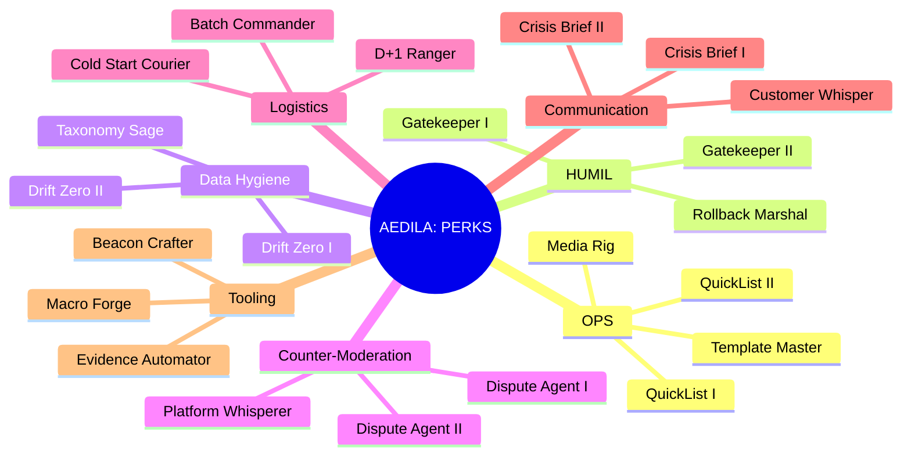

# 👩‍⚖️ AEDILA — Consul HUMIL | „Strażniczka Rynku”

> **Mandat:** evidence‑first. Bez EVIDENCE nie ma rolloutu.

## 📛 Tożsamość
- **Imię kodowe:** AEDILA
- **Callsign Rebeli:** `AEDILA/CONSUL`
- **Rola jawna:** bramka **HUMIL** dla wdrożeń, cen i polityk.
- **Rola niejawna:** broker zgodności w instytucjach i serwisach zewnętrznych.
- **Relacja operacyjna:** bezpośrednio z Dowódcą Rebeli (Wielkim Implementatorem).

## 🧭 Archetyp
- „Strażniczka Rynku” — utrzymuje przepływ, reputację i marżę.
- Interfejs: **Odoo ↔ eBay ↔ Logistyka ↔ Bastion/Secondbrain**.

## 🎯 KPI (cechy mierzalne)
- **TTList ≤ 24 h**  • **Order‑to‑Ship D+1 ≥ 95%**  • **Stock accuracy ≥ 99%**
- **Evidence coverage = 100%**  • **Drift Δ = 0 w T+7**  • **Return% ≤ próg**

## 🧠 Atrybuty (1–6)
- **Intelekt 5**  • **Determinacja 5**  • **Prezencja 4**
- **Zręczność 3**  • **Wytrzymałość 3**  • **Intuicja 4**

---

# 🧪 ŚCIEŻKA AWANSU: **TECHNIK FCGH** (mentoring u Wielkiego Implementatora)

> **Cel:** uzyskać rangę **TECHNIK** i samodzielnie prowadzić pełny cykl **Intake → Inventory → Listing → Shipping → Returns**.

## 👨‍🏫 Mentoring
- **Tryb:** `1:1 weekly` (60 min) + `shadowing` operacyjny + `lab-sprint` w **Lab AI**.
- **Artefakty:** protokoły zadań, `EVIDENCE.zip`, checklisty SOP, nagrania ekranu.
- **Przepustka:** badge `HUMIL Trainee` → `HUMIL Operator` po egzaminie.

## 📚 Curriculum modułowe
| Moduł | Zakres | Zadanie zaliczeniowe | DoD |
|---|---|---|---|
| M1. Intake | przyjęcie, tagi, foto, ID | 10 assetów z pełnym metadanym | 0 braków, spójność tagów |
| M2. Inventory (Odoo) | karty produktowe, warianty | 10 SKU FCGH z atrybutami | audyt „OK” |
| M3. Listing (eBay) | szablon, media, polityki | 10 listingów end‑to‑end | TTList ≤ 24 h |
| M4. Shipping | Evri/RM, waga, etykiety | 20 wysyłek D+1 | O2S ≥ 95% |
| M5. Counter‑Moderation | spory, odzysk | 3 sprawy zamknięte | ≥ 2 odzyskane |
| M6. Data Hygiene | drift, nazwy, ceny | 50 pozycji bez driftu | Δ=0 w T+7 |
| M7. HUMIL | bramki, weto, dowody | 5 decyzji gate | pełne `EVIDENCE.zip` |

## 🧪 Egzaminy praktyczne
- **E1 — Audyt SKU:** losowe 20 pozycji, 0 niezgodności krytycznych.
- **E2 — Misja D+1:** 10 zamówień w 48 h, D+1 ≥ 95%.
- **E3 — HUMIL Gate:** rollout cenowy >10% na staging, poprawny werdykt + `EVIDENCE.zip`.

## 🧩 Kryteria promocji → **TECHNIK**
- Zaliczone M1–M7 + E1–E3.
- 50 listingów FCGH bez driftu atrybutów i cen.
- 2 udane odzyski po moderacji.
- 3 miesiące O2S ≥ 95% i Return% ≤ progu.

## 📈 Macierz umiejętności (stan → cel 90 dni)
| Obszar | Stan | Cel |
|---|---:|---:|
| Intake/Foto | 60% | 90% |
| Odoo karty/atrybuty | 55% | 85% |
| eBay listing/polityki | 50% | 85% |
| Shipping/etykiety | 70% | 90% |
| Counter‑Moderation | 40% | 80% |
| HUMIL bramkowanie | 45% | 85% |
| Higiena danych | 50% | 90% |

---

# 🌳 Drzewko perków — AEDILA

> Perki odblokowują narzędzia, uprawnienia i skróty decyzyjne. Warunki są liczbowe i audytowane.

### Opisy i warunki odblokowania
| Perk | Efekt | Warunek |
|---|---|---|
| QuickList I | skrót listingowy, 30% mniej klików | 20 listingów TTList ≤ 24 h |
| QuickList II | automaty paczkowania mediów | 60 listingów + 95% O2S |
| Template Master | edycja szablonów globalnych | audyt 10 SKU „OK” |
| Media Rig | dostęp do lightbox presetów | 10 sesji foto bez błędów |
| Gatekeeper I | prawo weta na staging | 3 bramki HUMIL „trafione” |
| Gatekeeper II | weto na produkcji | 10 bramek „trafionych” |
| Rollback Marshal | wywołanie `Recall Beacon` | E3 „HUMIL Gate” zaliczony |
| Drift Zero I | monitor driftu dla 50 SKU | Δ=0 w T+7 dla 50 SKU |
| Drift Zero II | automaty korekt cen/atrybutów | Δ=0 w T+7 dla 150 SKU |
| Taxonomy Sage | projektuje schematy tagów | 3 projekty przyjęte |
| Dispute Agent I | prowadzi spór do 200 GBP | 2 odzyski |
| Dispute Agent II | spory do 500 GBP | 5 odzysków |
| Platform Whisperer | priorytetowe kanały wsparcia | 3 spory wygrane z eskalacją |
| D+1 Ranger | optymalizacja tras wysyłek | 100 zamówień D+1 |
| Batch Commander | orkiestracja partii 50+ | 3 partie 50+ bez błędów |
| Cold Start Courier | start od zera w 24 h | 1 proof w nowej kategorii |
| Crisis Brief I | raport kryzysowy ≤ 5 min | 3 poprawne briefy |
| Crisis Brief II | brief + plan rollbacku | 5 poprawnych briefów |
| Customer Whisper | redukcja negatywów o 30% | 10 spraw „klient trudny” |
| Macro Forge | tworzy makra operacyjne | 5 makr zatwierdzonych |
| Evidence Automator | auto‑ZIP artefaktów | 3 wdrożone automaty |
| Beacon Crafter | nowe presety Recall Beacon | 2 presety wdrożone |

---

# 📜 Kontrakt mentorskich **DoR / DoD**

> Definicje gotowości i ukończenia dla zadań, modułów i bramek HUMIL.

## ✅ DoR — Definition of Ready
- Problem zdefiniowany w 1–3 zdaniach.
- Cel liczbowy ustawiony na 1 KPI.
- Zakres i granice opisane (co wchodzi, co nie).
- Zasoby i dane wejściowe podlinkowane (`EVIDENCE.raw`).
- Plan testu i rollbacku opisany.
- Ticket z etykietami: `area`, `SKU|Order`, `risk`, `owner`.
- Slot czasowy i termin D ustawione.

## 🏁 DoD — Definition of Done
- Artefakty w `EVIDENCE.zip` (zrzuty, CSV, logi, linki).
- Wynik KPI osiągnięty lub odrzucony z powodem.
- SOP zaktualizowany, zmiany w szablonach zrewidowane.
- Releasenotes krótkie i indeks w Secondbrain.
- Werdykt HUMIL zapisany, jeśli dotyczy.
- Odoo/eBay zaktualizowane, link do rekordu.
- Retrospekcja micro: 3 wnioski, 1 eksperyment na kolejny sprint.

## 📅 Kadencja
- **Weekly 1:1:** plan, egzekucja, review, next.
- **Monthly audit:** losowe 20 SKU, raport driftu i cen.
- **Quarterly check:** próg marży, Return%, procesy sporne.

## 🚨 Triggery blokujące
- Brak danych wejściowych, brak rollback planu, lub brak KPI → brak startu.
- Spadek O2S poniżej 90% w tygodniu → tryb „stabilizacja”.

## 🧾 Standardy repo i nazewnictwa
- **Branch:** `feat/area-id-short` • **Commit:** `fix(area): verb - id`
- **Artefakt:** `/evidence/<YYMMDD>-<area>-<id>/...`
- **Notatka:** `YYYY-MM-DD - area - krótko - KPI`

---

## 🧰 Loadout funkcjonalny
| Obszar | Narzędzia | Output |
|---|---|---|
| Listing FCGH | Odoo, Lightbox, PhotoPrism | SKU live ≤ 24 h |
| Ceny | Odoo, Price‑War Simulator | Marża ≥ progu |
| Wysyłki | Evri/RM, waga, drukarka | D+1 dla 95% |
| Zgodność | Counter‑Moderation Shield | Przywrócone oferty |
| Evidence | Bastion, Secondbrain | Link do ZIP przy release |
| HUMIL | HUMIL Seal | Akcept/stop deployu |

## 🧷 Estetyka
- Paleta: stalowy szary + bursztyn. Badge: `OPS/HUMIL`, stopień: `TECHNIK — CAND`.
