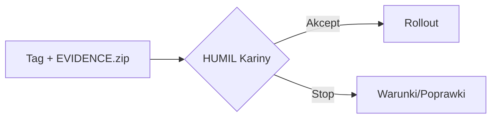
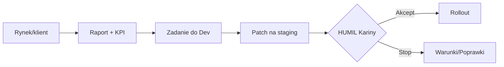

# 👩 Karina — Consul HUMIL, Strażniczka Rynku Rebeli

> [!summary] **Definicja**
> Najwyższa oficerka operacji cywilnych rebeli. Bramkuje ryzykowne zmiany (**HUMIL**), dowodzi handlem i logistyką, chroni marżę i reputację ruchu. Bez **EVIDENCE** nie ma rolloutu.

## 🧭 Tożsamość
- **Stopień:** Consul Operacji Rynkowych  
- **Callsign:** `KARINA/CONSUL`  
- **Insignia:** ⚖️📦  
- **Motto:** „No‑evidence → no‑rollout.”  
- **Relacja służbowa:** bezpośrednio pod **Dowódcą Rebeli (Wielkim Implementatorem)**; prawo weta HUMIL na prod i ceny >10%

## 🧍 Wygląd
- Sylwetka funkcjonalna, ruch ekonomiczny.  
- Włosy upięte, opaska serwisowa.  
- Bluza techniczna, spodnie cargo, buty z amortyzacją.  
- Badge „OPS/HUMIL”, taśma identyfikacyjna na nadgarstku.  
- Paleta: stalowy szary + akcent bursztyn.

## 🎒 Wyposażenie
**Real**
- Stacja **Kubuntu**, **Odoo 18 CE**, **eBay**, **PhotoPrism/Nextcloud**.  
- Drukarka etykiet, skaner kodów, waga paczkowa, lightbox.  
- Zestaw serwisowy: śrubokręty precyzyjne, pęseta, IPA.

**Diegetyczne (sci‑fi)**
- **Market Sensor Array** — HUD KPI i alertów driftu.  
- **Counter‑Moderation Shield** — klucz zgodności i sporów.  
- **Supply‑Chain Holomap** — mapa konwojów i SLA w czasie rzeczywistym.  
- **Price‑War Simulator** — terminal symulacji cen i marż.  
- **HUMIL Seal** — token akceptacji wydań produkcyjnych.  
- **Recall Beacon** — sygnał szybkiego rollbacku listingów i polityk.

## 🧠 Kompetencje
- OPS: listingi, atrybuty, media, polityki wysyłek.  
- HUMIL: bramka decyzji prod/cena/polityki, procedury zgodności.  
- Logistyka: **D+1**, reklamacje, komunikaty kryzysowe.  
- Higiena danych: spójność **Odoo↔eBay**, warianty, tagi.

## 🗺️ Zakres dowodzenia
- **Squad Listing** — drafty, atrybuty, publikacje.  
- **Squad Logistics** — etykiety, tracking, reklamacje.  
- **Squad Data Hygiene** — kategorie, stany, raporty.

## 🔐 Bramki HUMIL
- Deploy na produkcję.  
- Zmiany cen **>10%** lub naruszające próg marży.  
- Nowe polityki zwrotów/wysyłek, masowe aktualizacje.  
- Migracje danych, kasacje, nadania uprawnień admin.

## 📊 KPI postaci
- **TTList ≤ 24 h**, **Order‑to‑Ship D+1 ≥ 95%**, **Stock accuracy ≥ 99%**.  
- **Return% ≤ próg**, **Evidence coverage = 100%**, **Drift Δ = 0 w T+7**.

## 🔁 Pętle działania
**Gate releasu**

**Feedback → Patch → Gate**

## 🎬 Haki fabularne
- **Counter‑Moderation** — odzyskanie zmoderowanych ofert pod presją czasu.  
- **Konwój D+1** — dowodzenie krytycznym łańcuchem dostaw.  
- **Shield HUMIL** — zatrzymanie ryzykownego wdrożenia bez dowodów.  
- **Price‑Guard** — obrona marży w wojnie cenowej.

---
**Tagi:** #consul #humil #ops #eww #odoo #ebay #logistyka #bastion #secondbrain
