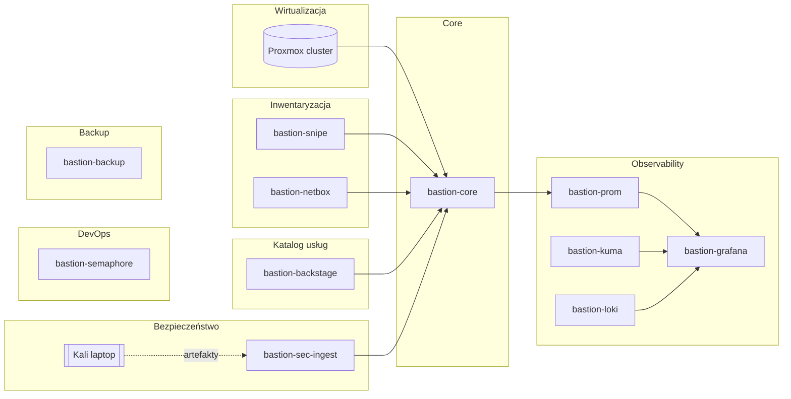

# 🛡️ Bastion — funkcje, warstwy, VM (make.md)

> [!summary] **Cel**
> Jeden system do **Audytu**, **Inwentaryzacji** i **Observability**.  
> Źródła prawdy: **Snipe-IT** (sprzęt), **Backstage** (usługi), **Proxmox** (VM/CT).  
> Bastion **koreluje**, **ocenia ryzyko**, **raportuje**. Remediacje wykonuje **Ansible/Semaphore** poza Bastionem.

> [!info] **Zasada**
> Każda VM = **jedna funkcja**. Twarde granice odpowiedzialności. Linki zwrotne między systemami.

---

## 🗺️ Topologia (warstwy → VM)



---

## 🧱 VM-per-funkcja

| VM | Warstwa | Funkcja | Oprogramowanie | Krytyczność |
|---|---|---|---|---|
| **bastion-core** | L0 | Korelacja, raporty, linki zwrotne | kolektory API + raporty MD/JSON | Wysoka |
| **bastion-snipe** | L1 | CMDB sprzętu | Snipe-IT (+ DB) | Wysoka |
| **bastion-netbox** | L1 | Źródło sieci | NetBox (+ DB) | Średnia |
| **Proxmox cluster** | L2 | Źródło VM/CT | Proxmox VE | Wysoka |
| **bastion-backstage** | L3 | Katalog usług | Backstage (+ TechDocs) | Wysoka |
| **bastion-prom** | L4 | Metryki i alerty | Prometheus + Alertmanager | Wysoka |
| **bastion-grafana** | L4 | Wizualizacja | Grafana | Średnia |
| **bastion-loki** | L4 | Logi | Loki (+ Promtail na hostach) | Średnia |
| **bastion-kuma** | L4 | Syntetyki | Uptime Kuma | Średnia |
| **bastion-sec-ingest** | L5 | Ingest artefaktów security | HTTP/SMB ingest + indeks | Wysoka |
| **Kali (laptop)** | L5 | Pentest i skany | nmap, nuclei, GVM, testssl, syft/grype/trivy, lynis | Wysoka |
| **bastion-semaphore** | L6 | Observability wdrożeń | Semaphore (Ansible UI) | Średnia |
| **bastion-backup** | L7 | Kopie | restic, pgBackRest | Wysoka |

> [!tip] **Usługi krytyczne monitorowane**  
> Odoo-App/DB, Synapser (n8n/Git/Syncthing/CouchDB), NetBox, Snipe-IT, Backstage, Prometheus/Grafana, Kuma, Proxmox-nodes.

---

## ⚙️ Funkcje (kontrakty)

> [!abstract] **F1 — Audyt infrastruktury (CORE)**  
> Wejścia: Proxmox, Snipe-IT, Backstage, Sec-Ingest.  
> Wyjścia: `reports/audit_*.md|json` z sekcjami: *Inventory delta*, *Ownership gaps*, *Healthcheck gaps*, *Vulns*, *Drift*.  
> ```yaml
> function: audit_infra
> steps: [collect, correlate, check_drift, risk_score, emit, sync_links]
> risk_score: CVSS|exposure|criticality
> ```

> [!abstract] **F2 — Inwentaryzacja fizyczna (Snipe)**  
> CMDB sprzętu. Pola: `owner, location, last_seen, asset_tag, links.service_ref`.

> [!abstract] **F3 — Inwentaryzacja wirtualna (Proxmox)**  
> Lista VM/CT. Pola: `vmid, name, node, status, uptime, cpu, ram, disk, nets[].ip, vlan, tags`.

> [!abstract] **F4 — Katalog usług (Backstage)**  
> `catalog-info.yaml`. Wymagane: `owner`, `lifecycle`, `healthcheck`, linki do **Snipe-IT** i **VM**.

> [!abstract] **F5 — Observability (Prom/Graf/Loki/Kuma)**  
> Metryki, synthetic probes, logi. Panele: **Drift**, **Vulns**, **Orphans**, **Owner Coverage**, **Infra Health**.

> [!abstract] **F6 — Observability wdrożeń (Semaphore)**  
> Historia jobów, exit code, diff. Korelacja z usługami w Backstage.

> [!abstract] **F7 — Ingest bezpieczeństwa (Sec-Ingest + Kali)**  
> Przechowuje i wersjonuje artefakty skanów. Udostępnia CORE.

> [!abstract] **F8 — Backup (BKP)**  
> Retencja i odtwarzalność baz: Snipe-IT, NetBox, Backstage, Odoo, itp.

---

## 🔌 Interfejsy / API

- **Proxmox** → `GET /api2/json/cluster/resources?type=vm` + `nodes/{node}/{qemu|lxc}`  
- **Snipe-IT** → `GET/POST /api/v1/hardware` + `PATCH custom_fields.bks_service_ref|last_seen|ifaces|criticality`  
- **Backstage** → PR na repo katalogu lub Catalog API (`annotations.bastion/asset-links`, `backstage.io/techdocs-ref`)  
- **Sec-Ingest** → HTTP/SMB upload; indeks JSON (hash, typ, CVSS, powiązane entityRef/asset_tag)  
- **Prometheus** → scrape: `node_exporter`, `blackbox_exporter`, `snmp_exporter`, `prometheus-pve-exporter`, metryki Loki

---

## 🗂️ Model danych i mapowanie

> [!info] **Tożsamość**
> Główny klucz: `hostname`.  
> Aliasy: `asset_tag` (Snipe-IT), `vmid` (Proxmox), `entityRef` (Backstage).

```yaml
schema:
  asset:   [asset_tag, hostname, model, serial, owner, location, ip, mac, criticality, links.service_ref]
  vm:      [vmid, name, node, status, uptime, cpu, ram, disk, nets[].ip, vlan, tags]
  service: [name, entityRef, owner, lifecycle, endpoints[], healthcheck.url, snipe_links[], vm_links[]]
mapping:
  asset.hostname <- prefer(vm.name)|fallback(custom_field.hostname)
  service.links  <-> asset.asset_tag|vm.vmid
```

---

## 🧭 Reguły spójności i drift

> [!warning] **Reguły**
> - VM bez **service.owner** → błąd.  
> - Usługa bez **healthcheck** → błąd.  
> - Asset bez **last_seen** > 7 dni → przegląd.  
> - **CVSS ≥ 7.0** otwarte → remediacja wymagana.

> [!tip] **Drift**  
> Porównanie stanu z deklaracją Ansible. Wynik: lista różnic + propozycje playbooków do uruchomienia w Semaphore.

---

## ⏱️ Harmonogram (ramowy)

- Proxmox VM/CT: co **15 min**  
- Inwentaryzacja fizyczna: co **6 h**  
- Skany bezpieczeństwa: **tygodniowo** + **po zmianach krytycznych**  
- Raport dzienny i tygodniowy: **stała godzina (Europe/London)**

---

## 📑 Artefakty

- `reports/audit_*.md|json` — audyt i korelacja  
- `reports/vm_*.json`, `reports/snipeit_assets_*.json`, `reports/backstage_entities_*.json` — snapshoty źródeł  
- `artifacts/security/*` — nmap, nuclei, testssl, GVM, lynis, SBOM (syft), vuln (grype, trivy)

---

## 📈 KPI / SLO

- **Owner coverage** usług = **100%**  
- **Assety** z `location+owner+link` = **100%**  
- **Sieroty** VM/asset/usługa = **0**  
- **CVSS High/Critical** = w SLA, brak zaległości  
- **last_seen** ≤ **24 h**

---

## 🎯 Definicja „done”

> Każdy asset w **Snipe-IT** ma właściciela, lokalizację i link do usługi.  
> Każda usługa w **Backstage** ma ownera, healthcheck i linki do assetów/VM.  
> Drift zaakceptowany lub = 0.  
> Brak krytycznych CVE lub otwarte zadania remediacyjne zgodne z polityką.
