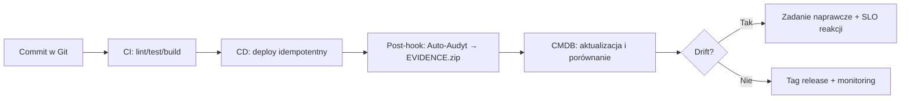

# 🛡️ Bastion — kluczowe narzędzie Wielkiego Implementatora

> [!summary] **Teza**
> Bastion jest Twoim **źródłem prawdy i pętlą kontroli**. Bez niego działasz w trybie *JIT discovery* i „snowflake servers”. Z nim wdrożenia są **powtarzalne, audytowalne i odwracalne**.

## 🎯 Co rozwiązuje
- **Rozproszenie wiedzy** → jeden model stanu (CMDB light).
- **Drift konfiguracyjny** → porównania *deklaratywne ↔ rzeczywiste*.
- **Brak śladu dowodowego** → `EVIDENCE.zip` po każdym deployu.
- **Wydłużona diagnoza** → gotowe logi, wersje, dumpy.
- **Ręczne releasy** → playbooki i hooki, nie „klikologia”.

## 📈 Efekt na metrykach (typowo)
- **MTTR**: ↓ 30–60%
- **Change Failure Rate**: ↓ 20–40%
- **Lead Time**: ↓ 15–35%
- **Konfig‑Drift**: spadek do budżetu driftu zdefiniowanego polityką

## 🧩 Minimalny rdzeń Bastionu
- **CMDB light**: NetBox/Snipe‑IT dla hostów, ról, IP, wersji usług, tagów release.
- **GitOps light**: inventory + playbooki w Git; idempotentny deploy przez Semaphore/Ansible.
- **Auto‑audyt**: post‑hook generuje `EVIDENCE.zip` (dump PG, filestore, moduły, logi, konfigi, hashe).
- **Monitoring minimal**: Uptime Kuma + node‑exporter na krytycznych VM.
- **Backup + test odtworzenia**: pgBackRest + restic, cykliczne *restore test*.

## 🛠️ Zasady operacyjne
- **No‑evidence → no‑deploy**.
- **Single Source of Truth**: zmiana stanu tylko przez Git + Bastion.
- **Budżet driftu**: każdy nadmiar → alarm z przypisanym właścicielem.
- **Release = tag + link do EVIDENCE**.
- **Rollback ćwiczony co sprint**.

## 🔁 Pętla operacyjna (flow)

## 📦 Artefakty po każdym deployu
> [!info] **EVIDENCE.zip zawiera**
> `odoo_version, pg_version, modules.tsv, pg_dump, filestore.tar.gz, odoo.conf, unit file, nginx, host_snapshot, checksums`

## 🧭 Tryby wdrożenia Bastionu
| Tryb | Zakres | Kiedy | Koszt operacyjny |
|---|---|---|---|
| **Light** | CMDB+GitOps+Auto‑audyt+Kuma | start, ≤10 usług | niski |
| **Pro** | + Prometheus/Grafana, alerting, polityki driftu, SSO | >10 usług, zespół | średni |
| **Plus** | + Immutable/Golden Images, Argo‑style reconcilation | skala, multi‑env | wyższy |

## 👥 RACI w Twoim modelu
- **Jakub (A/R)**: decyzje, merge, release, pętla ulepszeń.
- **Karina (R/C)**: struktury, repo, tablice, metryki, linki do ZIP.
- **AI/Secondbrain (C)**: szablony, lint, generacja docs, checklisty.

## ✅ Kryteria sukcesu
- 100% deployów ma **EVIDENCE.zip** i widoczny link w release.
- CMDB = stan rzeczywisty ± budżet driftu.
- Rollback przeszedł test w ostatnim sprincie.
- Monitoring wskazuje na stabilny DF, spadający MTTR i CFR.

## ⚠️ Ryzyka i kontra
- **Fałszywe bezpieczeństwo** → wymuś post‑hook i nocny drift‑check.
- **Sekrety w artefaktach** → redakcja w skryptach, `.env` poza ZIP.
- **Śmieci w repo** → EVIDENCE poza Git; w Git tylko URL.

## 🔗 Miejsca w Twoim układzie
- `/02_BUSINESS/development/projects/<projekt>/audits/<timestamp>/`
- `/02_BUSINESS/development/projects/<projekt>/ansible/` (playbooki)
- `/02_BUSINESS/development/projects/<projekt>/docs/` (README, status)

## 🧱 One‑liners do README sprintu
- „Deploy przyjęty, **EVIDENCE**: {url}, **drift Δ**: 0.”
- „Rollback przetestowany. RPO/RTO w normie.”
- „CMDB zaktualizowane. Tagi: vX.Y.Z.”

> [!tip] **Nazewnictwo stylu**
> Używaj roboczo: **audit‑driven ops**. Formalne słowa‑klucze: *GitOps, CMDB, Configuration Drift, Immutable Infrastructure, Change Management*.
