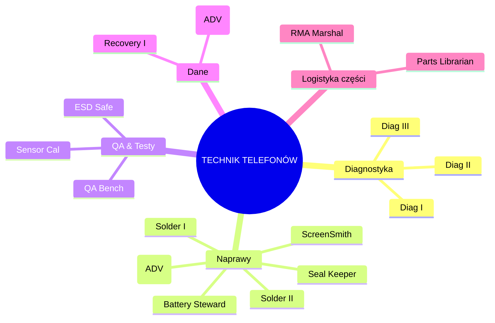
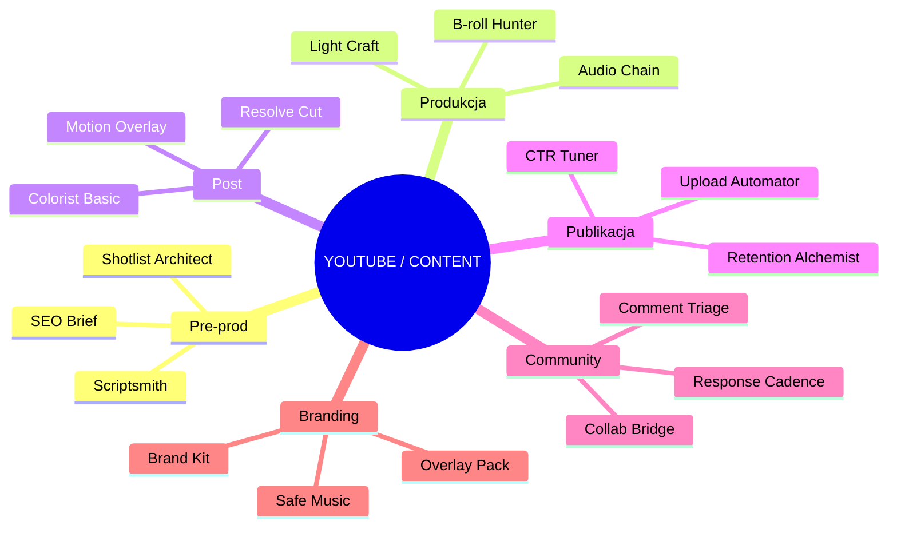

# 👩‍⚖️ AEDILA — Consul HUMIL | „Strażniczka Rynku”

> [!summary] **Mandat • tożsamość**
> **Evidence‑first.** Bez `EVIDENCE.zip` nie ma rolloutu.  
> **Callsign:** `AEDILA/CONSUL` • **Pseudonim:** **AEDILA** • **Alias zewn.:** *Kari Aedila* („Broker”).  
> **Ranga:** `OPS/HUMIL` → *TECHNIK — CAND* (mentoring u Wielkiego Implementatora).  
> **Domeny:** Odoo ↔ eBay ↔ Logistyka ↔ Bastion/Secondbrain • FCGH • YouTube/Content.

---

## 📊 KPI postaci
- **TTList ≤ 24 h** • **O2S D+1 ≥ 95%** • **Stock accuracy ≥ 99%**  
- **Evidence coverage 100%** • **Drift Δ=0 w T+7** • **Return% ≤ próg**

## 🧠 Atrybuty (1–6)
**Intelekt 5** • **Determinacja 5** • **Prezencja 4** • **Zręczność 3** • **Wytrzymałość 3** • **Intuicja 4**

---

## 🧪 Ścieżka awansu → **TECHNIK FCGH** (mentoring)
> [!info] **Cel:** samodzielny cykl **Intake → Inventory → Listing → Shipping → Returns**.

### Curriculum M1–M7
| Moduł | Zakres | Zadanie | DoD |
|---|---|---|---|
| **M1 Intake** | przyjęcie, tagi, foto | 10 assetów pełnych | 0 braków |
| **M2 Inventory** | karty, warianty, atrybuty | 10 SKU FCGH | audyt „OK” |
| **M3 Listing** | szablon, media, polityki | 10 listingów | **TTList ≤ 24 h** |
| **M4 Shipping** | Evri/RM, waga, etykiety | 20 wysyłek | **O2S ≥ 95%** |
| **M5 Counter‑Mod** | spory, odzysk | 3 sprawy | ≥2 odzyskane |
| **M6 Data Hygiene** | drift, nazwy, ceny | 50 SKU | **Δ=0 w T+7** |
| **M7 HUMIL** | bramki, weto, dowody | 5 decyzji | pełne `EVIDENCE.zip` |

### Egzaminy E1–E3
- **E1 Audyt SKU:** 20 losowych, 0 krytycznych.  
- **E2 Misja D+1:** 10 zamówień/48 h, O2S ≥ 95%.  
- **E3 HUMIL Gate:** rollout cenowy >10% na staging + poprawny werdykt + `EVIDENCE.zip`.

---

## 🌳 Perki — rdzeń OPS/HUMIL
| Gałąź | Perk | Efekt | Warunek |
|---|---|---|---|
| OPS | **QuickList I/II** | skróty i auto‑media | 20/60 listingów, O2S ≥ 95% |
| HUMIL | **Gatekeeper I/II** | weto na staging/produkcji | 3/10 bramek trafionych |
| HUMIL | **Rollback Marshal** | `Recall Beacon` | E3 zaliczony |
| Data | **Drift Zero I/II** | monitoring/auto‑korekty | 50/150 SKU Δ=0 |
| Taxonomy | **Sage** | projekt tagów | 3 projekty „OK” |
| Disputes | **Agent I/II** | spory 200/500 GBP | 2/5 odzysków |
| Logistics | **D+1 Ranger** | optymalizacja tras | 100 zamówień D+1 |
| Logistics | **Batch Commander** | partie 50+ | 3 partie bez błędów |
| Comms | **Crisis Brief I/II** | brief ≤5 min / +rollback | 3/5 poprawnych |
| Tooling | **Macro Forge** | makra operacyjne | 5 makr „OK” |
| Tooling | **Evidence Automator** | auto‑ZIP artefaktów | 3 automaty |

---

## 🌳 Perki — **TECHNIK TELEFONÓW**

| Perk | Efekt | Warunek |
|---|---|---|
| **Diag I/II/III** | intake+testy → płyta → oscyloskop | 10/30/50 diagnoz |
| **ScreenSmith** | wymiana ekranów bez driftu | 20 szt., reklamacje < 2% |
| **Battery Steward** | wymiana i kalibracja | 30 szt., log kalibracji |
| **Seal Keeper** | odtworzenie uszczelnień/IP | 15 szt., test IP |
| **Solder I/II** | mikro‑lut/układy QFN/PMIC | 10/10 reworków, 90% pass |
| **Reball (ADV)** | reball BGA | 5 sukcesów |
| **ESD Safe** | zgodność ESD | audyt „OK” |
| **QA Bench** | standaryzacja testów | 50 urządzeń, 0 braków |
| **Sensor Cal** | kalibracje prox/cam | 15 „OK” |
| **Recovery I/II** | odzysk logiczny/ADV bez chip‑off | 10/5 sukcesów |
| **Parts Librarian** | system części i zgodności | 200 pozycji, Δ=0 |
| **RMA Marshal** | zwroty/RMA end‑to‑end | 10 spraw, ≤7 dni |

---

## 🌳 Perki — **YouTube/Content**

| Perk | Efekt | Warunek |
|---|---|---|
| **Scriptsmith** | skrypty 60–120 s | 10 skryptów „OK” |
| **Shotlist Architect** | lista ujęć/props | 5 odcinków |
| **SEO Brief** | metadane spójne | 10 publikacji |
| **Light Craft** | setup 3‑pkt w 10 min | 10 realizacji |
| **Audio Chain** | czysty dźwięk, −LUFS | 10 nagrań |
| **B‑roll Hunter** | B‑roll maskuje cięcia | 10 wideo |
| **Resolve Cut** | płynny montaż | 10 wideo |
| **Colorist Basic** | balans bieli/skin | 10 korekcji |
| **Motion Overlay** | overlay brand | 5 szablonów |
| **CTR Tuner** | A/B thumbs/tytuły | **CTR ≥ 6%** ×5 |
| **Retention Alchemist** | hook+pacing | **AVD ≥ 35%** ×5 |
| **Upload Automator** | preset upload | 10 publikacji |
| **Response Cadence** | okno 24 h | 10 filmów |
| **Comment Triage** | klasyfikacja szablonami | 50 wątków |
| **Collab Bridge** | goście/cross‑promo | 3 współprace |
| **Brand Kit** | fonty/kolory/logo | zestaw w repo |
| **Overlay Pack** | lower‑thirds/intro/outro | 1 pakiet |
| **Safe Music** | biblioteka licencji | 20 utworów |

---

## 🎛️ Playbook OPS
- **QuickList:** preset foto → szablon → atrybuty → publikacja → `EVIDENCE.zip`.  
- **D+1 Ranger:** batch 10, cut‑off 14:00, drop‑off 17:00, CSV etykiet.  
- **Shield (Counter‑Mod):** analiza → wariant treści → apelacja → eskalacja.  
- **Seal/Recall (HUMIL):** PR+testy+KPI → **Akcept/Warunki/Stop** → plan `Recall`.

## 🔐 OPSEC podwójnego agenta
> [!warning] **Dwa kanały, jedna prawda.** Treść spójna, metadane rozdzielone.
- Tożsamości: `AEDILA/CONSUL` ↔ „Broker” (osobne sesje/klucze).  
- Kanały: jawny raport ↔ wewnętrzny `EVIDENCE.zip` + log Bastion/Secondbrain.  
- Zakaz cross‑tokenów i wspólnych ciasteczek. Rollback gotowy przed rolloutem.

---

## ⏱️ Energetyka i rytuały
- 2×90 min głębokiej pracy/dzień • 4×25 min batch.  
- Tygodniowo: przegląd 3 KPI, 1 audyt SKU, 1 mikro‑retro.

## 📈 90‑dniowy tor postępu
- [ ] M1–M3 • [ ] M4–M5 • [ ] M6–M7 + **E1–E3**  
- [ ] 50 listingów bez driftu • [ ] 2 odzyski • [ ] O2S ≥ 95% przez 12 tyg.

---

## 🧰 Loadout
**Real:** Kubuntu, Odoo 18 CE, eBay, PhotoPrism/Nextcloud, drukarka etykiet, skaner, waga, lightbox, zestaw serwisowy.  
**Diegetyczne:** Market Sensor Array, Counter‑Moderation Shield, Supply‑Chain Holomap, Price‑War Simulator, **HUMIL Seal**, **Recall Beacon**.

## 🎨 Estetyka i insygnia
Paleta: stalowy szary + bursztyn • Badge: `OPS/HUMIL` • Stopień: `TECHNIK — CAND`.
