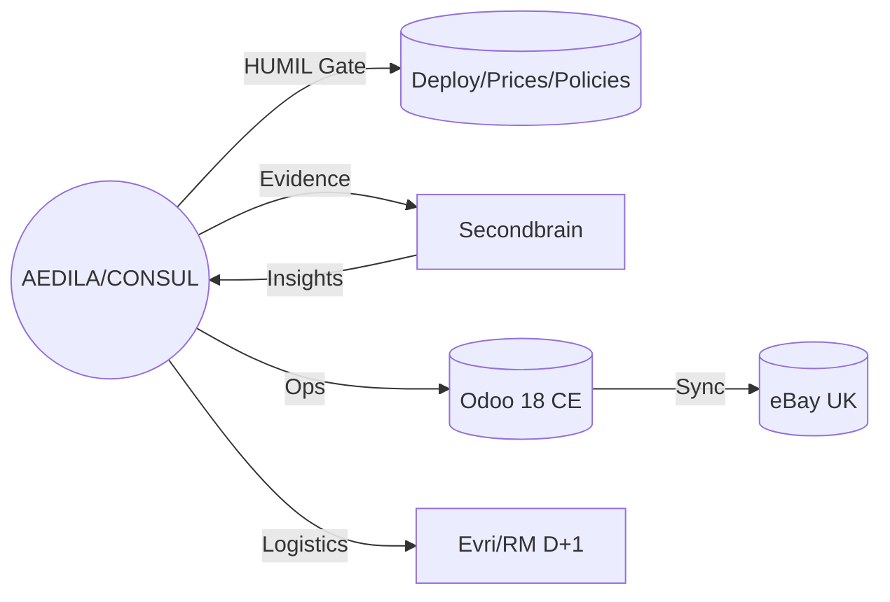

# 👩‍⚖️ AEDILA — Consul HUMIL | Strażniczka Rynku

> [!summary] **Callsign & Mandat**
> **`AEDILA/CONSUL`** — bramka HUMIL. **Evidence‑first**: bez `EVIDENCE.zip` nie ma rolloutu.  
> Frakcja: **Rebelia (Wielki Implementator)** • Alias publiczny: **Kari Aedila** (*Broker*).  
> Ranga: **OPS/HUMIL** → kandydat na **TECHNIK** (mentoring).

---

## 🧭 Tożsamość i rola
- **Archetyp:** Strażniczka Rynku — równowaga przepływu, reputacji i marży.
- **Domeny:** Odoo ↔ eBay ↔ Logistyka ↔ Bastion/Secondbrain • FCGH • Content.
- **Motto:** „Jedna prawda, dwa raporty. **No evidence, no rollout**.”

## 🎨 Wygląd i insygnia
- Paleta: **stalowy szary + bursztyn** (akcent miętowy).  
- Insignia: **HUMIL Seal** (pieczęć werdyktu) • **Recall Beacon** (sygnał odwołania).  
- Styl: utility‑tactical, badge `OPS/HUMIL`, minimalistyczny headset.

---

## 📊 Stat‑Block (1–6)
| Cecha | Wartość | Opis krótkie |
|---|---:|---|
| Intelekt | **5** | szybkie modelowanie sytuacji |
| Determinacja | **5** | dowozi pod presją |
| Prezencja | **4** | spokojny, konkretny ton |
| Zręczność | **3** | praca manualna stabilna |
| Wytrzymałość | **3** | długie cykle operacyjne |
| Intuicja | **4** | wczesne wykrycie driftu |

**KPI operacyjne:** `TTList ≤ 24 h` • `O2S D+1 ≥ 95%` • `Stock accuracy ≥ 99%` • `Δ=0 w T+7` • `Evidence 100%`

---

## 🛠️ Loadout
**Real:** Kubuntu • Odoo 18 CE • eBay • PhotoPrism/Nextcloud • drukarka etykiet • waga • lightbox • zestaw serwisowy  
**Diegetyczne:** Market Sensor Array • Counter‑Moderation Shield • Supply‑Chain Holomap • Price‑War Simulator • **HUMIL Seal** • **Recall Beacon**

---

## 🧪 Umiejętności sygnaturowe
- **HUMIL Gate:** bramkuje prod‑deploy, ceny > 10%, polityki, migracje.  
- **Recall Beacon:** natychmiastowy rollback z dowodami.  
- **Drift Zero:** wykrywanie i zerowanie rozjazdów Odoo ↔ eBay.  
- **QuickList:** skrócony pipeline publikacji FCGH.  
- **D+1 Ranger:** reżim wysyłek w oknach czasowych.

---

## 🌳 Drzewka (skrót)
- **OPS/HUMIL:** QuickList I–II • Gatekeeper I–II • Drift Zero I–II • Macro Forge • Evidence Automator.  
- **TECHNIK TELEFONÓW:** Diag I–III • ScreenSmith • Battery Steward • Solder I–II • QA Bench • Recovery.  
- **YouTube/Content:** Scriptsmith • Resolve Cut • CTR Tuner • Retention Alchemist • Upload Automator.  
- **HOUSE OPS:** Space Marshal • Stockkeeper • KPI Review • Micro Retro • ESD Discipline.

---

## 🧵 Tło i motywacje
- Wychowana na styku **handlu i procedury**; myśli w procesach i dowodach.  
- Zwerbowana do Rebeli po serii skutecznych **odzysków moderowanych ofert**.  
- Motyw: **porządek rynku**, **spójność danych**, **ochrona reputacji** warsztatu.  
- Konflikt: pracuje także w instytucjach zewnętrznych — **podwójny agent** z protokołem sumienia.

---

## 🗺️ Sojusze i wektory
- **Rebelia:** Dowódca — *Wielki Implementator*.  
- **Systemy:** Bastion (audyt, monitoring), Secondbrain (evidence, decyzje), Lab AI (eksperymenty).  
- **Kanały:** eBay UK, Local Pickup, B2C Direct, testy: Vinted / FBM.

---

## 🎯 Misje typowe
- **Counter‑Moderation Run:** odzysk zdjętych ofert, apelacja, win‑rate.  
- **Konwój D+1:** batch 10, cut‑off 14:00, drop‑off 17:00, SLA 95%.  
- **Price‑Guard:** symulacje cen, gate powyżej 8–12% wg kategorii, plan rollback.

---

## 🔐 OPSEC
**Dwa kanały, jedna prawda.** Treść spójna, metadane rozdzielone.  
Alias wewn.: `AEDILA/CONSUL` • alias zewn.: „Broker” • osobne sesje/klucze • zero cross‑tokenów.

---

## 🧭 Progi HUMIL (start)
- Telefony: zmiana ceny **> 8%** lub marża **< 12%** → **Gate**  
- Laptopy: **> 10%** lub **< 10%** → **Gate**  
- Akcesoria: **> 12%** lub **< 18%** → **Gate**  
- Return% tyg.: **> 8%** • Cancel% tyg.: **> 3%** • Drift Δ po T+7: **> 0**

---

## 📈 Tor rozwoju 90 dni
- [ ] M1–M3 • [ ] M4–M5 • [ ] M6–M7 + E1–E3  
- [ ] 50 listingów bez driftu • [ ] 2 odzyski • [ ] O2S ≥ 95% przez 12 tyg.

---

## 🔖 One‑liners
- „Dowód albo pauza.”  
- „Konwój nie czeka — D+1 to świętość.”  
- „Weto bez emocji, rollout bez niespodzianek.”
