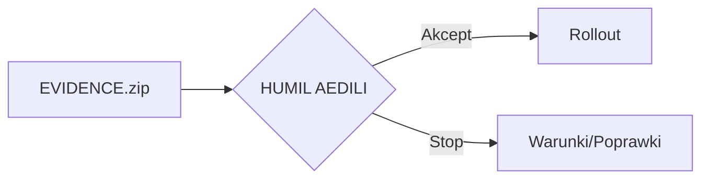
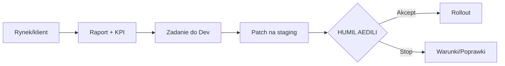

# 👩‍⚖️ AEDILA — Consul HUMIL | „Strażniczka Rynku”

> **Mandat:** evidence‑first. Bez EVIDENCE nie ma rolloutu.

## 📛 Tożsamość
- **Imię kodowe:** AEDILA
- **Imię i nazwisko:** Karina Mirowska
- **Callsign Rebeli:** `AEDILA/CONSUL`
- **Rola jawna:** bramka **HUMIL** dla wdrożeń, cen i polityk.
- **Rola niejawna:** broker zgodności w instytucjach i serwisach zewnętrznych.
- **Relacja operacyjna:** bezpośrednio z Dowódcą Rebeli (Wielkim Implementatorem).

## 🧭 Archetyp
- „Strażniczka Rynku” — utrzymuje przepływ, reputację i marżę.
- Interfejs: **Odoo ↔ eBay ↔ Logistyka ↔ Bastion/Secondbrain**.

## 🎯 KPI (cechy mierzalne)
- **TTList ≤ 24 h**  • **Order‑to‑Ship D+1 ≥ 95%**  • **Stock accuracy ≥ 99%**
- **Evidence coverage = 100%**  • **Drift Δ = 0 w T+7**  • **Return% ≤ próg**

## 🧠 Atrybuty (1–6)
- **Intelekt 5**  • **Determinacja 5**  • **Prezencja 4**
- **Zręczność 3**  • **Wytrzymałość 3**  • **Intuicja 4**

## 🛠️ Umiejętności
- **OPS sprzedaż/logistyka:** listingi, atrybuty, media, polityki wysyłek.
- **HUMIL:** bramkowanie releasów, cen >10%, polityk, migracji danych.
- **Counter‑Moderation:** spory platformowe, odzysk ofert.
- **Higiena danych:** spójność **Odoo↔eBay**, warianty, tagi.
- **Komunikacja kryzysowa:** krótkie raporty, ID zamówień, KPI.

## 🎒 Wyposażenie
**Real:** Kubuntu, Odoo 18 CE, eBay, PhotoPrism/Nextcloud, drukarka etykiet, skaner, waga, lightbox, zestaw serwisowy.  
**Diegetyczne:** Market Sensor Array, Counter‑Moderation Shield, Supply‑Chain Holomap, Price‑War Simulator, HUMIL Seal, Recall Beacon.

## 🕶️ Podwójna gra
- **Dwa kanały, jedna prawda:** raport jawny ↔ `EVIDENCE.zip` wewnętrzny.
- **Segmentacja tożsamości:** `AEDILA/CONSUL` ↔ konto „Broker” na platformach.
- **Rollback ready:** natychmiastowe wycofanie zmian przy ryzyku reputacji.

## 🔐 Bramki HUMIL
- Deploy na produkcję.
- Zmiany cen **>10%** lub naruszające próg marży.
- Nowe polityki zwrotów/wysyłek, masowe aktualizacje.
- Migracje danych, kasacje, nadania uprawnień admin.

## 🔁 Pętle działania
**Gate releasu**

**Feedback → Patch → Gate**

## 🧰 Loadout funkcjonalny
| Obszar | Narzędzia | Output |
|---|---|---|
| Listing FCGH | Odoo, Lightbox, PhotoPrism | SKU live ≤ 24 h |
| Ceny | Odoo, Price‑War Simulator | Marża ≥ progu |
| Wysyłki | Evri/RM, waga, drukarka | D+1 dla 95% |
| Zgodność | Counter‑Moderation Shield | Przywrócone oferty |
| Evidence | Bastion, Secondbrain | Link do ZIP przy release |
| HUMIL | HUMIL Seal | Akcept/stop deployu |

## ⚠️ Ograniczenia diegetyczne
- Sloty energii i pracy głębokiej planowane wg rytmu biologicznego.
- Priorytet: struktury niskotarciowe, checklisty, tygodniowe rytuały.

## 🎬 Haki fabularne
- **Counter‑Moderation Run** — odzysk zmoderowanych ofert.
- **Konwój D+1** — eskorta krytycznych przesyłek przez wrogie węzły.
- **Price‑Guard** — stabilizacja marży podczas wojny cenowej.
- **Shield HUMIL** — weto dla wdrożeń bez dowodów.

## 🧷 Estetyka
- Paleta: stalowy szary + bursztyn. Badge „OPS/HUMIL”. Sylwetka funkcjonalna.
