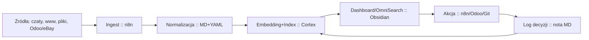

# 🧠 Secondbrain — kluczowe narzędzie Wielkiego Implementatora

> [!summary] **Teza**
> Secondbrain to **operacyjny układ poznawczy**. Zbiera, porządkuje, indeksuje i uruchamia działanie. Efekt: **szybsze decyzje, mniej chaotycznej pracy, większa powtarzalność**.

## 🎯 Co rozwiązuje
- **Rozproszenie informacji** → jedno miejsce prawdy o wiedzy i kontekście.
- **Utrata śladu** → wersjonowane notatki, artefakty, logi decyzyjne.
- **Powtarzanie pracy** → szablony, SOP-y, automatyzacje.
- **Przeciążenie poznawcze** → wyszukiwanie semantyczne, embeddingi, podpowiedzi.
- **Ręczne klejenie systemów** → przepływy n8n i integracje.

## 📈 Efekt na metrykach (typowo)
- **Czas pozyskania informacji**: ↓ 50–80%.
- **Duplikaty wiedzy**: ↓ 30–60%.
- **Czas decyzji operacyjnej**: ↓ 25–50%.
- **Udział zadań zautomatyzowanych**: ↑ do 30–70% obszarów pomocniczych.

## 🧩 Rdzeń funkcjonalny
- **Ingest**: import czatów, plików, historii przeglądarki, e‑maili, eBay/Odoo, repozytoriów.
- **Normalizacja**: parsowanie → Markdown + metadane YAML.
- **Indeks/embedding**: wewnętrzna baza wektorowa, autotagowanie, linki kontekstowe.
- **Reasoning**: agenci LLM z Twoim stylem pracy; generowanie planów i szkiców.
- **Action**: n8n joby, wywołania API, komendy w repo, aktualizacje Odoo.
- **Prezentacja**: Obsidian dashboardy, canvasy, panele stanu.

## 🏗️ Architektura minimalna (Light)
- **Hippocampus** — pliki i archiwa (np. Nextcloud).
- **Synapser** — automatyzacje i integracje (n8n).
- **Cortex** — LLM/embeddings/inferencja (Ollama + UI).
- **Prefrontal** — zarządzanie projektami i priorytetami.
- **OrbitalFrontal** — finanse i śledzenie kosztów.
- **Obsidian Vault** — interfejs pracy i wiedzy.

> [!info] **Zasada**
> 1 osoba = 1 serwer Secondbrain. Wiele integracji. Pełna lokalność i kontrola.

## 🔁 Pętla operacyjna (24h)

> [!tip] **Reguła**
> **No-input → no-insight.** Bez codziennego ingestu nie ma wartości.

## 👥 RACI w Twoim modelu
- **Jakub (A/R)**: strategia, priorytety, agenci i ich uprawnienia.
- **Karina (R/C)**: struktury vaulta, porządek, nazewnictwo, checklisty.
- **AI/Secondbrain (C)**: generacja szkiców, indeksy, podpowiedzi, testy.

## 🧱 Artefakty i struktura
- `/02_BUSINESS/development/projects/secondbrain/`
  - `docs/` — definicje, polityki, statusy.
  - `ingest/` — konektory n8n, mapowania.
  - `agents/` — konfiguracje agentów, prompty, uprawnienia.
  - `models/` — profile LLM, parametry, cache.
  - `dashboards/` — widoki Obsidian (Make.md).
  - `sops/` — SOP-y i workflowy.
  - `tests/` — testy regresji na notatkach i przepływach.

## 📦 Standard danych MD (skrót)
```md
---
title: "..."
type: note|sop|artifact|decision
tags: [area/topic,...]
created: 2025-10-31
updated: 2025-10-31
source: [url|system]
embeddings: true
---
Treść notatki...
```

## 🎛️ Tryby wdrożenia
| Tryb | Zakres | Kiedy | Koszt operacyjny |
|---|---|---|---|
| **Light** | ingest + Obsidian + embeddings + n8n | start, 1 użytkownik | niski |
| **Pro** | + agenci zadaniowi, harmonogramy, audyty | rosnąca złożoność | średni |
| **Plus** | + polityki uprawnień, sandboxy, testy A/B agentów | skala i zespół | wyższy |

## 📊 Metryki sukcesu
- **Coverage**: % źródeł w ingest.
- **Search MTTK**: czas do „pierwszego właściwego wyniku”.
- **Automation rate**: % zadań zamkniętych przez n8n/agentów.
- **Decision log rate**: % decyzji z notą MD i linkami.
- **Model drift**: różnica jakości podpowiedzi tydzień do tygodnia.

## ✅ Kryteria „działa”
- OmniSearch zwraca właściwe noty w <3 s.
- Każdy sprint ma notę decyzyjną i link do artefaktów.
- n8n wykonuje min. 3 powtarzalne przepływy dziennie.
- Backfill starych plików uzupełniony do 90%.
- Backup i test odtworzenia przeszły w tym tygodniu.

## ⚠️ Ryzyka i kontra
- **Prywatność** → lokalne LLM, brak chmury, szyfrowanie.
- **Bałagan** → polityka nazw, linter YAML, przegląd tygodniowy.
- **Dryf modeli** → wersjonowanie promptów i wag, testy kontrolne.
- **Ciche błędy** → sentry na przepływach, alerty n8n.

## 🔗 Punkty integracji wysokiej wartości
- **Odoo ↔ Secondbrain**: import kart produktu, logów i decyzji.
- **eBay ↔ Secondbrain**: analizy listingu, szablony opisów, ceny.
- **PhotoPrism/Nextcloud**: automatyczna kategoryzacja zdjęć.
- **Git**: changelogi, release notes, index artefaktów.

## 🧰 Szablon karty Make.md
```md
> [!todo] 🧠 SECONDRAIN: {obszar}
**Cel:** …
**Wejścia:** …
**Wyjście:** …
**Kroki:** 1) … 2) … 3) …
**DoR:** …
**DoD:** …
**Logi/metryki:** …
```

## 🧭 Co to daje Wielkiemu Implementatorowi
- **Tempo**: mniej szukania, więcej działania.
- **Powtarzalność**: decyzje i rozwiązania są odtwarzalne.
- **Leverage**: agenci wykonują pracę pomocniczą.
- **Skalowalność**: 1 osoba koordynuje wiele strumieni bez chaosu.

## 🧩 One-liners do README sprintu
- „Insight wygenerowany, **akcja**: n8n job #{id}, **źródła**: {linki}.”
- „Embeddingi zaktualizowane, **MTTK**: 1.8 s, **coverage**: 92%.”
- „Agent {nazwa} zamknął 5 zadań. Review zaplanowane.”
