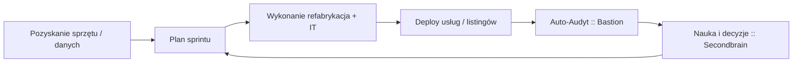

# 👤 Wielki Implementator — rola i system operacyjny

> [!summary] **Definicja**
> Postać prowadząca **E‑Waste Workshop**. Integruje używany sprzęt, przywraca go do obiegu i steruje dwoma filarami: **Bastion** (serwer audytowy) oraz **Secondbrain** (interaktywne miejsce pracy).

## 🎯 Mandat
- Priorytety, decyzje, akceptacja ryzyka.
- Gatekeeper releasów i standardów operacyjnych.
- Utrzymanie pętli: **plan → wykonanie → audyt → nauka**.

## 🧩 Filary
- **🛡️ Bastion** — źródło prawdy o infrastrukturze i wdrożeniach.  
  Funkcje: CMDB light, GitOps light, auto‑audyt po deployu, monitoring minimal, backup+restore test.
- **🧠 Secondbrain** — repo wiedzy i wykonawca akcji.  
  Funkcje: ingest danych, normalizacja do MD+YAML, embeddings/omniview, agenci, n8n flows, dashboardy.

## 🔁 Pętla operacyjna

> [!tip] Zasada: **no‑evidence → no‑deploy**, **no‑input → no‑insight**.

## 📊 KPI Wielkiego Implementatora
- **DF**: Deployment Frequency.
- **MTTR**: Mean Time To Restore.
- **CFR**: Change Failure Rate.
- **Throughput refabu**: szt./tydz.
- **Time‑to‑list**: pozyskanie → publikacja.
- **Gross margin / item**.
- **Evidence coverage**: % deployów z `EVIDENCE.zip`.
- **Search MTTK**: czas do właściwej informacji w Secondbrain.

## 👥 RACI
- **Jakub** — *A/R*: decyzje, merge, release, priorytety.
- **Karina** — *R/C*: struktury, repo, tablice, metryki, linki artefaktów.
- **AI/Secondbrain** — *C*: generacja szkiców, indeksy, automatyzacje, testy.

## 🛠️ Standardy operacyjne
- Sprint 7 dni. WIP ≤ 2/os.
- Release = **tag + URL do EVIDENCE**.
- Drift budżetowany. Nadwyżka = zadanie naprawcze.
- Backup + test odtworzenia co sprint.
- Linter YAML + tygodniowy review vaulta.

## 🧱 Artefakty i struktury
- **Bastion**: `EVIDENCE.zip`, `README.md`, `LOG.md`, porównania CMDB↔live.
- **Secondbrain**: noty MD z YAML, decyzje, SOP‑y, dashboardy, przepływy n8n.
- **E‑Waste**: karty sprzętu, BOM, zdjęcia, listingi, ślad od pozyskania do sprzedaży.

## 🔗 Interfejsy wysokiej wartości
- Odoo↔eBay↔Secondbrain: import/analizy/templatki/ ceny.
- Bastion↔Secondbrain: auto‑link do ZIP w notach releasu i SOP rollbacku.
- PhotoPrism/Nextcloud↔Secondbrain: kategoryzacja zdjęć refurbu.

## ✅ Checklista „działa”
- 100% releasów z `EVIDENCE.zip` i linkiem.
- OmniSearch < 3 s do trafnej noty.
- ≥3 automaty per dobę wykonane przez n8n/agentów.
- Test rollbacku wykonany w bieżącym sprincie.
- Drift Δ ≤ budżet.

## 🧰 Szablon karty Make.md
```md
> [!todo] 👤 WIELKI IMPLEMENTATOR: {obszar}
**Cel:** …
**Wejścia:** …
**Wyjście:** …
**Kroki:** 1) … 2) … 3) …
**DoR:** …
**DoD:** …
**Logi/metryki:** DF, MTTR, CFR, Evidence
```

## 🗺️ Słownik roboczy
- **Audit‑driven ops** — styl pracy, w którym dowody z audytu są obowiązkowym artefaktem każdego wdrożenia.
- **CMDB light** — minimalny katalog zasobów i wersji usług.
- **Embeddings** — wektorowy indeks wiedzy do wyszukiwania semantycznego.
- **Drift** — odchylenie stanu rzeczywistego od deklaratywnego.
